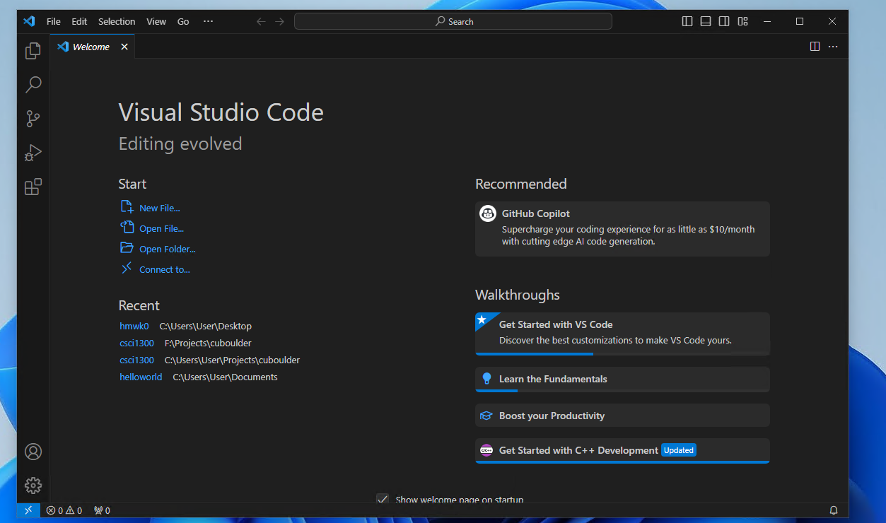
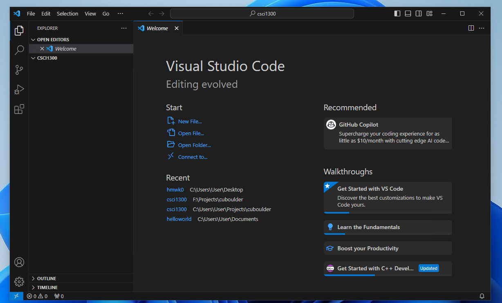
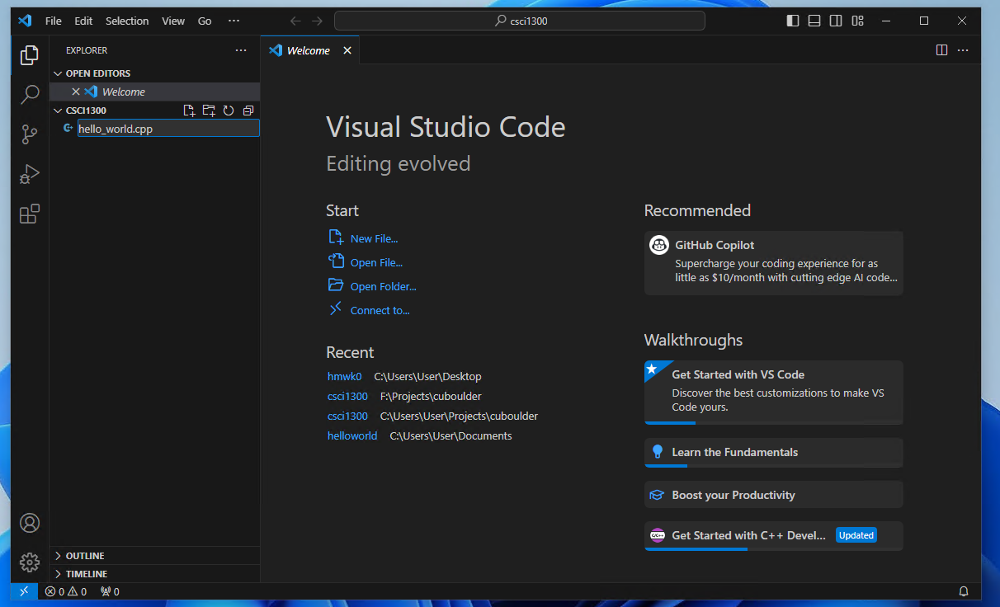
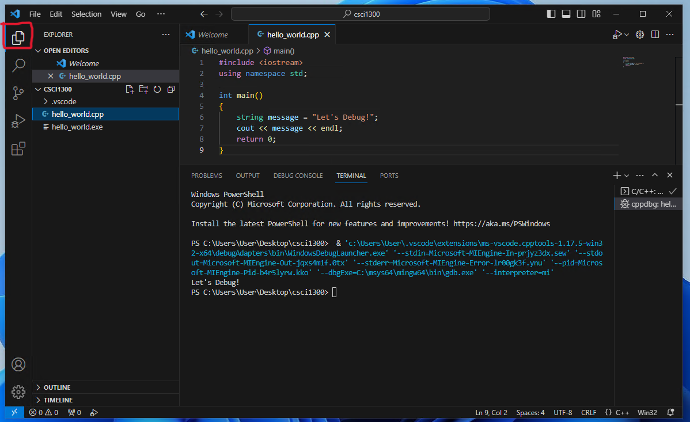
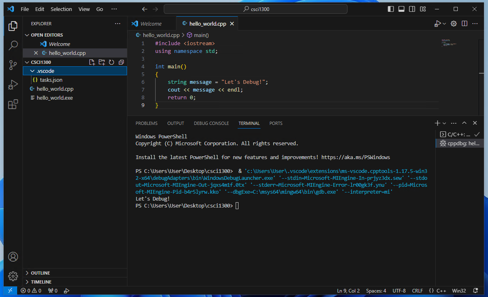
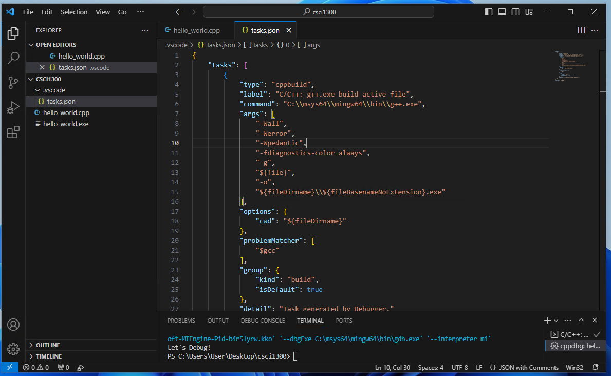
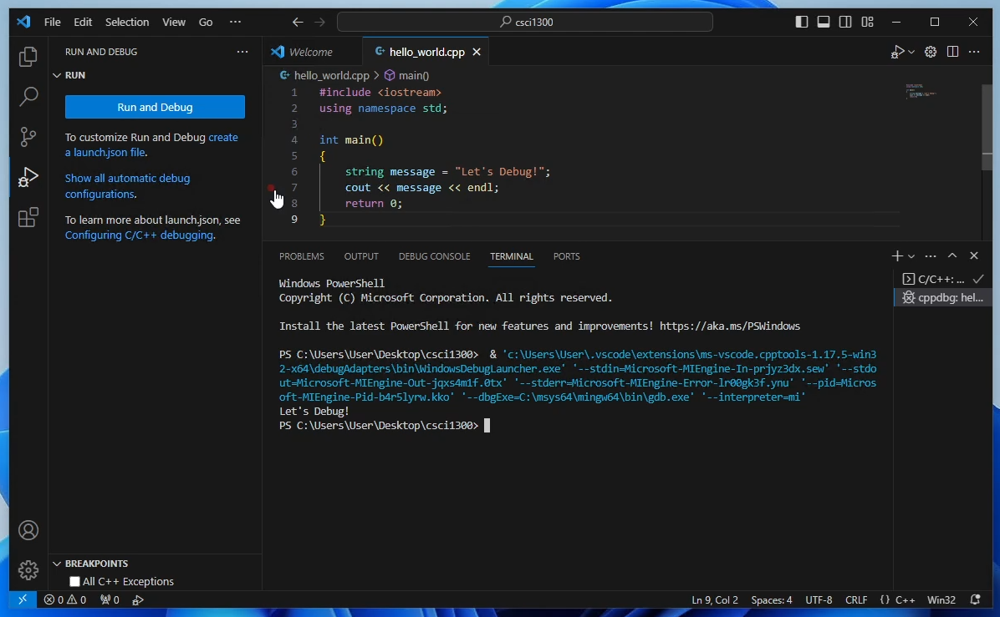

# Debugging

A debugger is an incredibly powerful tool you can use to help find issues with your code and fix them. It allows you to do step-by-step examination of your code, inspecting variable values at different points, and understanding how your code actually runs when it is executed.

## Setup

Windows users will use a debugger called gdb to debug their C++ code. This program has been installed with your compiler in [homework0](../homework/homework0/homework0.md).
The steps below will demonstrate the process of setting up the debugger in VSCode on Windows.

### 1. Open code directory with VSCode
For more detailed reference, please refer to the guide in [homework0](../homework/homework0/homework0.md).

Open VSCode.

Open the folder containing your code. For demonstration purposes, we will be using the "csci1300" folder located in Desktop. Once you have navigated to the target folder and selected it, click "Select Folder" on the lower right corner of the folder selection dialog.

You should see something resembling the image below.


### 2. Open a cpp file to debug
If you already have a cpp file in this folder, double click that file in the left pane. In this demonstration, we will be creating a new cpp file named "hello_world.cpp".

The sample code we will be using is as follows. This code declares a string variable named "message" and prints it to the terminal.
```cpp
#include <iostream>
using namespace std;

int main()
{
    string message = "Let's Debug!";
    cout << message << endl;
    return 0;
}
```
Copy the sample code into "hello_world.cpp" and save the file.


### 3. Click "Run and Debug"
Go to the debugging pane by clicking on the icon in the red square.

Then click "Run and Debug".

### 4. Select debugging option
After clicking "Run and Debug", a dialog will appear as shown below.  
Select "C++ (GDB/LLDB)"

Another dialog will show up as shown below.  
Select the option that contains "C:\msys64\mingw64\bin\g++.exe".

The result will be as shown below. For the dialog at the bottom right corner of the screen click "Not now".

Click "TERMINAL" in the center of the screen. You will see the message in the terminal "Let's Debug!". At this point you have successfully setup and ran your debugger in VSCode. To make the debugger to the same compilation flags that we use, we will have to edit a configuration file called ```tasks.json```.

Navigate back to the file explorer pane by clicking the first icon on the left pane. There will be a folder with the name ".vscode" created for you.

Click the folder to view the files inside. You will find ```tasks.json``` inside.

Open ```tasks.json```. This is the configuration of your debugging task which include compilation commands.

Add the value "-Wall", "-Werror" and "-Wpedantic" in the "args" section as shown below. Save the file after you have completed editing.


### 5. Adding breakpoints
Breakpoints are line or specific code that we want to inspect. Once a breakpoint is reached during runtime, the program will pause for you to inspect the value of each variable. Once you are done inspecting that particular point, you may continue the program by pressing continue.

Navigate back to your cpp file by clicking the tab of you file at the center top of the screen. 
To add a breakpoint, hover your mouse over the line number of your code that you would like to inspect. The image below is selecting line 7. After clicking, the red dot will not disappear when you move your mouse away.  

|Selecting line of code|Breakpoint added to line of code|
|:----:|:----:|
| | |

Now we can run the debugger by navigating to the debugging pane and clicking "Run and Debug" as in step 3 and 4.

Notice that our program pauses at the line the breakpoint was added. There is also a list of variables on the left pane. For this instance, the variable "message" is being shown with the value "Let's Debug!". This is very useful when we have many variables in our program.


To continue the program, click the icon . The menu to control the execution of your program is descibed below.


The buttons are

1. <b>Continue:</b> go until the next breakpoint is encountered
2. <b>Step Over:</b> go to the next line, skipping the details of functions
3. <b>Step Into:</b> go to the next line, if necessary jumping into a function that is called
4. <b>Step Out:</b> jump to the end of the function your are in, returning to wherever that function was called from
5. <b>Restart:</b> start the program over from the beginning
6. <b>Stop:</b> quit debugging

Most of the time you can do most of your debugging with just the Continue and the Step Over buttons as long as you have put breakpoints at all the points of your code you care about.
