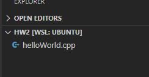
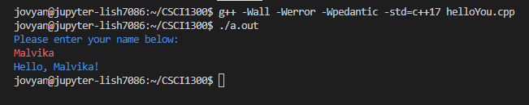

#### **CSCI 1300 CS1: Starting Computing: Homework 1**
#### **Hoenigman/Naidu/Park/Ramesh - Fall 2023**
#### **Due: Friday, September 8 by 5:00pm MST**

<br/>

# Table of contents
1. [Objectives](#objectives)
2. [Background](#background)
3. [Questions](#questions)
    1. [Question 1](#question1)
    2. [Question 2](#question2)
    3. [Question 3](#question3)
    4. [Question 4](#question4)
    5. [Question 5](#question5)
    6. [Question 6](#question6)
4. [Submission Instructions](#submissions)
5. [Overview](#overview)
    1. [Checklist](#checklist)
    2. [Grading Rubric](#grading)

# Objectives <a name="objectives"></a>

* Compile and run C++ code
* Take user inputs and produce outputs
* Understand C++ data types
* Perform arithmetic operations


# Background <a name="background"></a>
## Input & Output
The ability to display information to the user and receive input from them is key to making your programs useful. In C++, one way we can achieve this exchange of information is by using **cout** (console out) and **cin** (console in) from the iostream library. Whenever you use **cout** or **cin**, you must include the **iostream** (input output stream) library and use the **std** (standard) namespace.

To provide a more readable and organized output, **endl** is often used. The **endl** manipulator is used to start a new line. It will allow the cursor to move to the beginning of the following line. See the example below.

Example Input (User input in **bold**)
```cpp
#include <iostream>
using namespace std;

int main()
{
   int number_1;
   int number_2;
   cout << "Please enter the first number:" << endl;
   cin >> number_1;
   cout << "Please enter the second number:" << endl;
   cin >> number_2;
   cout << "Sum of numbers: " << number_1 + number_2 << endl;
}
```
<pre>
Please enter the first number:
<b>1</b>
Please enter the second number:
<b>2</b>
Sum of numbers: 3
</pre>

## Data Types

When programming, we store the variables in our computer's memory, but the computer needs to know what kind of data we want to store in them since it is not going to occupy the same amount of memory to store a simple number as store a single letter or a large number, and they are not going to be interpreted the same way. Some commonly used data types in C++ are:

1. int (for integers)
    * int my_int = 5;  
2. char (for characters)
    * char my_char = 'c';
3. bool (for true or false values)
    * bool my_bool = false;
4. float (for floating-point numbers)
    * float my_float = 4.4531;
5. double (for double precision floating-point numbers)
    * double my_double = 4.4531;
6. string (for strings of characters)
    * string my_string = “Hello World”;

## Coding Style

### Whitespace and indentation

**Whitespaces:** Whitespaces can set things off and reduce the strain on the reader's eyes. Because the compiler ignores whitespace, you can place things anywhere and format them however you want. Whitespace can come in several forms, including indentation.

**Indenting:** Increase your indentation by one increment of each brace "{" and decrease it once on each closing brace "}". Place a line break after every "{" or "}". Use Tab to increase indent and Shift+Tab to decrease indentation.

**Bad Example:** There is no indentation, and it is difficult to see where different portions of the code start and stop.
```cpp
int main(){int number = 0;
    while(number < 10){
    if(number < 5){
    cout << "Less than 5" << endl;
    }else{
    cout << "Greater than 5" << endl;
    }
    number++;
    }
}
```
Good Example: There is proper indentation, and the code is easier to read.
```cpp
int main()
{
    int number = 0;
    while(number < 10)
    {
        if(number < 5)
        {
            cout << "Less than 5" << endl;
        }
        else
        {
            cout << "Greater than 5" << endl;
        }
        number++;
    }
}
```

### Naming and variables
**Names:** Give variables descriptive names, such as first_name or homework_score. Avoid one-letter names like "a" or "x", except for loop counter variables such as "i".

Bad Example:
```cpp
int thing = 16;
double a = 2.2;
string x = "Michael";
```

Good Example:
```cpp
int cups_per_gallon = 16;
double lbs_per_kilo = 2.2;
string first_name = "Michael";
```
**Capitalization:** Name **functions** with “camel-casing”, where the first letter is lowercase and all subsequent words in the name start with a capital letter. **Variables** names are all lowercase with underscores between words.

Bad Example:
```cpp
int numberbananas = 10;
double NumberFish = 7;
string AGEOFPERSON = "Michael";
void play_GAME (int Players)
{
    . . .
}
```
Good Example:
```cpp
int number_bananas = 10;
double number_fish = 7;
string age_of_person = "Michael";
void playGame (int players)
{
    . . .
}
```


### Comments
* Your code should be well-commented. Use comments to explain what you are doing, especially if you have a complex code section. These comments are intended to help other developers understand how your code works. Single-line comments should begin with two forward slashes (//). Multi-line comments begin with one forward slash and an asterisk (/* ... comments here ... */).

* Examples:
    *  Single-line:
    ```cpp
    // CSCI 1300 Fall 2023
    ```
    * Multi-line:
    ```cpp
    /*
    Algorithm:
    Input: two numbers
    Output: sum of input numbers

    1. Ask the user to enter a number
    Save in variable number_1
    2. Ask the user to enter a number
    Save in variable number_2
    3. Compute sum
    sum = number_1 + number_2
    4. Display sum to user
    */
   ```

# Questions <a name="questions"></a>
## **Question 1 (2 points): Hello World** <a name="question1"></a>
The first program that we usually write in any programming language we’re learning is "Hello, World!". Create a program that prints “Hello, World!” to the screen (the output window in VS Code).

Expected output
```
Hello, World!
```
The file should be named _helloWorld.cpp_



The .cpp extension on the filename tells VS Code that the file should be read in the C++ programming language. Once you save it, the lines you write in the file should be color-coded to reflect what they do in the program. This is called syntax highlighting.

Here are some suggested steps:

**Step 1: Write Your Code** <br/>
In VS Code, enter the following hello world program:

```cpp
#include <iostream>
using namespace std;

int main(){
    cout << "Hello, World!" << endl;
    return 0;
}
```

**Step 2: Running Your Code from Command Line** </br>
Move to the “terminal” tab. Make sure you are inside the hmwk1 directory (you can type _pwd_ to see where you are). Type: </br>
``$ g++ -Wall -Werror -Wpedantic -std=c++17 helloWorld.cpp``

the ``-std=c++17`` option makes sure that the C++ version used to run the program is C++ 17. If you don’t give this option then the default version (which is usually C++98) is used.

The ``-Wall -Werror -Wpedantic`` will ensure that our code does not violate any standards.


This creates an executable called "a.out" (or "a.exe" for Windows). You can run it by typing

``$ ./a.out `` or ``$ ./a.exe``

Since no executable name was specified to g++, a.out is chosen by default. You can alternatively use the "-o" option to change the name :

``$ g++ -Wall -Werror -Wpedantic -std=c++17 helloWorld.cpp -o hello``

creates an executable called "hello" (see figure below). You can run it by typing

``$ ./hello``

Notice the output looks the same: "Hello, World!", followed by the return of the prompt, for new commands. (The blue text is the output from running the file.)


**Step 3: Submit to CodeRunner**<br/>
Head over to Canvas to the assignment **Homework 1 - Coderunner** in the Week 2 Module. Submit your solution for the first problem and press the Check button. You will see a report on how your solution passed the tests and the resulting score for the first problem. You can modify your code and re-submit (press “Check” again) as many times as you need to.


If the code runner says “incorrect”, click the “show difference” button.


It will highlight the differences between the expected output and the output your program produced. These outputs should be exactly the same, including upper/lower case, punctuation, and spaces. Otherwise, it’ll be marked as incorrect.


## **Question 2 (4 points): Hello You!** <a name="question2"></a>
If a program is more interactive, it’s fun! Create a program that takes a name as input and prints _“Hello, \<name>!”_. Your output should be exactly the same as below, including the prompt for the user input.

**--- Sample run ---:** (Blue is program output, and red is user input.)



Develop and validate your solution on VS code and head over to Coderunner on Canvas and paste your solution in the answer box!

## **Question 3 (4 points): Fahrenheit to Celsius Converter** <a name="question3"></a>

Create a program that convert temperatures from Fahrenheit to Celsius.

```
Celsius = (Fahrenheit - 32) * (5.0 / 9.0)
```

The answer-box on CodeRunner is pre-loaded with following solution template for this question.

```cpp
#include <iostream>

using namespace std;

int main(){
    // declare all the variable
    double fahrenheit, celsius;

    // prompt the user & get their input
    cout << "<add question>" << endl; // EDIT THIS LINE TO PROMPT USER
    cin >> fahrenheit;

    // temperature calculation
    celsius = <add equation>; // EDIT THIS LINE TO CALCULATE TEMPERATURE
    // hint: use (5.0/9.0) instead of (5/9)

    cout << "The temperature is " << celsius << " degree Celsius." << endl;
    return 0;
}
```

**--- Sample run ---:** (Blue is program output, and red is user input.)


Develop and validate your solution on VS code and head over to Coderunner on Canvas and paste your solution in the answer box!

## **Question 4 (6 points): Area of a Trapezoid** <a name="question4"></a>

Create a program that calculates the area of a trapezoid. You should prompt the user for the two side lengths and the height. A trapezoid is a four-sided polygon with two parallel and two non-parallel sides. The formula to calculate the area of a trapezoid is:

```
area = 0.5 * (base_one + base_two) * height
```

* _base_one_ is the length of one of the parallel sides
* _base_two_ is the length of the other parallel side
* _height_ is the distance between the two parallel side

**--- Sample run ---:** (Blue is program output, and red is user input.)


Develop and validate your solution on VS code and head over to Coderunner on Canvas and paste your solution in the answer box!

## **Question 5 (10 points): Pool Water Management** <a name="question5"></a>

You're in charge of maintaining a swimming pool with a minor leak. The pool has some water in it already and needs to be filled up. However, due to the leak, the water level decreases slightly every hour at a constant rate. Your program takes the hour as an input (as an integer) and predicts the pool's water level over time.


| **Pool**      | **Initial water level (inches)** | **Fill rate (inches/hour)** | **Leakage rate (inches/hour)** |
| ------------- | -------------------------------- | --------------------------- | ------------------------------ |
| Indoor pool   | 10                               | 0.5                         | 0.2                            |
| Outdoor pool  | 14                               | 0.8                         | 0.3                            |


**--- Sample run ---:** (Blue is program output, and red is user input.)


Develop and validate your solution on VS code and head over to Coderunner on Canvas and paste your solution in the answer box!

## **Question 6 (12 points): Convert Currency** <a name="question6"></a>

You are traveling to another country with a different coin system. The currency conversion is shown below:

|     Base      |       Rate      |
| ------------- | --------------- |
| 1 gold coin   | 23 silver coins |
| 1 silver coin | 13 bronze coins |
| 1 bronze coin | 3 iron coins    |

Write a program that takes the number of iron coins as user input (as an integer) and converts it to the number of bronze, silver, and gold coins. The conversion information between these measurement metrics is provided in the table above. The number of iron coins should be converted to maximize the number of gold, silver, and bronze coins.


**--- Sample run ---:** (Blue is program output, and red is user input.)


Develop and validate your solution on VS code and head over to Coderunner on Canvas and paste your solution in the answer box!


# Overview  <a name="overview"></a>
## Checklist <a name="checklist"></a>
Here is a checklist for submitting the assignment:
1. Use your solutions in VS Code to complete the **Homework 1 - Coderunner** assignment on Canvas (Modules → Week 2).
2. Complete the Homework 1 Quiz.


## Grading Rubric <a name="grading"></a>

| **Criteria**                                | Points |
| ------------------------------------------- | ------ |
| Question 1                  | 2     |
| Question 2                  | 4     |
| Question 3                  | 4     |
| Question 4                  | 6     |
| Question 5                  | 10    |
| Question 6                  | 12    |
| Homework 1 Quiz             | 12    |
| Total                                       | 50     |
