#### **CSCI 1300 CS1: Starting Computing: Homework 2**
#### **Hoenigman/Naidu/Park/Ramesh - Fall 2023**
#### **Due: Friday, September 15th by 5:00pm MST**

<br/>

# Table of contents
1. [Objectives](#objectives)
2. [Background](#background)
3. [Questions](#questions)
    1. [Question 1](#question1)
    2. [Question 2](#question2)
    3. [Question 3](#question3)
    4. [Question 4](#question4)
    5. [Question 5](#question5)
4. [Overview](#overview)
    1. [Checklist](#checklist)
    2. [Grading Rubric](#grading)

# Objectives <a name="objectives"></a>

* Compile and run C++ code 
* Understand how to implement decisions using if statements in C++


# Background <a name="background"></a>
## Relational Operators

A relational operator is a feature of a programming language that tests or defines some kind of relation between two entities. These include numerical equality (e.g., 5 == 5) and inequalities (e.g., 4 ≥ 3). Relational operators will evaluate to either True or False based on whether the relation between the two operands holds or not. When two variables or values are compared using a relational operator, the resulting expression is an example of a boolean condition that can be used to create branches in the execution of the program. Below is a table with each relational operator’s C++ symbol, definition, and an example of its execution.

||||
|-----|-----|-----|
| >  | greater than | 5 > 4 is TRUE | 
| <  | less than | 4 < 5 is TRUE | 
| >= | greater than or equal | 4 >= 4 is TRUE | 
| <= | less than or equal | 3 <= 4 is TRUE | 
| == | equal to | 5 == 5 is TRUE | 

## Logical Operators

Logical operators are used to compare the results of two or more conditional statements, allowing you to combine relational operators to create more complex comparisons. Similar to relational operators, logical operators will evaluate to True or False based on whether the given rule holds for the operands. Below are some examples of logical operators and their definitions.

||||
|----|----|----|
| && | AND | returns true if and only if both operands are true
| \|\| | OR | returns true if one or both operands are true
| ! | NOT | returns true if the operand is false and false if the operand is true

### Truth tables

Every logical operator will have a corresponding truth table, which specifies the output that will be produced by that operator on any given set of valid inputs. Below are truth tables for each of the logical operators specified above.

**AND ( && ):**
These operators return true if and only if both operands are True. This can be visualized as a venn diagram where the circles are overlapping.

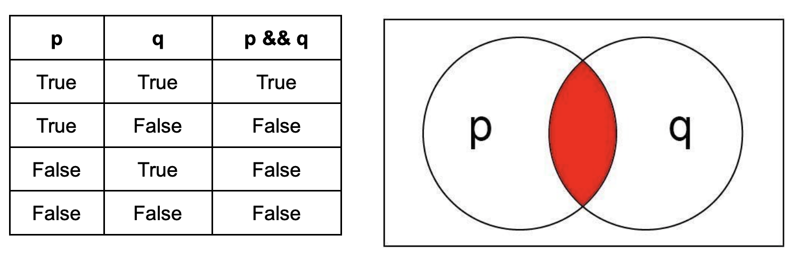

**OR ( || ):**
These operators return True if one or both of the operands are True. This can be visualized as the region of a venn diagram encapsulated by both circles.

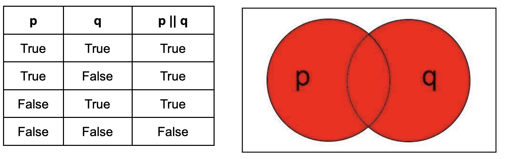

**NOT ( ! ):**
This operator returns the opposite of the operand. This can be visualized as the region of a venn diagram outside the circle. Unlike AND and OR, the NOT operator has only one operand.


## Conditional Statements
Conditional statements, also known as decision statements or branching statements, are used to make a decision based on condition. A condition is an expression that evaluates to a boolean value, either true or false. [Conditional Execution in C++](https://cal-linux.com/tutorials/conditionals.html) is a good online resource for learning about conditionals in C++.

**IF Statements:** An if statement in C++ is composed of a condition and a body. The body is executed only if the condition is true. The condition appears inside a set of parentheses following the keyword “if” and the body appears within a set of curly brackets after the condition:

The general format for **if statements** is:
```
if ( <CONDITION> )
{
	<BODY>
}
```

It is good practice to vertically align the open `"{"` and closed `"{"` curly brackets and to indent the body.

The condition is interpreted as a boolean value, either true or false. Be careful, most expressions in C++ have a boolean interpretation. For instance, non-zero numeric values are true. Assignment operations (single equal sign) are interpreted as true as well. A common mistake is to use a single equals sign inside a condition when a double equals sign is intended.

Unintended behavior when accidentally using assignment operation (= instead of ==) in conditional:
```cpp
// INCORRECT CODE
int x = 5;
if (x = 1) // one equal sign: changes value of x, will always evaluate to true
{
	cout << “The condition is true.” << endl;
}
cout << "x is equal to " << x << endl;
```
Example output:
<pre>
The condition is true.
x is equal to 1
</pre>

What you **actually** mean to do:
```cpp
// CORRECT CODE
int x = 5;
if (x == 1) // two equal signs, performs comparison
{
	cout << “The condition is true.” << endl;
}
cout << "x is equal to " << x << endl;
```
Example output:
<pre>
x is equal to 5
</pre>

Remember, “=” is for assignment and “==” is for checking equality.

**IF-ELSE Statements:** If statements may be paired with else statements in C++. If the condition associated with the if statement is false, the body associated with the else statement is executed. The else statement body is enclosed in a set of curly brackets:
```cpp
if ( <CONDITION> )
{
	<BODY>
    // executed when CONDITION is true
}
else
{
	<BODY>
    // executed when CONDITION is false
}
```
An if statement does not need an else statement, but there must be an if statement before every else statement.

**ELSE-IF Statements:** Finally, an if statement may also be associated with any number of else-if statements. These statements each have an associated condition and an associated body. The body is executed if the condition is true and the conditions for all preceding if- and else-if statements in the same group are false. An else statement may be included at the end of the group but is not required. The else statement will be executed if all the previous conditions are false. 

```cpp
if ( <CONDITION> )
{
	<BODY>
}
else if ( <CONDITION> )
{
	<BODY>
}
else if ( <CONDITION> )
{
	<BODY>
}
else
{
	<BODY>
}
```

**Some examples:**

- If the int `num` is negative, print “Changing sign” and make it positive.
```cpp
if (num < 0)
{
	cout << “Changing sign” << endl;
	num = -1 * num;
}
```
- If the int `num` is 0, print “Can’t divide by 0!”. Otherwise, set num to 1000 divided by num.
```cpp
if (num == 0) //notice the double equals!
{
	cout << “Can’t divide by 0!” << endl;
}
else
{
	num = 1000 / num; //integer arithmetic
}
```
- If the int `num` is greater than 0 and less than 10, set num to 5 times itself. Otherwise, if num is greater than 100, set num to itself divided by 10.
```cpp
if (num > 0 && num < 10)
{
	num = 5 * num;
}
else if (num > 100)
{
	num = num / 10;
}
```
- Print “Positive” if the int num is positive, “Zero” if it is 0, and “Negative” if it is negative. Both of the approaches below work. Why? Can you think of other ways to achieve the same result?

Approach 1:
``` cpp
if ( num > 0 )
{
	cout << “Positive” << endl;
}
else if ( num == 0 )
{
	cout << “Zero” << endl;
}
else if ( num < 0 )
{
	cout << “Negative” << endl;
}
```
Approach 2:
```cpp
if ( num > 0 )
{
	cout << “Positive” << endl;
}
else if ( num == 0 )
{
	cout << “Zero” << endl;
}
else
{
	cout << “Negative” << endl;
}
```
- Let score be an int between 0 and 100. Print the letter grade associated with score (A: 90-100, B: 80-89, C: 70-79, D: 60-69, F: 0-59). Both of the approaches below work.

Approach 1:
```cpp
if (score >= 90 && score <= 100)
{
	cout << “A” << endl;
}
else if (score >= 80 && score <= 89)
{
	cout << “B” << endl;
}
else if (score >= 70 && score <= 79)
{
	cout << “C” << endl;
}
else if (score >= 60 && score <= 69)
{
	cout << “D” << endl;
}
else if (score >= 0 && score <= 59)
{
	cout << “F” << endl;
}
```

Approach 2:
```cpp
if (score >= 90 && score <= 100)
{
	cout << “A” << endl;
}
else if (score >= 80)  // this condition is checked only if the first condition fails, so score must be less 90
{
	cout << “B” << endl;
}
else if (score >= 70) 
{
	cout << “C” << endl;
}
else if (score >= 60)  // this condition is check only if all the above conditions fail, so the score must be less than 70
{
	cout << “D” << endl;
}
else if (score >= 0)
{
	cout << “F” << endl;
}
```

### Rounding to required Decimal places
We use the `<iomanip>` library in C++ which helps in manipulating the output of the program. The two functions that we are going to be using here are `setprecision` and `fixed`.
**setprecision:** This function mainly used in displaying significant digits and rounds off the last displayed digit. It takes in a parameter which defines how many digits to be displayed in the output. 
**fixed:** This functions is used to display decimal numbers in fixed point notation. It enforces a consistent number of decimal places irrespective of their actual precision.
For example:
 Here's a snippet to print the speed of sprinter in Olympics upto 3 decimal places. 
 ```cpp
 #include <iostream>
 #include <iomanip> // first we import the library

 using namespace std;

 int main()
 {
    double sprint_time = 19.1886;

    cout<<fixed<<setprecision(3)<<"The sprint time in seconds : "<<sprint_time<<endl;
    return 0;
 }
 ```
Correct Output:
<pre>
The sprint time in seconds : 19.189
</pre>

If we **do not** use `fixed` function in our `cout` statement then,
Wrong Output:
<pre>
The sprint time in seconds : 19.2
</pre>
Note: Please use `fixed` function to set the number of decimal places to be outputed and use `setprecision(x)` (here `x` is the number of decimal places) to round to the last digit.  

## Coding Style

### Whitespace and indentation

**Whitespaces:** Whitespaces can set things off and reduce the strain on the reader's eyes. Because the compiler ignores whitespace, you can place things anywhere and format them however you want. Whitespace can come in several forms, including indentation.

**Indenting:** Increase your indentation by one increment of each brace "{" and decrease it once on each closing brace "}". Place a line break after every "{" or "}". Use Tab to increase indent and Shift+Tab to decrease indentation.

**Bad Example:** There is no indentation, and it is difficult to see where different portions of the code start and stop.
```cpp
int main(){int number = 0;
    while(number < 10){
    if(number < 5){
    cout << "Less than 5" << endl;
    }else{
    cout << "Greater than 5" << endl;
    }
    number++;
    }
}
```
Good Example: There is proper indentation, and the code is easier to read.
```cpp
int main()
{
    int number = 0;
    while(number < 10)
    {
        if(number < 5)
        {
            cout << "Less than 5" << endl;
        }
        else
        {
            cout << "Greater than 5" << endl;
        }
        number++;
    }
}
```

### Naming and variables
**Names:** Give variables descriptive names, such as first_name or homework_score. Avoid one-letter names like "a" or "x", except for loop counter variables such as "i".

Bad Example:
```cpp
int thing = 16;
double a = 2.2;
string x = "Michael";
```

Good Example:
```cpp
int cups_per_gallon = 16;
double lbs_per_kilo = 2.2;
string first_name = "Michael";
```
**Capitalization:** Name **functions** with “camel-casing”, where the first letter is lowercase and all subsequent words in the name start with a capital letter. **Variables** names are all lowercase with underscores between words.

Bad Example:
```cpp
int numberbananas = 10;
double NumberFish = 7;
string AGEOFPERSON = "Michael";
void play_GAME (int Players)
{
    . . .
}
```
Good Example:
```cpp
int number_bananas = 10;
double number_fish = 7;
string age_of_person = "Michael";
void playGame (int players)
{
    . . .
}
```


### Comments
* Your code should be well-commented. Use comments to explain what you are doing, especially if you have a complex code section. These comments are intended to help other developers understand how your code works. Single-line comments should begin with two forward slashes (//). Multi-line comments begin with one forward slash and an asterisk (/* ... comments here ... */).

* Examples:
    *  Single-line:
    ```cpp
    // CSCI 1300 Fall 2023
    ```
    * Multi-line:
    ```cpp
    /*
    Algorithm:
    Input: two numbers
    Output: sum of input numbers

    1. Ask the user to enter a number
    Save in variable number_1
    2. Ask the user to enter a number
    Save in variable number_2
    3. Compute sum
    sum = number_1 + number_2
    4. Display sum to user
    */
   ```

### Compiling a C++ program
The first program that we usually write in any programming language we’re learning is "Hello, World!". Create a program that prints “Hello, World!” to the screen (the output window in VS Code).

Expected output
```
Hello, World!
```
The file should be named _helloWorld.cpp_


The .cpp extension on the filename tells VS Code that the file should be read in the C++ programming language. Once you save it, the lines you write in the file should be color-coded to reflect what they do in the program. This is called syntax highlighting.

Here are some suggested steps:

**Step 1: Write Your Code** <br/>
In VS Code, enter the following hello world program:

```cpp
#include <iostream>
using namespace std;

int main(){
    cout << "Hello, World!" << endl;
    return 0;
}
```

**Step 2: Running Your Code from Command Line** </br>
Move to the “terminal” tab. Make sure you are inside the hmwk1 directory (you can type _pwd_ to see where you are). Type: </br>
``g++ -Wall -Werror -Wpedantic -std=c++17 helloWorld.cpp``

the ``-std=c++17`` option makes sure that the C++ version used to run the program is C++ 17. If you don’t give this option then the default version (which is usually C++98) is used.

The ``-Wall -Werror -Wpedantic`` will ensure that our code does not violate any standards.

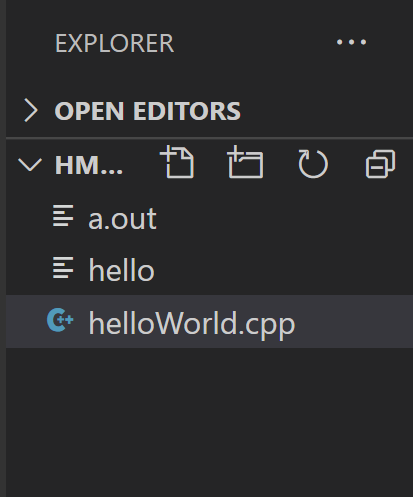

This creates an executable called "a.out" (or "a.exe" for Windows). You can run it by typing

``./a.out `` or ``./a.exe``

Since no executable name was specified to g++, a.out is chosen by default. You can alternatively use the "-o" option to change the name :

``g++ -Wall -Werror -Wpedantic -std=c++17 helloWorld.cpp -o hello``

creates an executable called "hello" (see figure below). You can run it by typing

``./hello``

Notice the output looks the same: "Hello, World!", followed by the return of the prompt, for new commands. (The blue text is the output from running the file.)

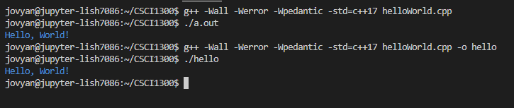

**Step 3: Submit to CodeRunner**<br/>
Head over to Canvas to the assignment **Homework 1 - Coderunner** in the Week 2 Module. Submit your solution for the first problem and press the Check button. You will see a report on how your solution passed the tests and the resulting score for the first problem. You can modify your code and re-submit (press “Check” again) as many times as you need to.

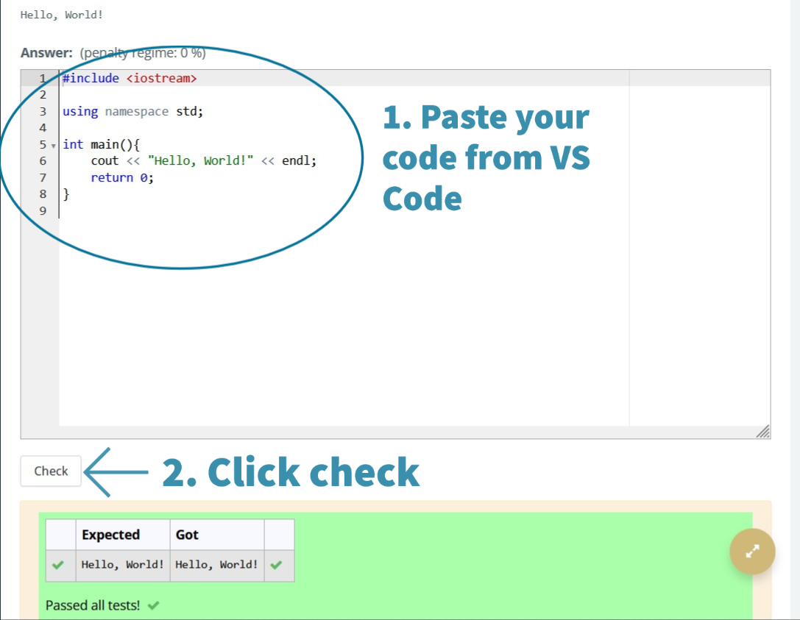

If the code runner says “incorrect”, click the “show difference” button.
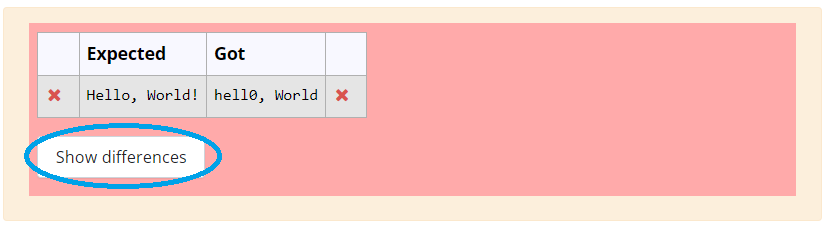

It will highlight the differences between the expected output and the output your program produced. These outputs should be exactly the same, including upper/lower case, punctuation, and spaces. Otherwise, it’ll be marked as incorrect.


# Questions <a name="questions"></a>

## **Question 1 (2 point): Taylor Swift's Concert** <a name="question1"></a>
You are driving from Boulder to Los Angeles to attend Taylor Swift's concert. Unfortunately, you had a flat tire on the way, and now you're on a tight schedule. To make it to the concert on time, the highway's traffic flow rate must be greater than or equal to 800 cars per hour. Write a C++ program to determine whether you will arrive at the concert on time or not, based on the current traffic flow rate.

The program should take an integer input from the user and display one of the two phrases to the user (unless input is invalid).

Make sure your program does basic input validation. The traffic flow rate on the highway must be greater than zero. If the user inputs a non-positive value, print `Invalid traffic flow rate.` and exit the program.

The answer-box on CodeRunner is pre-loaded with the following solution template for this question
```cpp
#include <iostream>

using namespace std;

int main() 
{
    // declare all the variables
    int traffic_flow_rate;

    // prompt the user & get their input
    cout << "What is the traffic flow rate on the highway?" << endl;
    cin >> traffic_flow_rate;

    // input validation: traffic flow rate on the highway must be positive
    if () // EDIT THIS LINE
    {
        cout << "Invalid traffic flow rate." << endl;
        return 0;
    }

    // decide if it's possible to reach the concert on time based on traffic flow rate
    if () // EDIT THIS LINE
    {
        cout << "You're gonna make it to the concert on time." << endl;
    }
    else
    {
        cout << "You're gonna be late to the concert." << endl;
    }

    return 0;
}
```

**--- Sample run ---:** (Blue is program output, and red is user input.)
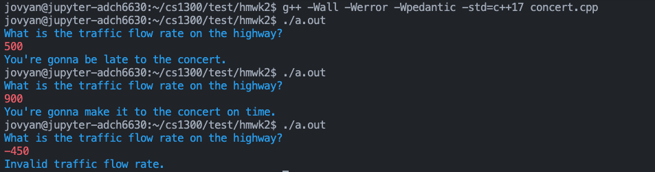

## **Question 2 (5 points): Transaction Limit** <a name="question2"></a>
You have recently opened a Bank account and deposited \$1000. The Bank has a policy to maintain a minimum balance of \$100. Write a C++ program that takes the amount of money the user would like to withdraw and determine if the transaction is successful or not. 
A transaction is deemed successful if the balance left after the amount has been withdrawn is greater than or equal to $100.

The user should input a non-negative number (_double_). 

**--- Sample run ---:** (Blue is program output, and red is user input.)
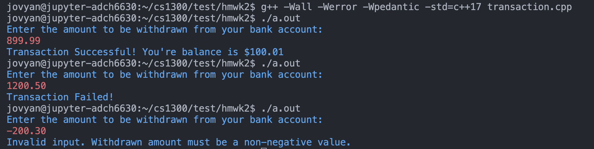

**Note:** The balance should be formatted with a two-digit precision. You can use the setprecision() function with the fixed manipulator from `<iomanip>` library to do so.

Bad formatting: `10.8`

Good formatting: `$10.80`

Ensure you are doing basic input validation as shown in the previous question above. If the user inputs a transaction amount less than or equal to 0 then display output ` Invalid input. Withdrawn amount must be a non-negative value. ` and exit.

Develop and validate your solution on VS code and head over to Coderunner on Canvas and paste your solution in the answer box!

## **Question 3 (7 points): Skiing** <a name="question3"></a>
You are excited to go Skiing with your friends and packed all your gear. You check your weather app just to be sure if the weather conditions for tomorrow is most suitable for skiing. The best temperature for skiing is between 20 to 30 degrees Fahrenheit inclusive and wind speed not more than 50 kmph (kilometers per hour). Write a C++ program to prompt the user to enter the temperature and wind speed values and determine if the conditions are ideal for skiing or not.

The input should be a non-negative integer (for temperature) and non-negative integer (for wind speed).

**--- Sample run ---:** (Blue is program output, and red is user input.)
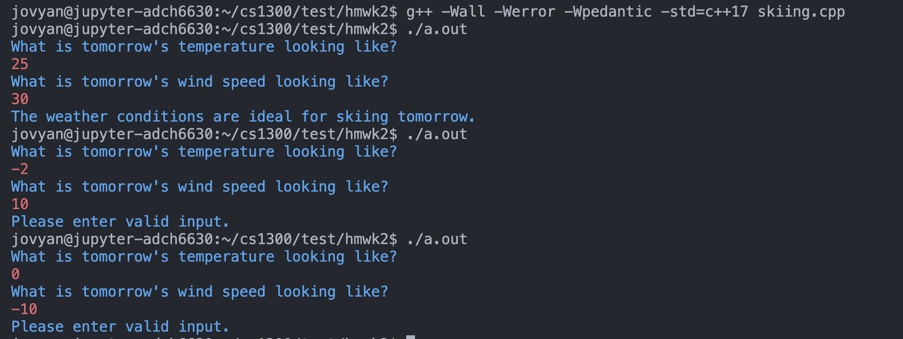

Ensure you are doing input validation similar to the last question. If the user inputs temperature or wind speed less than 0 then display output ` Please enter valid input. ` and exit.

Develop and validate your solution on VS code and head over to Coderunner on Canvas and paste your solution in the answer box!

## **Question 4 (10 points): Nuggets Tickets** <a name="question4"></a>
It's the chance to witness history as Game 5 of NBA Finals (Nuggets vs Heats) is happening at the Ball Arena in Denver and the Nuggets are very close to winning their first title. The Ball Arena has 4 types of seats:

|Arena Seats | Cost|
|----|----|
| Green | $1075.15 |
| Blue | $1340.96 |
| Purple | $1684.29 |
| Orange | $1950.33 |

Write a C++ program that will take the desired seat the user wishes to purchase and their budget, and determine if the desired seats are within the budget of the user or not.

The program should take a non-negative number (_double_) and character input( _G, B, P or O_ ) from the user and display one of the two phrases to the user (unless input is invalid).

**--- Sample run ---:** (Blue is program output, and red is user input.)
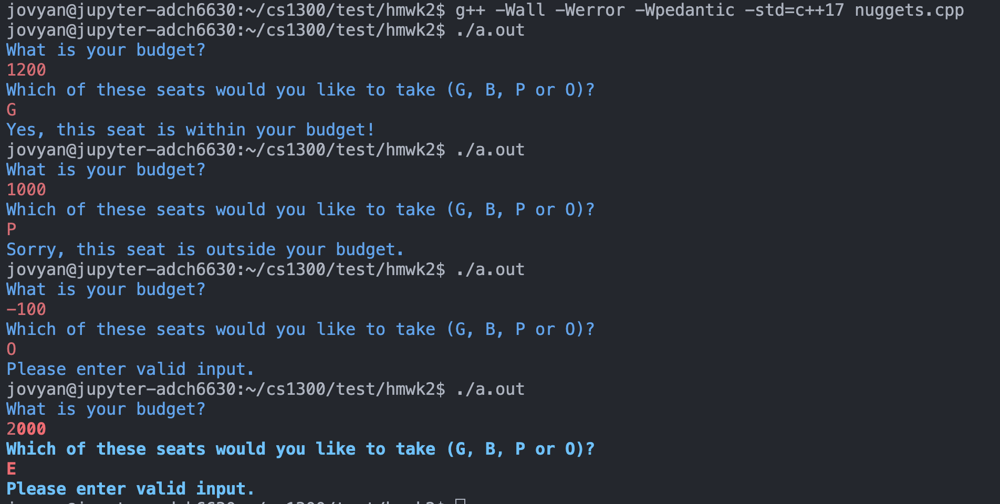

Ensure that you do input validation. For example, the budget the user puts in should be a non-negative number. The user should also only input either G, B, P or O. Whenever the user inputs something that is not allowed, print ` Please enter valid input. ` and then exit the program.

Develop and validate your solution on VS code and head over to Coderunner on Canvas and paste your solution in the answer box!

## **Question 5 (11 points): Car Rental** <a name="question5"></a>
You have decided to go on a roadtrip to see Fall colours. So, you plan to rent a car for this trip. The car rental company offers wide range of options and has 4 categories based on car features and seating capacity. Each type of car has their own specific base rate and price per day to rent the car. Write a C++ program that calculates the Bill Total based on the car type and number of days.

|Car Type | Base Price |Price per day|
|----|----|----|
| A | $100 | $15|
| B | $150 | $20|
| C | $200 | $25|
| D | $250 | $30|

The input should be a character (for car type) and non-negative integer (for number of days you want to rent the car) and the output should be a double.

The bill total is calculated based on this formula:

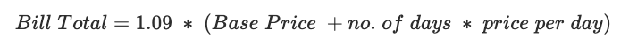

**--- Sample run ---:** (Blue is program output, and red is user input.)
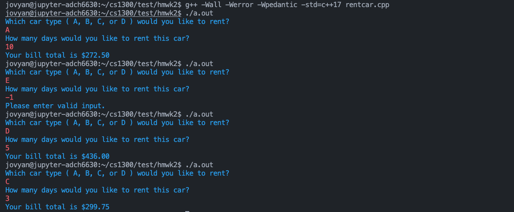

Note: The Bill total should be formatted with a two-digit precision. You can use the setprecision() function with the fixed manipulator from <iomanip> library to do so.

Bad formatting: 10.8

Good formatting: $10.80


The user should input only from these choices A, B, C or D and the minimum number of days to rent a car is 1. Ensure you are doing input validation. Your program should output ` Please enter valid input. ` if the user inputs wrong value for the car type or number of days and exit the program.

Develop and validate your solution on VS code and head over to Coderunner on Canvas and paste your solution in the answer box!

# Overview  <a name="overview"></a>
## Checklist <a name="checklist"></a>
Here is a checklist for submitting the assignment:
1. Use your solutions in VS Code to complete the **Homework 2 - Coderunner** assignment on Canvas (Modules → Week 3).
2. No quiz this week.

## Grading Rubric <a name="grading"></a>


| **Criteria**                                | Points |
| ------------------------------------------- | ------ |
| Question 1                  | 2     |
| Question 2                  | 5     |
| Question 3                  | 7     |
| Question 4                  | 10    |
| Question 5                  | 11    |
| Total                                    | 35    |

