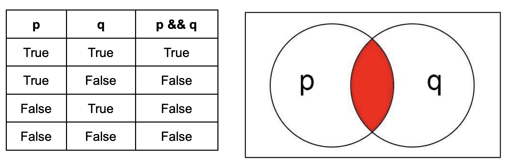
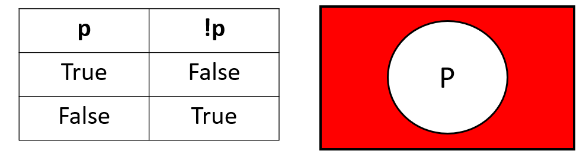
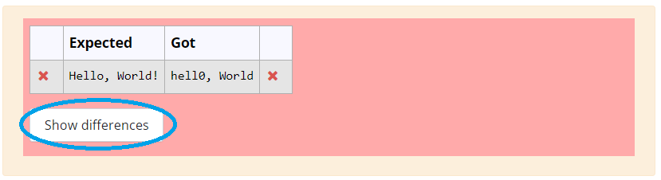
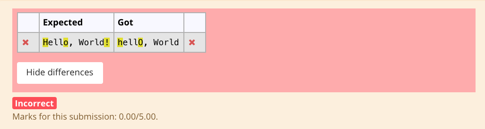

#### **CSCI 1300 CS1: Starting Computing: Homework 3**
#### **Hoenigman/Naidu/Park/Ramesh - Fall 2023**
#### **Due: Friday, September 22nd by 5:00pm MST**

<br/>

# Table of contents
1. [Objectives](#objectives)
2. [Background](#background)
    1. [Relational Operators](#relationaloperators)
    2. [Logical Operators](#logicaloperators)
    3. [Conditional Statements](#conditionals)
    4. [Switch Statements](#switchstatement)
    5. [Rounding To Required Decimal Places](#rounding)
    6. [Functions](#functions)
    7. [Coding Style](#codingstyle)
3. [Questions](#questions)
    1. [Question 1](#question1)
    2. [Question 2](#question2)
    3. [Paint the House](#question3456)
    4. [Question 3](#question3)
    5. [Question 4](#question4)
    6. [Question 5](#question5)
    7. [Question 6](#question6)
4. [Overview](#overview)
    1. [File Header](#fileheader)
    2. [Checklist](#checklist)
    3. [Grading Rubric](#grading)

# Objectives <a name="objectives"></a>

* Compile and run C++ code
* Understand how to implement nested if statements, switch case, and functions in C++


# Background <a name="background"></a>
## Relational Operators <a name="relationaloperators"></a>

A relational operator is a feature of a programming language that tests or defines some kind of relation between two entities. These include numerical equality (e.g., 5 == 5) and inequalities (e.g., 4 ≥ 3). Relational operators will evaluate to either True or False based on whether the relation between the two operands holds or not. When two variables or values are compared using a relational operator, the resulting expression is an example of a boolean condition that can be used to create branches in the execution of the program. Below is a table with each relational operator’s C++ symbol, definition, and an example of its execution.

||||
|-----|-----|-----|
| >  | greater than | 5 > 4 is TRUE |
| <  | less than | 4 < 5 is TRUE |
| >= | greater than or equal | 4 >= 4 is TRUE |
| <= | less than or equal | 3 <= 4 is TRUE |
| == | equal to | 5 == 5 is TRUE |

## Logical Operators <a name="logicaloperators"></a>

Logical operators are used to compare the results of two or more conditional statements, allowing you to combine relational operators to create more complex comparisons. Similar to relational operators, logical operators will evaluate to True or False based on whether the given rule holds for the operands. Below are some examples of logical operators and their definitions.

||||
|----|----|----|
| && | AND | returns true if and only if both operands are true
| \|\| | OR | returns true if one or both operands are true
| ! | NOT | returns true if the operand is false and false if the operand is true

### Truth tables

Every logical operator will have a corresponding truth table, which specifies the output that will be produced by that operator on any given set of valid inputs. Below are truth tables for each of the logical operators specified above.

**AND ( && ):**
These operators return true if and only if both operands are True. This can be visualized as a venn diagram where the circles are overlapping.



**OR ( || ):**
These operators return True if one or both of the operands are True. This can be visualized as the region of a venn diagram encapsulated by both circles.


**NOT ( ! ):**
This operator returns the opposite of the operand. This can be visualized as the region of a venn diagram outside the circle. Unlike AND and OR, the NOT operator has only one operand.



## Conditional Statements <a name="conditionals"></a>
Conditional statements, also known as decision statements or branching statements, are used to make a decision based on condition. A condition is an expression that evaluates to a boolean value, either true or false. [Conditional Execution in C++](https://cal-linux.com/tutorials/conditionals.html) is a good online resource for learning about conditionals in C++.

**IF Statements:** An if statement in C++ is composed of a condition and a body. The body is executed only if the condition is true. The condition appears inside a set of parentheses following the keyword “if” and the body appears within a set of curly brackets after the condition:

The general format for **if statements** is:
```
if ( <CONDITION> )
{
	<BODY>
}
```

It is good practice to vertically align the open `"{"` and closed `"{"` curly brackets and to indent the body.

The condition is interpreted as a boolean value, either true or false. Be careful, most expressions in C++ have a boolean interpretation. For instance, non-zero numeric values are true. Assignment operations (single equal sign) are interpreted as true as well. A common mistake is to use a single equals sign inside a condition when a double equals sign is intended.

Unintended behavior when accidentally using assignment operation (= instead of ==) in conditional:
```cpp
// INCORRECT CODE
int x = 5;
if (x = 1) // one equal sign: changes value of x, will always evaluate to true
{
	cout << “The condition is true.” << endl;
}
cout << "x is equal to " << x << endl;
```
Example output:
<pre>
The condition is true.
x is equal to 1
</pre>

What you **actually** mean to do:
```cpp
// CORRECT CODE
int x = 5;
if (x == 1) // two equal signs, performs comparison
{
	cout << “The condition is true.” << endl;
}
cout << "x is equal to " << x << endl;
```
Example output:
<pre>
x is equal to 5
</pre>

Remember, “=” is for assignment and “==” is for checking equality.

**IF-ELSE Statements:** If statements may be paired with else statements in C++. If the condition associated with the if statement is false, the body associated with the else statement is executed. The else statement body is enclosed in a set of curly brackets:
```cpp
if ( <CONDITION> )
{
	<BODY>
    // executed when CONDITION is true
}
else
{
	<BODY>
    // executed when CONDITION is false
}
```
An if statement does not need an else statement, but there must be an if statement before every else statement.

**ELSE-IF Statements:** Finally, an if statement may also be associated with any number of else-if statements. These statements each have an associated condition and an associated body. The body is executed if the condition is true and the conditions for all preceding if- and else-if statements in the same group are false. An else statement may be included at the end of the group but is not required. The else statement will be executed if all the previous conditions are false.

```cpp
if ( <CONDITION> )
{
	<BODY>
}
else if ( <CONDITION> )
{
	<BODY>
}
else if ( <CONDITION> )
{
	<BODY>
}
else
{
	<BODY>
}
```

**Some examples:**

- If the int `num` is negative, print “Changing sign” and make it positive.
```cpp
if (num < 0)
{
	cout << “Changing sign” << endl;
	num = -1 * num;
}
```
- If the int `num` is 0, print “Can’t divide by 0!”. Otherwise, set num to 1000 divided by num.
```cpp
if (num == 0) //notice the double equals!
{
	cout << “Can’t divide by 0!” << endl;
}
else
{
	num = 1000 / num; //integer arithmetic
}
```
- If the int `num` is greater than 0 and less than 10, set num to 5 times itself. Otherwise, if num is greater than 100, set num to itself divided by 10.
```cpp
if (num > 0 && num < 10)
{
	num = 5 * num;
}
else if (num > 100)
{
	num = num / 10;
}
```
- Print “Positive” if the int num is positive, “Zero” if it is 0, and “Negative” if it is negative. Both of the approaches below work. Why? Can you think of other ways to achieve the same result?

Approach 1:
``` cpp
if ( num > 0 )
{
	cout << “Positive” << endl;
}
else if ( num == 0 )
{
	cout << “Zero” << endl;
}
else if ( num < 0 )
{
	cout << “Negative” << endl;
}
```
Approach 2:
```cpp
if ( num > 0 )
{
	cout << “Positive” << endl;
}
else if ( num == 0 )
{
	cout << “Zero” << endl;
}
else
{
	cout << “Negative” << endl;
}
```
- Let score be an int between 0 and 100. Print the letter grade associated with score (A: 90-100, B: 80-89, C: 70-79, D: 60-69, F: 0-59). Both of the approaches below work.

Approach 1:
```cpp
if (score >= 90 && score <= 100)
{
	cout << “A” << endl;
}
else if (score >= 80 && score <= 89)
{
	cout << “B” << endl;
}
else if (score >= 70 && score <= 79)
{
	cout << “C” << endl;
}
else if (score >= 60 && score <= 69)
{
	cout << “D” << endl;
}
else if (score >= 0 && score <= 59)
{
	cout << “F” << endl;
}
```

Approach 2:
```cpp
if (score >= 90 && score <= 100)
{
	cout << “A” << endl;
}
else if (score >= 80)  // this condition is checked only if the first condition fails, so score must be less 90
{
	cout << “B” << endl;
}
else if (score >= 70)
{
	cout << “C” << endl;
}
else if (score >= 60)  // this condition is check only if all the above conditions fail, so the score must be less than 70
{
	cout << “D” << endl;
}
else if (score >= 0)
{
	cout << “F” << endl;
}
```
## Switch Statements <a name="switchstatement"></a>

Switch case statements are a substitute for long if statements that compare a variable to several values.


### Syntax
With the switch statement, the variable name is used once in the opening line. A case keyword is used to provide the possible values of the variable, which is followed by a colon and a set of statements to run if the variable is equal to a corresponding value.

An example of a simple switch statement:
```cpp
switch (n){
     case 1:
          // code to be executed if n == 1;
          break;
     case 2:
          // code to be executed if n == 2;
          break;
     default:
          // code to be executed if n doesn’t match any cases
}
```

**Important notes to keep in mind when using switch statements :**
- The expression provided in the switch should result in a constant value otherwise it would not be valid.
    - switch(num)
        - allowed (num is an integer variable)
    - switch(‘a’)
        - allowed (takes the ASCII Value)
    - switch(a+b)
        - allowed,where a and b are int variable, which are defined earlier
- The **break** statement is used inside the switch to terminate a statement sequence. When a break statement is reached, the switch terminates, and the flow of control jumps to the next line following the switch statement.
- The break statement is optional. If omitted, execution will continue on into the next case. The flow of control will fall through to subsequent cases until a break is reached.
- The **default** statement is optional. Even if the switch case statement does not have a default statement, it would run without any problem.

## Rounding to required Decimal places <a name="rounding"></a>
We use the `<iomanip>` library in C++ which helps in manipulating the output of the program. The two functions that we are going to be using here are `setprecision` and `fixed`.
**setprecision:** This function mainly used in displaying significant digits and rounds off the last displayed digit. It takes in a parameter which defines how many digits to be displayed in the output.
**fixed:** This functions is used to display decimal numbers in fixed point notation. It enforces a consistent number of decimal places irrespective of their actual precision.
For example:
 Here's a snippet to print the speed of sprinter in Olympics upto 3 decimal places.
 ```cpp
 #include <iostream>
 #include <iomanip> // first we import the library

 using namespace std;

 int main()
 {
    double sprint_time = 19.1886;

    cout<<fixed<<setprecision(3)<<"The sprint time in seconds : "<<sprint_time<<endl;
    return 0;
 }
 ```
Correct Output:
<pre>
The sprint time in seconds : 19.189
</pre>

If we **do not** use `fixed` function in our `cout` statement then,
Wrong Output:
<pre>
The sprint time in seconds : 19.2
</pre>
Note: Please use `fixed` function to set the number of decimal places to be outputed and use `setprecision(x)` (here `x` is the number of decimal places) to round to the last digit.

## Functions <a name="functions"></a>
A function in C++ is a block of code that performs a specific task. It is a way to group related code together and make it easier to read and understand. Functions can also be used to reuse code, which can make your programs shorter and easier to maintain.

Here is the syntax for a function declaration in C++:

```return_type functionName(parameter_list);```

  * ```return_type``` is the data type of the value that the function returns. If the function does not return a value, then ```void``` is used as the return type.
  * ```functionName``` is the name of the function.
  * ```parameter_list``` is a list of variables that are passed to the function. The variables in the parameter list are called parameters.

Here is an example of **defining** a function in C++ that adds two numbers and returns the result:

```cpp
int addNumbers(int a, int b) {
  int c = a + b;
  return c;
}
```
The function ```addNumbers()``` takes two parameters, both of data type `int`. It adds the two parameters and returns the result.

To call a function, you use its name followed by a list of ```arguments``` enclosed in parentheses. The arguments are the values that are passed to the function. For example, the following code calls the ```addNumbers()``` function to add 10 and 5:

```cpp
int result = addNumbers(10, 5);
```

In the above code 10 and 5 are called arguments. The ```variable``` will now contain the 15.

### Function prototype

A function prototype in C++ is a declaration of a function. It tells the compiler the name of the function, it's ```return type```, and the ```types of its parameters```. **The prototype does not contain the body of the function, only its signature**.

The following is a function prototype for a function that adds two numbers:

```cpp
int addNumbers(int a, int b);
```
This prototype tells the compiler that the function ```addNumbers()``` takes two parameters, a, and b which are an integers, and returns an integer. **The body of the function is not specified in the prototype**.

Function prototypes are used for a variety of purposes. They can be used to:

  * Declare functions that are defined in other files.
  * Check the types of arguments passed to a function.
  * Allow the compiler to generate more efficient code.

Below is an example that uses function prototypes and functions.

```cpp
#include <iostream>
using namepsace std;

int addNumbers(int a, int b); // function prototype

int main() {
    int c = addNumbers(10, 5); // calling the function
    cout << "The sum of 10 and 5 :" << c << endl;
    return 0;
}

int addNumbers(int a, int b) {  // function definition
  int c = a + b;
  return c;
}

```

## Coding Style <a name="codingstyle"></a>

### Whitespace and indentation

**Whitespaces:** Whitespaces can set things off and reduce the strain on the reader's eyes. Because the compiler ignores whitespace, you can place things anywhere and format them however you want. Whitespace can come in several forms, including indentation.

**Indenting:** Increase your indentation by one increment of each brace "{" and decrease it once on each closing brace "}". Place a line break after every "{" or "}". Use Tab to increase indent and Shift+Tab to decrease indentation.

**Bad Example:** There is no indentation, and it is difficult to see where different portions of the code start and stop.
```cpp
int main(){int number = 0;
    while(number < 10){
    if(number < 5){
    cout << "Less than 5" << endl;
    }else{
    cout << "Greater than 5" << endl;
    }
    number++;
    }
}
```
Good Example: There is proper indentation, and the code is easier to read.
```cpp
int main()
{
    int number = 0;
    while(number < 10)
    {
        if(number < 5)
        {
            cout << "Less than 5" << endl;
        }
        else
        {
            cout << "Greater than 5" << endl;
        }
        number++;
    }
}
```

### Naming and variables
**Names:** Give variables descriptive names, such as first_name or homework_score. Avoid one-letter names like "a" or "x", except for loop counter variables such as "i".

Bad Example:
```cpp
int thing = 16;
double a = 2.2;
string x = "Michael";
```

Good Example:
```cpp
int cups_per_gallon = 16;
double lbs_per_kilo = 2.2;
string first_name = "Michael";
```
**Capitalization:** Name **functions** with “camel-casing”, where the first letter is lowercase and all subsequent words in the name start with a capital letter. **Variables** names are all lowercase with underscores between words.

Bad Example:
```cpp
int numberbananas = 10;
double NumberFish = 7;
string AGEOFPERSON = "Michael";
void play_GAME (int Players)
{
    . . .
}
```
Good Example:
```cpp
int number_bananas = 10;
double number_fish = 7;
string age_of_person = "Michael";
void playGame (int players)
{
    . . .
}
```


### Comments
* Your code should be well-commented. Use comments to explain what you are doing, especially if you have a complex code section. These comments are intended to help other developers understand how your code works. Single-line comments should begin with two forward slashes (//). Multi-line comments begin with one forward slash and an asterisk (/* ... comments here ... */).

* Examples:
    *  Single-line:
    ```cpp
    // CSCI 1300 Fall 2023
    ```
    * Multi-line:
    ```cpp
    /*
    Algorithm:
    Input: two numbers
    Output: sum of input numbers

    1. Ask the user to enter a number
    Save in variable number_1
    2. Ask the user to enter a number
    Save in variable number_2
    3. Compute sum
    sum = number_1 + number_2
    4. Display sum to user
    */
   ```

### Compiling a C++ program
The first program that we usually write in any programming language we’re learning is "Hello, World!". Create a program that prints “Hello, World!” to the screen (the output window in VS Code).

Expected output
```
Hello, World!
```
The file should be named _helloWorld.cpp_


The .cpp extension on the filename tells VS Code that the file should be read in the C++ programming language. Once you save it, the lines you write in the file should be color-coded to reflect what they do in the program. This is called syntax highlighting.

Here are some suggested steps:

**Step 1: Write Your Code** <br/>
In VS Code, enter the following hello world program:

```cpp
#include <iostream>
using namespace std;

int main(){
    cout << "Hello, World!" << endl;
    return 0;
}
```

**Step 2: Running Your Code from Command Line** </br>
Move to the “terminal” tab. Make sure you are inside the hmwk1 directory (you can type _pwd_ to see where you are). Type: </br>
``g++ -Wall -Werror -Wpedantic -std=c++17 helloWorld.cpp``

the ``-std=c++17`` option makes sure that the C++ version used to run the program is C++ 17. If you don’t give this option then the default version (which is usually C++98) is used.

The ``-Wall -Werror -Wpedantic`` will ensure that our code does not violate any standards.


This creates an executable called "a.out" (or "a.exe" for Windows). You can run it by typing

``./a.out `` or ``./a.exe``

Since no executable name was specified to g++, a.out is chosen by default. You can alternatively use the "-o" option to change the name :

``g++ -Wall -Werror -Wpedantic -std=c++17 helloWorld.cpp -o hello``

creates an executable called "hello" (see figure below). You can run it by typing

``./hello``

Notice the output looks the same: "Hello, World!", followed by the return of the prompt, for new commands. (The blue text is the output from running the file.)


**Step 3: Submit to CodeRunner**<br/>
Head over to Canvas to the assignment **Homework 1 - Coderunner** in the Week 2 Module. Submit your solution for the first problem and press the Check button. You will see a report on how your solution passed the tests and the resulting score for the first problem. You can modify your code and re-submit (press “Check” again) as many times as you need to.


If the code runner says “incorrect”, click the “show difference” button.


It will highlight the differences between the expected output and the output your program produced. These outputs should be exactly the same, including upper/lower case, punctuation, and spaces. Otherwise, it’ll be marked as incorrect.



# Questions <a name="questions"></a>

## **Warning : you are not allowed to use global variables for this homework. **

## **Question 1 (2 points): Time to File Taxes** <a name="question1"></a>
You are a tax expert and your friends have come to you for help in calculating their taxes. They are interested in knowing how much tax they owe to the government based on their ```age``` and ```income```. Write a C++ program to help them calculate their taxes using the rubric below.

<table>
  <thead>
    <tr>
      <th>Age</th>
      <th>Income</th>
      <th>Tax percentage</th>
    </tr>
  </thead>
  <tbody>
    <tr>
      <td rowspan="2">less than 60</td>
      <td>less than $50,000 </td>
      <td>10%</td>
    </tr>
    <tr>
      <td>greater than $50,000 (inclusive)</td>
      <td>20%</td>
    </tr>
    <tr>
      <td rowspan="2">greater than 60 (inclusive)</td>
      <td>less than $20,000 </td>
      <td>Nil (no tax)</td>
    </tr>
    <tr>
      <td>greater than $20,000 (inclusive)</td>
      <td>5%</td>
    </tr>
  </tbody>
</table>

Make sure your program does basic input validation. The ```age``` and ```income``` must always be greater than 0. If the user inputs a non-positive value, print `Neither age nor income can be zero` and exit the program.

The answer-box on CodeRunner is pre-loaded with the following solution template for this question
```cpp
// CSCI 1300 Fall 2023
// Author: ADD YOUR NAME HERE
// TA: ADD YOUR TA'S NAME HERE
// Question 1

#include <iostream>

using namespace std;

int main()
{
    // declare all the variables
    int age, income;

    // prompt the user & get their input
    cout << "What is your age?" << endl;
    cin >> age;
    cout << "What is your income?" << endl;
    cin >> income;

    if () // EDIT THIS LINE
    {
        cout << "Neither age nor income can be zero" << endl;
        return 0;
    }

    // Check for age criteria
    if () // EDIT THIS LINE
    {
        // Check for income criteria
        if () // EDIT THIS LINE
        {
            cout << "You are required to pay $" << 0.1*income << " in taxes" << endl;
        }
        else
        {
            cout << "You are required to pay $" << 0.2*income << " in taxes" << endl;
        }
    }
    else
    {
        // Check for income criteria
        if () // EDIT THIS LINE
        {
            cout << "You are not required to pay taxes" << endl;
        }
        else
        {
            cout << "You are required to pay $" << 0.05*income << " in taxes" << endl;
        }
    }

    return 0;
}
```

Develop and validate your solution on VS code and head over to Coderunner on Canvas and paste your solution in the answer box!

**--- Sample run ---:** (Blue is program output, and red is user input.)


Please make sure that add file header in your program before you turn your code into coderunner. Refer [File Header](#fileheader) for instructions.


## **Question 2 (6 points): Lending books** <a name="question2"></a>
You have a collection of books available for lending. Write a C++ program helps users find and choose books based on their preferred genre, authors, and titles.

Here's how the program works:

* __Genre Selection__: The user starts by selecting a genre from a list.
* __Author Selection__: Once the user selects a genre, the program displays a list of authors who have books in that genre. The user then picks an author from the list.
* __Title Selection__: After choosing an author, the program provides a list of book titles written by the selected author within the chosen genre. The user selects a title from this list.
* __Booking Confirmation__: Once the user picks a title, the program displays a success message which states that the particular book has been ordered.

<table>
  <thead>
    <tr>
      <th>Genre</th>
      <th>Authors</th>
      <th>Book Titles</th>
    </tr>
  </thead>
  <tbody>
    <tr>
      <td rowspan="6">(1) Mystery</td>
      <td rowspan="2">(1) Agatha Christie</td>
      <td>(1) Hercule Poirot</td>
    </tr>
    <tr>
        <td>(2) Miss Marple Detective</td>
    </tr>
    <tr>
      <td rowspan="2">(2) Arthur Conan Doyle</td>
      <td>(1) The Memoirs of Sherlock Holmes</td>
    </tr>
    <tr>
        <td>(2) Tales of Terror and Mystery</td>
    </tr>
     <tr>
      <td rowspan="2">(3) Stephen King</td>
      <td>(1) The Institute</td>
    </tr>
    <tr>
        <td>(2) Misery</td>
    </tr>
    <tr>
      <td rowspan="6">(2) Science</td>
      <td rowspan="2">(1) Stephen Hawking</td>
      <td>(1) A Brief History of Time</td>
    </tr>
    <tr>
        <td>(2) The Universe in a Nutshell</td>
    </tr>
    <tr>
      <td rowspan="2">(2) Carl Sagan</td>
      <td>(1) Cosmos</td>
    </tr>
    <tr>
        <td>(2) Pale Blue Dot</td>
    </tr>
     <tr>
      <td rowspan="2">(3) Mary Roach</td>
      <td>(1) Stiff: The Curious Lives of Human Cadavers</td>
    </tr>
    <tr>
        <td>(2) Gulp: Adventures on the Alimentary Canal</td>
    </tr>
  </tbody>
</table>


The user should input an integer in the range of the choices you give them. For example, a user cannot input 3 if you only present 2 choices. Ensure you are doing input validation. Your program should output ```Please enter a valid input``` if the user inputs an option they cannot choose and exit the program.

Develop and validate your solution on VS code and head over to Coderunner on Canvas and paste your solution in the answer box!

**--- Sample run ---:** (Blue is program output, and red is user input.)


Please make sure that you follow [submission instructions](#submission) before you turn your code into coderunner.

## **Questions 3, 4, 5 and 6: Paint The House** <a name="question3456"></a>

As a promising C++ programmer, you've been presented with an exciting opportunity by a reputable paint supplying company. They are seeking your expertise to develop a user-friendly C++ program that streamlines the process for their customers to estimate the cost of purchasing paint. This program will enable users to estimate the rough area of the four primary exterior walls of their house, which they can later use to calculate the required volume of paint and its cost. Additionally, the program offers users the option to hire painters, each with their own painting pace, to estimate the time needed to complete the painting project.

To tackle this project, you decide to break it down into small manageable chunks.

  1. **Calculate Exterior Wall Area**: This option helps users estimate the total surface area of the four main exterior walls of their house.
  2. **Calculate Paint Cost**: Users can choose this option to find out the cost of the paint required based on their house's wall area.
  3. **Estimate Painting Time**: This option allows users to estimate the time it might take to paint their house, considering different painters' speeds.


## **Question 3 (8 points): Calculate Exterior Wall Area - Paint The House** <a name="question3"></a>

In this step of the **Paint The House** project, you will create a C++ program that includes a *function* to calculate the area of the exterior walls of a house. For simplicity, we'll image every house as a rectangular prism consisting of only **four** walls, and each wall has a fixed height of ```10ft```, as shown in the following image.


Implementation Details

  1. The program will include a function named ```calculateWallArea()``` that takes two parameters: ```length``` and ```width```. This function calculates the ```area``` of all four exterior walls based on the provided dimensions and returns the total area of all the four walls.
  2. The ```main()``` function will prompt the user to enter the ```length``` and ```width``` of the rectangular base of the house. It will ensure input validation, allowing only positive values. If the user enters a non-positive value, the program will display ```Please enter a valid input``` and terminate.
  3. Decimal values for the ```length``` and ```width``` will be accepted.
  4. The ```main()``` function will call the ```calculateWallArea()``` function with the provided parameters to perform the calculations.
  5. The ```main()``` function will also store the returned value from ```calculateWallArea()``` function and display the result to the user in the format ```The total area of all the four walls: <number> sq ft``` (Check sample output).

*Function Specifications - calculateWallArea()*:
  * **Name**: calculateWallArea()
  * **Parameters (in this order)**:
    * ```double``` length: Length of the rectangular base of the house.
    * ```double``` width: Width of the rectangular base of the house.
  * **Return Type**: ```double```
    * The function will return the combined area of all the four walls.

Develop and validate your solution on VS code and head over to Coderunner on Canvas and paste your solution in the answer box!

**--- Sample run ---:** (Blue is program output, and red is user input.)


Please make sure that you follow [submission instructions](#submission) before you turn your code into coderunner.

## **Question 4 (8 points): Calculate Paint Cost - Paint The House** <a name="question4"></a>

In the next phase of the **Paint The House project**, you will create a C++ program that includes a *function*  to calculate the cost of the paint needed for the all the four walls of the house. The paint supplying company offers three different grades of paint, each with a specific cost per square foot, depending on its quality. The cost is summarized in the table below.

| Paint Grade  | Cost per square foot |
| ------------- | ------------- |
| A | $0.75  |
| B | $1.25  |
| C | $2.75  |

Implementation Details
  1. Your program will include a function named ```calculatePaintCost()```. This function takes two parameters: the total wall ```area``` and the chosen ```paint_grade``` (A, B, or C). It calculates and returns the total cost needed to paint the walls based on the chosen paint grade.
  2. The ```main()``` function will prompt the user to enter the total wall ```area``` and the ```paint_grade``` (A, B, or C). It should also ensure input validation, displaying ```Please enter a valid input``` and terminating the program if the user either enters a non-positive value for the ```area``` or an invalid character for the ```paint_grade```.
  3. Decimal values for ```area``` will be accepted.
  4. The ```main()``` function will call the ```calculatePaintCost()``` function with the provided parameters to perform the calculations.
  5. The ```main()``` function will also store the returned value from the ```calculatePaintCost()``` function and display the result to the user in the format: ```The total cost to paint all four walls: $<number>``` (Refer to the sample output).

*Function Specifications - calculatePaintCost()*:
  * **Name**: calculatePaintCost()
  * **Parameters (in this order)**:
    * ```double``` area: Total area of all the four walls of the house.
    * ```char``` paint_grade: The type of paint chosen by the user.
  * **Return Type**: ```double```
    * The function will return the total cost needed to paint the walls.

Develop and validate your solution on VS code and head over to Coderunner on Canvas and paste your solution in the answer box!

**--- Sample run ---:** (Blue is program output, and red is user input.)


Please make sure that you follow [submission instructions](#submission) before you turn your code into coderunner.

## **Question 5 (9 points): Estimate Painting Time - Paint The House** <a name="question5"></a>
We are making good progress. For the next step in **Paint The House** project, you will write a C++ program that includes a **function** estimate the time taken to paint the house. The paint supplying company provides 4 different kinds of painters. Each painter can paint at a different speed per square foot based on the table below.

| Painter  | Time taken per square foot |
| ------------- | ------------- |
| W | 5 sq ft per 12 minutes |
| X | 3 sq ft per 10 minutes |
| Y | 2 sq ft per 5 minutes |
| Z | 7 sq ft per 15 minutes |

Implementation Details
  1. Your program will include a function named ```estimatePaintingTime()```. This function takes two parameters: the total wall ```area``` and the chosen ```painter``` (W, X, Y, Z). It calculates and return the total time needed to paint the walls in **hours** based on the chosen painter.
  2. The ```main()``` function will prompt the user to enter the total wall ```area``` and the ```painter``` (W, X, Y, or Z). It should also ensure input validation, displaying ```Please enter a valid input``` and terminating the program if the user either enters a non-positive value for the ```area``` or an invalid character for the ```painter```.
  3. Decimal values for ```area``` will be accepted.
  4. The ```main()``` function will call the ```estimatePaintingTime()``` function with the provided parameters to perform the calculations.
  5. The ```main()``` function will also store the returned value from the ```estimatePaintingTime()``` function and display the result to the user in the format: ```The time taken to paint all four walls by painter <painter>: <number> hours``` (Refer to the sample output).

*Function Specifications - estimatePaintingTime()*:
  * **Name**: estimatePaintingTime()
  * **Parameters (in this order)**:
    * ```double``` area: Total area of all the four walls of the house.
    * ```char``` painter: Painter chosen by the user.
  * **Return Type**: ```double```
    * The function will return the time taken in **hours** needed to paint all the four walls by the painter.

Develop and validate your solution on VS code and head over to Coderunner on Canvas and paste your solution in the answer box!

**--- Sample run ---:** (Blue is program output, and red is user input.)


Please make sure that you follow [submission instructions](#submission) before you turn your code into coderunner.

## **Question 6 (10 points): Putting all together - Paint The House** <a name="question6"></a>
We are almost done. It's time to finalize the **Paint The House** project and deliver it to the paint supplying company. In this step, we'll combine the solutions from previous questions to create a comprehensive C++ program that incorporates all the functionalities required for the project.

Create a menu-driven program that presents users with four options:
  1. **Calculate Exterior Wall Area**: This option helps users estimate the total surface area of the four main exterior walls of their house.
  2. **Calculate Paint Cost**: Users can choose this option to find out the cost of the paint required based on their house's wall area.
  3. **Estimate Painting Time**: This option allows users to estimate the time it might take to paint their house, considering different painters' speeds.
  4. **Exit**: This option exits the program.
     
Recall that you have previously completed the functionalities needed for all the 3 options in question 3, 4, and 5.

Program Implementation details
  1. Create the menu listed above
  2. Copy functions ```calculateWallArea()```, ```calculatePaintCost()```, and ```estimatePaintingTime()``` from questions 3, 4, and 5 respectively.
  3. If the user chooses option 1,
      1. Prompt the user to enter the ```length``` and ```width``` of the rectangular base of the house.
      2. Call the function ```calculateWallArea()``` with parameters ```length``` and ```width``` and display the returned value in the format ```The total area of all the four walls: <number> sq ft``` (Check sample output).
      3. Ensure input validation, allowing only positive values. If the user enters a non-positive value, the program will display ```Please enter a valid input``` and terminate.
  4. If the user chooses option 2,
      1. Prompt the user to enter the total wall ```area``` and the ```paint_grade``` (A, B, or C).
      2. Call the function ```calculatePaintCost()``` with the parameters ```area``` and ```paint_grade``` and display the returned value in the format ```The total cost to paint all four walls: $<number>``` (Check sample output).
      3. Ensure input validation, display ```Please enter a valid input``` and terminate the program if the user either enters a non-positive value for the ```area``` or an invalid character for the ```paint_grade```.
  5. If the user chooses option 3,
      1. Prompt the user to enter the total wall ```area``` and the ```painter``` (W, X, Y, or Z).
      2. Call the function ```estimatePaintingTime()``` with parameters ```area``` and ```painter``` and display the returned value in the format ```The time taken to paint all four walls by painter <painter>: <number> hours``` (Check sample output).
      3. Ensure input validation, displaying ```Please enter a valid input``` and terminate the program if the user either enters a non-positive value for the ```area``` or an invalid character for the ```painter```.

Develop and validate your solution on VS code and head over to Coderunner on Canvas and paste your solution in the answer box!

**--- Sample run ---:** (Blue is program output, and red is user input.)


Please make sure that you follow [submission instructions](#submission) before you turn your code into coderunner.

# Overview  <a name="overview"></a>

## File Headers <a name="fileheader"></a>

Before submitting your program on coderunner ensure that you include the below information at the top of your file
```cpp
// CSCI 1300 Fall 2023
// Author: FirstName LastName
// TA: TA Name
// Question #
```

Example
```cpp
// CSCI 1300 Fall 2023
// Author: John Smith
// TA: Anush
// Question 1

#include <iostream>
using namespace std;

int main()
{
    cout << "Hello World!" << endl;
    return 0;
}
```

## Checklist <a name="checklist"></a>
Here is a checklist for submitting the assignment:
1. Use your solutions in VS Code to complete the **Homework 3 - Coderunner** assignment on Canvas (Modules → Week 4).
2. Complete the Homework 3 Quiz. This will be published on Monday, September 18th.

## Grading Rubric <a name="grading"></a>
Note: Global variables are not permitted in this homework. The use of global variables will result in a 0 on the entire homework.

| **Criteria**                                | Points |
| ------------------------------------------- | ------ |
| Question 1                  | 2     |
| Question 2                  | 6     |
| Question 3                  | 8     |
| Question 4                  | 8    |
| Question 5                  | 9    |
| Question 6                  | 10    |
| Homework 3 Quiz             | 17    |
| Total                                    | 60  |
