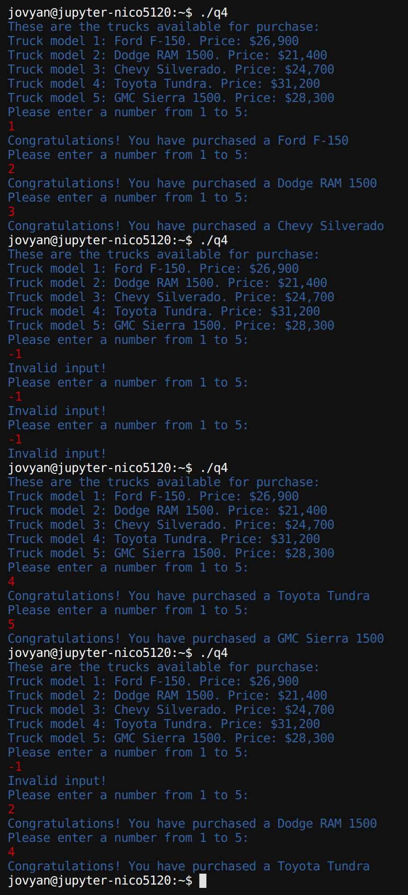

#### **CSCI 1300 CS1: Starting Computing: Homework 4**
#### **Hoenigman/Naidu/Park/Ramesh - Fall 2023**
#### **Due: Friday, September 29th by 5:00pm MST**

<br/>

# Table of contents
1. [Objectives](#objectives)
2. [Background](#background)
    1. [Relational and Logical Operators Cheatsheet](#operatorreview)
    2. [If Statements Cheatsheet](#ifreview)
    3. [Switch Statements](#switchstatement)
    4. [Functions](#functions)
    5. [Reminders](#reminders)
3. [Questions](#questions)
    1. [Question 1](#question1)
    2. [Question 2](#question2)
    3. [Question 3](#question3)
    4. [Question 4](#question4)
    5. [Question 5](#question5)
    6. [Question 6](#question6)
4. [Deliverables](#deliverables)
    1. [File Header](#fileheader)
    2. [Checklist](#checklist)
    3. [Grading Rubric](#grading)

# Objectives <a name="objectives"></a>

* Understand how and when to use functions in C++
* Understand how and when to use the switch-case statement
* Work through the assigned questions in VSCode and submit answers on Coderunner

# Background <a name="background"></a>
## Relational and Logical Operators Cheatsheet <a name="operatorreview"></a>

| **C++ Operator** | **Meaning** | **Example** |
|------------------|-------------|-------------|
| >             | greater than | 5 > 4 is TRUE |
| <                | less than | 4 < 5 is TRUE |
| >=  | greater than or equal | 4 >= 4 is TRUE |
| <=     | less than or equal | 3 <= 4 is TRUE |
| ==               | equal to | 5 == 5 is TRUE |
| !=           | not equal to | 4 != 5 is TRUE |


| **A** | **B** | **A \|\| B** | **A && B** | **!A** |
|-----|-----|-----|-----|-----|
| FALSE | FALSE | FALSE | FALSE | TRUE |
| FALSE | TRUE | TRUE | FALSE | TRUE |
| TRUE | FALSE | TRUE | FALSE | FALSE |
| TRUE | TRUE | TRUE | TRUE | FALSE |

## If Statements Cheatsheet <a name="ifreview"></a>

The general format for **if statements** is:
```cpp
if ( <CONDITION> )
{
	<CODE THAT EXECUTES IF CONDITION IS TRUE>
}
```


The general format for **if->else statements** is:
```cpp
if ( <CONDITION> )
{
	<CODE THAT EXECUTES IF CONDITION IS TRUE>
}
else
{
    <CODE THAT EXECUTES IF CONDITION IS FALSE>
}
```

The general format for **if->else if->else statements** is:
```cpp
if ( <CONDITION_1> )
{
	<CODE THAT EXECUTES IF CONDITION_1 IS TRUE>
}
else if ( <CONDITION_2> )
{
    <CODE THAT EXECUTES IF CONDITION_1 IS FALSE BUT CONDITION_2 IS TRUE>
}
.
.
.
else if (<CONDITION_N> )
{
    <CODE THAT EXECUTES IF CONDITION_1 IS FALSE AND CONDITION_2 IS FALSE ... BUT CONDITION_N IS TRUE>
}
else 
{
    <CODE THAT EXECUTES IF CONDITIONS 1 through N ARE ALL FALSE>
}
```

It is good practice to vertically align the open `"{"` and closed `"}"` curly brackets used in if/else statements and to indent the code blocks.

## Switch Statements <a name="switchstatement"></a>

Switch case statements are a substitute for long if statements that compare an integer valued variable against many values.


### Syntax
With the switch statement, the variable name is used once in the opening line. A case keyword is used to provide the possible values of the variable, which is followed by a colon and a set of statements to run if the variable is equal to a corresponding value.

An example of a simple switch statement: <br>
```cpp
switch (n)
{
     case 1:
          // code to be executed if n == 1;
          break;
     case 2:
          // code to be executed if n == 2;
          break;
     case 3:
          // code to be executed if n == 3;
          break;
     default:
          // code to be executed if n doesn’t match any cases
}
```

**Important notes to keep in mind when using switch statements :**
- The expression provided in the switch parentheses should result in an integer value otherwise it would not be valid.
    - switch(num)
        - allowed (num is an integer variable)
    - switch(‘a’)
        - allowed (takes the ASCII Value)
    - switch(a+b)
        - allowed,where a and b are int variable, which are defined earlier
    - switch(floating_point_value)
        - **NOT** allowed! No doubles or floats can be used in switch()
- The **break** statement is used inside the switch to terminate a statement sequence. When a break statement is reached, the switch terminates, and the flow of control jumps to the first line after the end of the switch statement.
- The break statement is optional. If omitted, execution will continue on into the next case. The flow of control will fall through to subsequent cases until a break is reached.
- The **default** statement is optional. If there is no default option and no case matches the switch variable, then no code executes for that switch statement.

See this modified example: <br>
```cpp
switch (n)
{
     case 1:
     case 2:
          // code to be executed if n == 2 or if n == 1;
          break;
     case 3:
          // code to be executed if n == 3;
          break;
}
```
Compared to the first version of this example, this code combines two of the cases (n==1 and n==2 both result in the same thing), and removes the default case. If n==4, nothing will happen in this example.

## Functions <a name="functions"></a>
A function in C++ is a block of code that performs a specific task. Functions are a way to group related code together and make it easier to read and understand. Functions can also be used to reuse code, which can make your programs shorter and easier to maintain.

Here is the syntax for a function declaration in C++:

```return_type functionName(parameter_list);```

  * ```return_type``` is the data type of the value that the function returns. If the function does not return a value, then ```void``` is used as the return type.
  * ```functionName``` is the name of the function.
  * ```parameter_list``` is a list of variables that are passed to the function. The variables in the parameter list are called parameters.

Here is an example of **defining** a function in C++ that adds two numbers and returns the result:

```cpp
int addNumbers(int a, int b) 
{
  int c = a + b;
  return c;
}
```
The function ```addNumbers()``` takes two parameters, both of data type `int`. It adds them together and returns the result.

To call a function, you use its name followed by a list of ```arguments``` enclosed in parentheses. The arguments are the values that are passed to the function. For example, the following code calls the ```addNumbers()``` function with arguments 10 and 5:

```cpp
int result = addNumbers(10, 5);
```

In the above code 10 and 5 are called arguments. ```result``` will now contain the value 15.

### Function prototype

A function prototype in C++ is a declaration of a function. It tells the compiler the name of the function, it's ```return type```, and the ```types of its parameters```. **The prototype does not contain the body of the function, only its signature**.

The following is a function prototype for a function that adds two numbers:

```cpp
int addNumbers(int a, int b);
```
This prototype tells the compiler that the function ```addNumbers()``` takes two parameters, a, and b which are an integers, and returns an integer. **The body of the function is not specified in the prototype**.

Function prototypes are used for a variety of purposes. They can be used to:

  * Declare functions that are defined in other files.
  * Check the types of arguments passed to a function.
  * Allow the compiler to generate more efficient code.

Below is an example that uses a function prototype.

```cpp
#include <iostream>
using namespace std;

int addNumbers(int a, int b); // function prototype

int main() 
{
    int c = addNumbers(10, 5); // calling the function
    cout << "The sum of 10 and 5 :" << c << endl;
    return 0;
}

 // function definition
int addNumbers(int a, int b) 
{ 
  int c = a + b;
  return c;
}

```

## Reminders <a name="reminders"></a>
Here is a collection of useful things:

- Setting decimal points in cout (remember to include ```<iomanip>```!): <br>
    ```cout << fixed << setprecision(number of decimal points) << floating point value << endl```
    As an example, try running this program to see the difference:
    ```cpp
    #include <iostream>
    #include <iomanip>
    using namespace std;

    int main() 
    {
        cout << 7.0/13.0 << endl;
        cout << fixed << setprecision(2) << 7.0/13.0 << endl;
        return 0;
    }
    ```
- Code compilation with g++: <br>
    ```g++ -Wall -Werror -Wpedantic -std=c++17 name_of_source_file.cpp```
- Using the ```-o``` option provided by g++ to name your executable [OPTIONAL]: <br>
    ```g++ -Wall -Werror -Wpedantic -std=c++17 name_of_source_file.cpp -o nameOfExecutable```
- Good coding style: <br>
    - Name variables well, for example: ```double d = 42.0167``` is confusing, whereas ```double height_of_rectangle = 42.0167``` is clearer about what the variable represents
    - Name functions well, for example: ```int Func(int x);``` is confusing, whereas ```int calculateSquare(int x);``` is clearer about what the function does
    - Variables should be named using snake-case, where_all_words are all lowercase and separated by underscores: this_is_snake_case.
    - Functions should be named using camel-case, where all words except the first start with an uppercase letter, and there are no separators: thisIsCamelCase.
    - Indent things properly! If-else blocks should be well spaced and indented, function blocks as well, etc. Use tab to increase indent, and shift+tab to decrease indent. Here is an example: <br>
    ```cpp
    void function(void){
    if(condition) {
    <code>}else{
    <code>}return;}
    ```
    The above is very confusing and hard to understand, simply adding space and indents really helps:
    ```cpp
    void function(void)
    {
        if (condition)
        {
            <code>
        }
        else
        {
            <code>
        }
        return;
    }
    ```
    - Remember to comment your code! Comment lines start with ```//```
    - Good places to put comments include (but are not limited to!): next to function prototypes, next to variable declarations, and next to important lines, such as numerical calculations, etc...
    - These conventions will make your code easier to read and understand


# Questions <a name="questions"></a>

## **Warning : you are not allowed to use global variables for this homework.**
## **If you are suspected of using an outside source to complete homework, you may be called for an in person interview, and could risk losing points for the assignment.**
## **For questions which require the use of a function, Coderunner will check that you have written the function correctly. DO NOT WRITE ALL YOUR CODE IN ```main()```! Your code will NOT compile if you do not have the correct function, see below for an example of what this could look like:** <br>


## **Question 1 (3 points): Fill in the Blanks** <a name="question1"></a>
*This question requires the use of declaring and calling functions. Understanding return types and parameters is necessary as well.*
<br>
<br>
For the following code, complete the function prototype and declaration for the incomplete functions. The program is supposed to display the perimeter of two different rectangles, and then display to the user which rectangle has a greater perimeter. Replace the items in brackets (```{}```) with the corresponding C++ code.
Coderunner is preloaded with this template.

```cpp
#include <iostream>
using namespace std;

{RETURN TYPE} calculatePerimeter({PARAMETERS});
{RETURN TYPE} displayPerimeter({PARAMETERS});
{RETURN TYPE} comparePerimeters({PARAMETERS});

int main()
{
    int width_1 = 5, height_1 = 7, width_2 = 3, height_2 = 11;

    //Calculate and display the perimeter of the first rectangle
    int perimeter_1 = calculatePerimeter(width_1, height_1);
    displayPerimeter(perimeter_1);

    //Calculate and display the perimeter of the second rectangle
    int perimeter_2 = calculatePerimeter(width_2, height_2);
    displayPerimeter(perimeter_2);

    //Decide which rectangle has larger perimeter
    comparePerimeters(width_1, height_1, width_2, height_2);

    return 0;
}

//This function calculates the perimeter of a rectangle
{RETURN TYPE} calculatePerimeter({PARAMETERS})
{
    int perimeter = 2*width + 2*height;
    return perimeter;
}

//This function displays the perimeter of a rectangle
{RETURN TYPE} displayPerimeter({PARAMETERS})
{
    cout << "The perimeter of the rectangle is: " << perimeter << endl;
    return; 
}

//This function compares the perimeter of two rectangles
{RETURN TYPE} comparePerimeters({PARAMETERS})
{
    int perimeter_1 = calculatePerimeter(width_1, height_1);
    int perimeter_2 = calculatePerimeter(width_2, height_2);
    
    if (perimeter_1 > perimeter_2)
    {
        cout << "The first rectangle has greater perimeter" << endl;
    }
    else if (perimeter_2 > perimeter_1)
    {
        cout << "The second rectangle has greater perimeter" << endl;
    }
    else
    {
        cout << "The rectangles have equal perimeter" << endl;
    }

    return;
}
```

## **Question 2 (5 points): Complete the Program** <a name="question2"></a>
*This question may require the use of if-else statements, switch-case statements, string composition, declaring and calling a function, and processing user input.*
<br>
<br>
You are given a partial program. ```main()``` is almost complete, and the function ```composeMessage()``` needs to be written. By looking at the existing code in ```main()```, figure out how to complete the function prototype, write the function declaration, and function implementation according to the desired output. ```main()``` requires the input validation condition to be completed. Replace items in brackets (```{}```) with the corresponding C++ code. The incomplete program is below: <br> 

```cpp
#include <iostream>
#include <iomanip>
#include <string>
using namespace std;

{RETURN TYPE} composeMessage({PARAMETERS});

int main()
{
    //Declare variables
    string first_name, last_name;
    char position;

    //Capture user input
    cout << "What is your first name?" << endl;
    cin >> first_name;
    cout << "What is your last name?" << endl;
    cin >> last_name;
    cout << "What is your position? Enter P for passenger, C for captain, E for engineer, and N for navigator:" << endl;
    cin >> position;

    //Validate input
    if ({FILL IN THE CONDITION TO VALIDATE INPUT}) {
        cout << "Invalid position!" << endl;
        return 0;
    }

    //Compose and display message
    string message = composeMessage(first_name, last_name, position);
    cout << message << endl;
    return 0;
}
```

The function is supposed to create a welcoming message for the crew and passengers of a ship. Here are some sample outputs: <br>


## **Question 3 (9 points): Bird Feeder Management** <a name="question3"></a>
*This question may require the use of relational operators, if-else statements, switch-case statements, declaring and calling a function, and processing user input.*
<br>
<br>
You have three birdfeeders around your house, but some pesky squirrels keep eating all the birdseed! In order to make sure all three feeders are topped off, you want to write a program to tell you when you need to fill each feeder. Your program should consist of two functions: ```main()```, and ```manageFeeder()```. Details are below: <br>

Implementation Details:
  1. ```main()``` should ask the user how many days ago each feeder was filled.
  1a. ```main()``` is responsible for checking the validity of the user input, no negative values are allowed for days.
  2. ```main()``` should call ```manageFeeder()``` three times, once per feeder, providing the user input as arguments.
  3. ```main()``` should store the output from each call to ```manageFeeder()```.
  4. Finally, ```main()``` should display how many days each feeder is empty on one line.

*Function Specifications - manageFeeder()*:
  * The function should calculate how many days until the specified feeder runs out of birdseed.
  * **Name**: manageFeeder()
  * **Parameters (in this order)**:
    * ```int``` feeder: Integer ID of the feeder the function needs to manage.
    * ```int``` days_since_last_fill: Number of days since that feeder was filled.
  * **Return Type**: ```int```
    * The number of days until the feeder runs out
    * 0 if the feeder is already empty

Below is the breakdown of feeder capacities and drain rates: <br>
| **Feeder Number** | **Capacity (oz)** | **Drain Rate (oz/day)** |
|-------------------|-------------------|-------------------------|
| 1                 | 21                | 3                       |
| 2                 | 37                | 2                       |
| 3                 | 17                | 4                       |

Here are some example outputs from the program:


Work through a few sample runs to get an idea of how the program is supposed to work. If you want, write out pseudocode for the program. Then, develop and test your solution in VSCode and submit on CodeRunner. Please make sure to include your header! See [File Header](#fileheader) for instructions.

## **Question 4 (9 points): Buying Snowplow Trucks** <a name="question4"></a>
*This question may require the use of logical operators, if-else statements, switch-case statements, declaring and calling a function, and processing user input.*
<br>
<br>
As a manager of a plowing company getting ready for winter, you decide to purchase several new work trucks. You have a budget of $81,350 and need to purchase at least two trucks in order to meet your target capacity. You want to write a program to help you manage your purchases. Details are below: <br>

Implementation Details:
  1. ```main()``` should display the truck models available for purchase to the user once at the beginning of the program.
  2. The user is allowed to purchase the same truck as many times as they want.
  3. The user can purchase three trucks.
  4. The user should only be prompted to purchase a third truck if their remaining budget is enough to cover the cost of **ANY** truck model.
  5. ```main()``` needs to keep track of the user's budget after each purchase in order to determine if a third truck is possible.
  6. If the user enters invalid input (an integer outside of the range [1,5]) for one of the first two purchases, the program should continue.
  6a. Invalid input checks should happen within the ```purchaseTruck()``` function.
  7. ```purchaseTruck()``` should display a confirmation message after the user selects a truck.
  8. The truck models are represented with the numbers 1 through 5.

*Function Specifications - purchaseTruck()*:
  * The function should prompt the user to purchase a truck and calculate the new budget after the truck purchase. 
  * **Name**: purchaseTruck()
  * **Parameters (in this order)**:
    * ```int``` budget: The current value of the user's budget.
  * **Return Type**: ```int```
    * The new budget.

The truck models are detailed below: <br>
| **Truck Model** | **Price** |
|-----------------|-----------|
| Ford F-150      | $26,900   |
| Dodge RAM 1500  | $21,400   |
| Chevy Silverado | $24,700   |
| Toyota Tundra   | $31,200   |
| GMC Sierra 1500 | $28,300   |

Here are some example outputs from the program: <br>



Work through a few sample runs to get an idea of how the program is supposed to work. If you want, write out pseudocode for the program. Then, develop and test your solution in VSCode and submit on CodeRunner. Please make sure to include your header! See [File Header](#fileheader) for instructions.

## **Question 5 (9 points): Calculating Distance Between Two Points** <a name="question5"></a>
*This question may require the use of logical and relational operators, if-else statements, declaring and calling a function, and processing user input.*
<br>
<br>
In mathematics, there are often many ways to decide how far two points are from each other. Write a program to calculate the distance between two points in two different ways, depending on what the user asks for. All points are 2-dimensional, each has an x component and a y component. In other words, define: $p1 = (x1, y1), p2 = (x2, y2)$. The first equation is defined as follows: <br>

$distance(p1, p2) = |x2 - x1| + |y2 - y1|$ <br>
This is distance type 1, called the "1-norm", or sometimes the "Manhattan Distance"
The second equation is: <br>

$distance(p1, p2) = \sqrt{(x2 - x1)^2 + (y2 - y1)^2}$ <br>
This is distance type 2, called the "2-norm" or "Euclidean Norm/Euclidean Distance"


Implementation Details:
  1. ```main()``` should ask the user for the (x,y) coordinates of two points, and which distance type they want to use.
  1a. ```main()``` needs to verify user input to ensure a valid distance type was requested.
  2. ```main()``` should then pass this information to ```calculateDistance()```.
  3. Finally, ```main()``` should display the result of the distance calculation to the user.
  4. All coordinate values are floating points with no restrictions.

*Function Specifications - calculateDistance()*:
  * The function should calculate the distance between the points for both equation options.
  * **Name**: calculateDistance()
  * **Parameters (in this order)**:
    * ```double``` x1: x coordinate of the first point.
    * ```double``` y1: y coordinate of the first point.
    * ```double``` x2: x coordinate of the second point.
    * ```double``` y2: x coordinate of the second point.
    * ```int``` distance_type: Which equation to use for calculating the distance.
  * **Return Type**: ```double```
    * The distance between the points.

Some example outputs are below: <br>


Work through a few sample runs to get an idea of how the program is supposed to work. If you want, write out pseudocode for the program. Then, develop and test your solution in VSCode and submit on CodeRunner. Please make sure to include your header! See [File Header](#fileheader) for instructions.

## **Question 6 (12 points): Ralphie's Weekly Diet** <a name="question6"></a>
*This question may require the use of logical and relational operators, if-else statements, declaring and calling a function, and processing user input.*
<br>
<br>
There are several big football games coming up, and in preparation, you need to write a program to figure out how to keep Ralphie in good shape. Ralphie needs at least 12.5 MCals (mega-calories) per day, at least 16.5 MCals on game days to fuel up for the run. Ralphie should never be fed more than 35 MCals over two consecutive days. Below is the schedule for the next week: 
- Monday: No game
- Tuesday: No game
- Wednesday: Game day!
- Thursday: No game
- Friday: No game
- Saturday: Game day!
- Sunday: Game day!
<!-- -->

Implementation Details:
  1. ```main()``` should ask the user to enter the current day, and how much Ralphie was fed on the previous day.
  1a. Days are represented with numbers with 0 corresponding to Monday, 1 corresponding to Tuesday, and so on.
  1b. ```main()``` is responsible for vaildating the input from the user, days (integers) outside the range [0, 6] are not supported, nor is a negative value for the previous days feed.
  2. ```main()``` should then pass the input to the ```calculateAndDisplayDiet()``` function.
  3. ```main()``` is **NOT** responsible for displaying the result to the user, that should happen within ```calculateAndDisplayDiet()```.
  4. If feeding Ralphie the minimum amount for the current day would go over the 35 MCal threshold, ```calculateAndDisplayDiet()``` should display an error message.
  5. The program does **NOT** need to account of any calories Ralphie has stored up, all calories Ralphie is fed on are used up on that day.

*Function Specifications - calculateAndDisplayDiet()*:
  * The function should calculate Ralphie's diet.
  * **Name**: calculateAndDisplayDiet()
  * **Parameters (in this order)**:
    * ```int``` current_day: Integer corresponding to the current day.
    * ```double``` previous_days_feed: How much Ralphie was fed on the previous day.
  * **Return Type**: ```void```
  * **Output**: Display one of two messages:
    * ```Ralphie was fed too much yesterday!``` 
    * ```Ralphie should be fed at least {value} and at most {value} MCals of food today.```

Here are some example outputs from the program:


Work through a few sample runs to get an idea of how the program is supposed to work. If you want, write out pseudocode for the program. Then, develop and test your solution in VSCode and submit on CodeRunner. Please make sure to include your header! See [File Header](#fileheader) for instructions.

# Deliverables  <a name="deliverables"></a>

## File Headers <a name="fileheader"></a>

Before submitting your program on coderunner ensure that you include the below information at the top of your file
```cpp
// CSCI 1300 Fall 2023
// Author: FirstName LastName
// TA: TA Name
// Question #
```

Example
```cpp
// CSCI 1300 Fall 2023
// Author: John Smith
// TA: Nick 
// Question 1
```

## Checklist <a name="checklist"></a>
Here is a checklist for submitting the assignment:
1. Use your solutions in VS Code to complete the **Homework 4 - Coderunner** assignment on Canvas (Modules → Week 5).
2. Complete the Homework 4 Quiz. This will be published on Monday, September 25th.

## Grading Rubric <a name="grading"></a>
Note: Global variables are not permitted in this homework. The use of global variables with result in a 0 on the entire homework.

| **Criteria**                                | **Points** |
| ------------------------------------------- | ---------- |
| Question 1                                  | 3          |
| Question 2                                  | 5          |
| Question 3                                  | 9          |
| Question 4                                  | 9          |
| Question 5                                  | 9          |
| Question 6                                  | 12         |
| Homework 4 Quiz                             | 23         |
| Total                                       | 70         |
