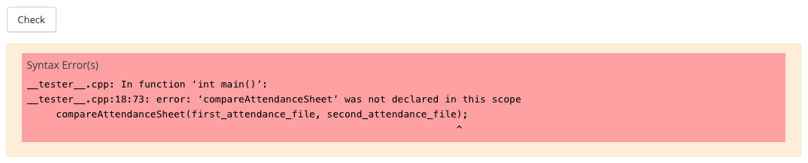

#### **CSCI 1300 CS1: Starting Computing: Homework 6**
#### **Hoenigman/Naidu/Park/Ramesh - Fall 2023**
#### **Due: Friday, October 27th by 5:00pm MST**

<br/>

# Table of contents
1. [Objectives](#objectives)
2. [Background](#background)
    1. [File Input](#fileinput)
    2. [String Streams](#stringstream)
    3. [Reminders](#reminders)
3. [Questions](#questions)
    1. [Question 1](#question1)
    2. [Question 2](#question2)
    3. [Question 3](#question3)
    4. [Question 4](#question4)
    5. [Question 5](#question5)
4. [Deliverables](#deliverables)
    1. [File Header](#fileheader)
    2. [Checklist](#checklist)
    3. [Grading Rubric](#grading)

# Objectives <a name="objectives"></a>

* Understand how to read and process data from files
* Understand how to use string streams
* Work through the assigned questions in VSCode and submit answers on Coderunner

# Background <a name="background"></a>

## File Input <a name="fileinput"></a>
So far in class, we've been using the `iostream` standard library. This library has provided us with methods like `cin` and `cout`. `cin` is the method that reads from standard input (i.e. in the terminal via the keyboard) and `cout` is for writing to standard output.

In this background section, we'll cover file input, which will allow you to read information from a file. To do this, we'll need to include C++'s `fstream` library, which is short for "file stream".

**Reading Lines From A File**

**Step 1. Make a stream object.** <br/>
Create an object (a variable) of file stream type. If you want to open a file for reading only, then the `ifstream` object should be used (short for “input file stream”).

*Example*
```cpp
// create an input file stream object
ifstream file_input;
```

**Step 2. Open a file.** <br/>
 Once you have a file stream object, you need to open the file. To do this, use the `ifstream` object's `open()` method (function), which takes only one parameter: the file name as a string (surrounded by " " if the file name is given directly).

*Example*
```cpp
// open myTextFile.txt with the file stream object
file_input.open("myTextFile.txt");  
```

**Step 3. Checking for open files.** <br/>
It is always good practice to check if the file has been opened properly and take appropriate action if not. To check if a file was successfully opened, you may use the `fail()` **or** `is_open()` methods.

`fail()`: This method will return a boolean value `true` if the file fails to open and `false` otherwise.

*Example*
```cpp
if (file_input.fail()) // true when file fails to open
{
    cout << "Could not open file." << endl;
    return -1; // return to terminate the program; -1 to indicate that the program didn't function as expected
}
// do things with the file
```

`is_open()`: This method will return a boolean value `true` if the file has successfully opened and `false` otherwise.

*Example*
```cpp
if (file_input.is_open()) // true when file opens successfully
{
    // do things with the file
}
else
{
    cout << "Could not open file." << endl;        
}
```

**Step 4. Read lines from the file.** <br/>
To read a line from the file, you can use `getline(file_input, line)`, which returns true as long as an additional line has been successfully assigned to the variable line. Once no more lines can be read in, getline returns false. So we can set up a while loop where the condition is the call to getline.
`.eof()`: This method will return a boolean value `true` if all the data in the file was processed and `false` otherwise.

*Example*
```cpp
string line = "";
int line_idx = 0;
// read each line from the file
while (!file_input.eof()) // continue looping as long as there is data to be processed in the file
{
    // get the next line from the file and store it in 'line' variable
    getline(file_input, line);

    // print each line read from the file
    cout << line_idx << ": " << line << endl;

    // increment index(count of lines in the file)
    line_idx++;   
}
```

**Step 5. Closing a file.** <br/>
When you are finished processing your files, it is recommended to close all the opened files before the program is terminated. You can do this by using the `.close()` function on your file stream object.

*Example*
```cpp
// closing the file
file_input.close();
```

**Step 6. Putting it all together.** <br/>
If we put all the previous steps together, this is the final piece of code we get.

*Example*
```cpp
// create an input file stream object
ifstream file_input;

// open myTextFile.txt with the file stream object
file_input.open("myTextFile.txt");

// check if file opened successfully
if (file_input.fail())
{
    cout << "Could not open file." << endl;
    return -1;
}
else
{
    // do things with the file
    string line = "";
    int line_idx = 0;

    // read each line from the file
    while (!file_input.eof())
    {
        // gets line of text from file_input, stores it in line
        getline(file_input, line);

        // print each line read from the file
        cout << line_idx << ": " << line << endl;

        // increment index (count of lines in the file)
        line_idx++;   
    }
}

// closing the file
file_input.close();
```

## Stringstreams <a name="stringstream"></a>

String streams are C++ objects that allow you to read from and write to strings as if they were streams. This means that you can use the same operators and functions that you use with other streams (```iostream``` and ```fstream```), such as ```<<``` and ```>>```, to manipulate strings.

To use a string stream, you first need to create an instance of the stringstream class. You can then use the ```<<``` operator to write to the string stream and the ```>>``` operator to read from the string stream.


Below are two examples that show how to create string streams and assign the value "Hello World!" to them.

#### Example 1 - Assign "Hello World!" to stringstream

```cpp
#include <iostream>
#include <sstream>
using namespace std;

int main()
{
    stringstream ss("Hello World!");    
    return 0;
}
```

#### Example 2 - Assign "Hello World!" to stringstream

```cpp
#include <iostream>
#include <sstream>
using namespace std;

int main()
{
    stringstream ss;
    ss << "Hello World!";  
    return 0;
}
```

Once a string stream has been initialized, we can use the ```>>``` to read the contents of it word by word. Please note that ```>>``` is splitting based on space.

#### Example - Read contents of stringstream word by word

```cpp
#include <iostream>
#include <string>
#include <sstream>
using namespace std;

int main()
{
    stringstream ss("Hello World!");    
    string word;
    while(ss >> word) {
        cout << word << endl;
    }
    return 0;
}
```

*Output*
```
Hello
World!
```
### getline with Stringstream

Since ```>>``` breaks on spaces and sometimes we may need to split based on other delimiters, we can use ```getline()``` to achieve it. In the previous programs, the syntax has been ```getline(cin, <variable_name>)``` or ```getline(file_stream, <variable_name>)```; however, when using ```getline()``` with the stringstream, there is another argument that is passed in, the delimiter. If we do not specify the third argument, the default value will be ```\n```, which is why getline() will read each line.

To specify the delimiter, we will add a third argument of type ```char``` (surrounded by \'\'). Below is an example of using comma as the delimiter.
#### Example - getline() with comma as the delimiter
```cpp
#include <iostream>
#include <sstream>
using namespace std;

int main()
{
    string line = "John,40";
    string name, age;
    stringstream ss(line);
    getline(ss, name, ',');
    getline(ss, age);  // the delimiter is set to \n by default
    cout << name << endl;
    cout << age << endl;
}
```

*Output*
```
John
40
```

When using getline and stringstreams, the variables that are parsed will be string, which cannot be used for comparison. This is when we can use ```stoi()``` or ```stod()``` to cast string into int or double, respectively.

Below is an example of the modified program from above, where we can compare the age.
```cpp
#include <iostream>
#include <sstream>

using namespace std;

int main()
{
    string line = "John,40";
    string name, age;
    stringstream ss(line);
    getline(ss, name, ',');
    getline(ss, age);
    int age_num = stoi(age);
    if(age_num >= 18){
        cout << name << " is an adult" << endl;
    } else{
        cout << name << " is still a minor" << endl;
    }
}
```

*Output*
```
John is an adult
```

### Reusing stringstreams

Depending on how you split using stringstream, reusing the same stringstream could create issues. Therefore to check on the status of stringstream by using ```fail()``` , reset the stringstream with ```clear()``` and reset the string with ```str("")```.

```cpp
#include <iostream>
#include <fstream>
#include <sstream>

using namespace std;

int main()
{
    stringstream ss("this is a test\n");
    string temp;
    while(ss >> temp){
        cout << temp << endl;
    }
    // checks on the status of ss
    if(ss.fail()){
        ss.clear();
        ss.str("");
    }
    
    ss.str("this is the second test\n");

    while(ss >> temp){
        cout << temp << endl;
    }
    return 0;

}
```

## Reminders <a name="reminders"></a>
Here is a collection of useful things:

- Setting decimal points in cout (remember to include ```<iomanip>```!):

    ```cout << fixed << setprecision(number of decimal points) << floating point value << endl```

    As an example, try running this program to see the difference:
    ```cpp
    #include <iostream>
    #include <iomanip>
    using namespace std;

    int main()
    {
        cout << 7.0/13.0 << endl;
        cout << fixed << setprecision(2) << 7.0/13.0 << endl;
        return 0;
    }
    ```
- Code compilation with g++: <br>
    ```g++ -Wall -Werror -Wpedantic -std=c++17 name_of_source_file.cpp```
- Using the ```-o``` option provided by g++ to name your executable [OPTIONAL]: <br>
    ```g++ -Wall -Werror -Wpedantic -std=c++17 name_of_source_file.cpp -o nameOfExecutable```
- Good coding style: <br>
    - Name variables well, for example: ```double d = 42.0167``` is confusing, whereas ```double height_of_rectangle = 42.0167``` is clearer about what the variable represents
    - Name functions well, for example: ```int Func(int x);``` is confusing, whereas ```int calculateSquare(int x);``` is clearer about what the function does
    - Variables should be named using snake-case, where_all_words are all lowercase and separated by underscores: this_is_snake_case.
    - Functions should be named using camel-case, where all words except the first start with an uppercase letter, and there are no separators: thisIsCamelCase.
    - Indent things properly! If-else blocks should be well-spaced and indented, function blocks as well, etc. Use tab to increase indent, and shift+tab to decrease indent. Here is an example: <br>
    ```cpp
    void function(void){
    if(condition) {
    <code>}else{
    <code>}return;}
    ```
    The above is very confusing and hard to understand, simply adding space and indents really helps:
    ```cpp
    void function(void)
    {
        if (condition)
        {
            <code>
        }
        else
        {
            <code>
        }
        return;
    }
    ```
    - Remember to comment your code! Comment lines start with ```//```
    - Good places to put comments include (but are not limited to!): next to function prototypes, next to variable declarations, and next to important lines, such as numerical calculations, etc.
    - These conventions will make your code easier to read and understand


# Questions <a name="questions"></a>

**Warning: you are not allowed to use global variables, pointers and references for this homework.** <br><br>
**If you are suspected of using an outside source to complete homework, you may be called for an in-person interview, and could risk losing points for the assignment.** <br><br>
**For questions which require the use of a function, Coderunner will check that you have written the function correctly. DO NOT WRITE ALL YOUR CODE IN ```main()```! Your code will NOT compile if you do not have the correct function, see below for an example of what this could look like:** <br>



## Question 1 (2 points): Country Names <a name="question1"></a>

*This question may require the use of file streams, loops, and vectors.*

Write a C++ program to read a file of country names and print them to the console in the same order as they appear in the file.

For this question, the answer-box on CodeRunner is pre-loaded with the following solution template. You are only required to fill in the appropriate blanks. Additionally, you may use [countries_1.txt](./data_files/countries_1.txt) file to test out your code. You may create more files for further testing.

```cpp
#include <iostream>
#include <fstream>
#include <vector>

using namespace std;

void listCountries(string filename)
{
    // initialize variables
    ifstream file(filename); // opens a file
    vector<string> countries;
    string country;

    if(file.is_open())
    {
        // Fill in the blank below with code to read from file and store in the countries vector
        __________________________

        cout << "List of countries in the file are" << endl;    
        for(int i = 0; i < int(countries.size()); i++)
        {
            cout << countries.at(i) << endl;
        }
    }
    else
    {
        cout << "Failed to open file" << endl;
    }
    file.close();
}

int main()
{
    string filename;
    cout << "Enter countries filename" << endl;
    cin >> filename;
    listCountries(filename);
    return 0;
}
```
Develop and validate your solution on VS code and head over to Coderunner on Canvas and paste your solution in the answer box!

Please make sure to add file header in your program before you turn your code into Coderunner. Refer [File Header](#fileheader) for instructions.

**Sample run 1:**

Input Files

  * [countries_1.txt](./data_files/countries_1.txt)

Output
```
Enter countries filename
countries_1.txt
List of countries in the file are
Argentina
Bulgaria
Cambodia
Denmark
Ethiopia
France
Ghana
Hungary
Iceland
Jamaica
Kenya
Latvia
Malaysia
Nepal
Oman
Portugal
Qatar
Romania
Samoa
Thailand
USA
Venezuela
Yemen
Zimbabwe
```

**Sample run 2:**

Input File

  * [does_not_exist.txt](./data_files/does_not_exist.txt)

Output
```
Enter countries filename
does_not_exist.txt
Failed to open file
```


## Question 2 (6 points): Museum Attendance <a name="question2"></a>

*This question may require the use of file streams, loops, and arrays.*

Your former high school took students on a museum trip. Before boarding the bus, the teachers made a list of all the students' names. After visiting the museum, the teachers asked the students to board the bus and made a new list of all the students' names. Before leaving, the teachers wanted to compare the two lists to make sure no student was left behind. Write a C++ program to help them do this quickly and easily. Your program compares the two lists and reports if any student is still inside the museum.


*Function Specifications*:
  * **Name**: compareAttendanceSheet()
  * **Parameters (in this order)**:
    * ```string``` first_attendance_file: filename of the fist attendance sheet.
    * ```string``` second_attendance_file: filename of the second attendance sheet.
  * **Return Type**: ```void```
  * **Output**:
    * Print the names of all the students who have not boarded the bus.
    * Print ```Every student has boarded the bus. It's time to leave.``` if every student has boarded the bus.
    * Print ```Failed to open attendance files``` and exit the program if either of the files could not be opened.

Develop and validate your solution on VS code and test it by writing a ```main()``` with either assert calls or one that supports user input. Below we provide a few examples testing out a valid ```compareAttendanceSheet()``` function.

Additionally you may use [attendance_sheet_1.txt](./data_files/attendance_sheet_1.txt) and [attendance_sheet_2.txt](./data_files/attendance_sheet_2.txt) files to test out your code. You may create more files for further testing.

When you are happy with your solution head over to Coderunner on Canvas and paste your function in the answer box! Make sure to ONLY include the ```compareAttendanceSheet()``` function (do not include ```main()``` or any other statements).

Please make sure to add file header in your program before you turn your code into Coderunner. Refer [File Header](#fileheader) for instructions.

Sample from [attendance_sheet_1.txt](./data_files/attendance_sheet_1.txt)
```
Jorden Owen
Waylon Mccoy
Dario Harding
Jameson Odonnell
Andrew Wilkinson
```

Sample from [attendance_sheet_2.txt](./data_files/attendance_sheet_2.txt)
```
Jorden Owen
Waylon Mccoy
Jameson Odonnell
Andrew Wilkinson
```

**Sample run 1:**

Input Files

  * [attendance_sheet_1.txt](./data_files/attendance_sheet_1.txt)
  * [attendance_sheet_2.txt](./data_files/attendance_sheet_2.txt)

Function Call
```cpp
string first_attendance_file = "attendance_sheet_1.txt"; 
string second_attendance_file = "attendance_sheet_2.txt";
compareAttendanceSheet(first_attendance_file, second_attendance_file);
```

Output
```
Students yet to board the bus are
Dario Harding
Lily Hoover
Kaila Cantu
```

**Sample run 2:**

Input Files

  * [does_not_exist_1.txt](./data_files/does_not_exist_1.txt)
  * [does_not_exist_2.txt](./data_files/does_not_exist_2.txt)

Function Call
```cpp
string first_attendance_file = "does_not_exist_1.txt"; 
string second_attendance_file = "does_not_exist_2.txt";
compareAttendanceSheet(first_attendance_file, second_attendance_file);
```

Output
```
Failed to open attendance files
```

**Sample run 3:**

Input Files

  * [attendance_sheet_3.txt](./data_files/attendance_sheet_3.txt)
  * [attendance_sheet_4.txt](./data_files/attendance_sheet_4.txt)

Function Call
```cpp
string first_attendance_file = "attendance_sheet_3.txt"; 
string second_attendance_file = "attendance_sheet_4.txt";
compareAttendanceSheet(first_attendance_file, second_attendance_file);
```

Output
```
Every student has boarded the bus. It's time to leave.
```

## Question 3 (10 points): Email Spam Detection <a name="question3"></a>

*This question may require the use of file streams, string streams, loops, and arrays.*

A close friend of yours is a data scientist who is working on identifying spam emails. They have noticed that the frequency of certain words in an email can be used to determine whether it is spam or not. If the frequency of certain words is greater than a specific threshold, the email is labeled as spam. Otherwise, it is labeled as not spam. Your friend has asked for your help in writing a C++ program to do this.

Approach it step by step 

First, we need to write a function that reads a file containing spam words and their corresponding thresholds and stores them in an array. The file has two columns, the first column is the spam keyword and the second column is its corresponding threshold.

*Function Specifications*:
  * **Name**: keywordThreshold()
  * **Parameters (in this order)**:
    * ```string``` keyword_file: filename containing the keyword.
    * ```string``` keyword_threshold[][2]: array that contains the keyword and the corresponding threshold
  * **Return Type**: ```int```
    * The count of the keywords read from keywords_file.
    * ```0``` if the function is unable to open the keyword_file. 
      * Print ```Failed to open keyword file``` before returning.
* The function read all the spam keywords and its corresponding thresholds from keyword_file and store it in keyword_threshold[][2].
* You may assume that the maximum number of spam keywords will be 10.

Second, create a function that reads an email file to calculates the frequency of the each spam word onto a separate array.

*Function Specifications*:
  * **Name**: countFilter()
  * **Parameters (in this order)**:
    * ```string``` email_file: filename containing an email.
    * ```string``` keyword_threshold[][2]: array that contains the keyword and the corresponding threshold.
    * ```int``` keyword_count[]: array that contains the score for each spam keyword
    * ```int``` keyword_size: the number of spam keywords present in keyword_threshold[][2].
  * **Return Type**: ```bool```
    * ```true``` if the function is able to open email_file and initialize keyword_count[] appropriately.
    * ```false``` if the function is unable to open email_file.
        * Print ```Failed to open email file``` before returning.
* The function should count the number of spam keywords in the email and store it in the keyword_count[].

Finally, create a function that checks if the frequency of all the spam keywords exceeds its respective threshold. If yes, categorize the email as spam, otherwise categorize it as not spam.

*Function Specifications*:
  * **Name**: checkSpam()
  * **Parameters (in this order)**:
    * ```int``` keyword_count[]: array that contains the score for each spam keyword
    * ```string``` keyword_threshold[][2]: array that contains the keywords and the corresponding threshold.
    * ```int``` keyword_size: the size of the keyword_count[] and keyword_threshold[][2], will be 10 for this question
  * **Return Type**: ```bool```
    * ```true``` if the email is spam, which means the word counts for **each and every keyword** given in ```keyword_threshold[][2]``` is greater than the corresponding threshold(inclusive).
    * ```false``` if the email is not spam, which means at least one word count for the keyword is less than the corresponding threshold.
  * Note: we can use ```stoi()``` to convert ```strings``` into ```int```.


Develop and validate your solution on VS code and test it by writing a ```main()``` with either assert calls or one that supports user input. Below we provide a few examples testing out a valid ```keywordThreshold(), countFilter(), checkSpam()``` function.

Additionally you may use [email_spam.txt](./data_files/email_spam.txt), [email_not_spam.txt](./data_files/email_not_spam.txt) and [keywords_1.txt](./data_files/keywords_1.txt) files to test out your code. You may create more files for further testing.

When you are happy with your solution head over to Coderunner on Canvas and paste your function in the answer box! Make sure to ONLY include the ```keywordThreshold(), countFilter(), checkSpam()``` function (do not include ```main()``` or any other statements).

Please make sure to add file header in your program before you turn your code into Coderunner. Refer [File Header](#fileheader) for instructions.

Sample from [email_spam.txt](./data_files/email_spam.txt)
```
subject: you have won

congratulations you have been randomly selected to receive a free prize to claim your prize simply click the link below and enter your personal information
```

Sample from [email_not_spam.txt](./data_files/email_not_spam.txt)
```
subject: free limited time offer: get 20% off your next purchase

as a valued customer we are offering you a special discount for a limited time only: get 20% off your next purchase at kings soopers.
```

Sample from [keywords_1.txt](./data_files/keywords_1.txt).
1. The first column represents the keyword
2. The second column represents the threshold frequency which must be crossed to categorize the email as spam.
3. It is guaranteed that keywords_file has at most 10 lines.

Ensure that you mark the email as spam **ONLY** if the frequency of **each and every** word in the keywords file crosses their corresponding threshold.
```
free 3
limited 2
prize 3
```

**Sample run 1:**

Input Files

  * [keywords_1.txt](./data_files/keywords_1.txt)
  * [email_spam.txt](./data_files/email_spam.txt)

Function Call
```cpp
string email_file = "email_spam.txt";
string keyword_file = "keywords_1.txt";
string keyword_threshold[10][2];
int keyword_count[10] = {0,0,0,0,0,0,0,0,0,0};
int keyword_size = 0;
bool read_email_file, spam_email;
keyword_size = keywordThreshold(keyword_file, keyword_threshold);
if(!keyword_size) {
    return 0;
}
read_email_file = countFilter(email_file, keyword_threshold, keyword_count, keyword_size);
if(!read_email_file) {
    return 0;
}
spam_email = checkSpam(keyword_count, keyword_threshold, keyword_size);
if(spam_email) {
    cout << "It's a spam email!!" << endl;
}
else {
    cout << "It's not a spam email!!" << endl;
}
```

Output
```
It's a spam email!!
```

**Sample run 2:**

Input Files

  * [keywords_1.txt](./data_files/keywords_1.txt)
  * [email_not_spam.txt](./data_files/email_not_spam.txt)

Function Call
```cpp
string email_file = "email_not_spam.txt";
string keyword_file = "keywords_1.txt";
string keyword_threshold[10][2];
int keyword_count[10] = {0,0,0,0,0,0,0,0,0,0};
int keyword_size = 0;
bool read_email_file, spam_email;
keyword_size = keywordThreshold(keyword_file, keyword_threshold);
if(!keyword_size) {
    return 0;
}
read_email_file = countFilter(email_file, keyword_threshold, keyword_count, keyword_size);
if(!read_email_file) {
    return 0;
}
spam_email = checkSpam(keyword_count, keyword_threshold, keyword_size);
if(spam_email) {
    cout << "It's a spam email!!" << endl;
}
else {
    cout << "It's not a spam email!!" << endl;
}
```

Output
```
Enter keywords filename
keywords_1.txt
Enter email filename
email_not_spam.txt
It's not a spam email!!
```

**Sample run 3:**

Input Files

  * [does_not_exist.txt](./data_files/does_not_exist.txt)
  * [email_spam.txt](./data_files/email_spam.txt)

Function Call
```cpp
string email_file = "email_spam.txt";
string keyword_file = "does_not_exist.txt";
string keyword_threshold[10][2];
int keyword_count[10] = {0,0,0,0,0,0,0,0,0,0};
int keyword_size = 0;
bool read_email_file, spam_email;
keyword_size = keywordThreshold(keyword_file, keyword_threshold);
if(!keyword_size) {
    return 0;
}
read_email_file = countFilter(email_file, keyword_threshold, keyword_count, keyword_size);
if(!read_email_file) {
    return 0;
}
spam_email = checkSpam(keyword_count, keyword_threshold, keyword_size);
if(spam_email) {
    cout << "It's a spam email!!" << endl;
}
else {
    cout << "It's not a spam email!!" << endl;
}
```

Output
```
Failed to open keyword file
```

**Sample run 4:**

Input Files

  * [keywords_1.txt](./data_files/keywords_1.txt)
  * [does_not_exist.txt](./data_files/does_not_exist.txt)

Function Call
```cpp
string email_file = "does_not_exist.txt";
string keyword_file = "keywords_1.txt";
string keyword_threshold[10][2];
int keyword_count[10] = {0,0,0,0,0,0,0,0,0,0};
int keyword_size = 0;
bool read_email_file, spam_email;
keyword_size = keywordThreshold(keyword_file, keyword_threshold);
if(!keyword_size) {
    return 0;
}
read_email_file = countFilter(email_file, keyword_threshold, keyword_count, keyword_size);
if(!read_email_file) {
    return 0;
}
spam_email = checkSpam(keyword_count, keyword_threshold, keyword_size);
if(spam_email) {
    cout << "It's a spam email!!" << endl;
}
else {
    cout << "It's not a spam email!!" << endl;
}
```

Output
```
Failed to open email file
```

## Question 4 (10 points): Major League Soccer <a name="question4"></a>

*This question may require the use of file streams, string streams, loops, and vectors.*

In the middle of the Major League Soccer season, the sponsors would like to host a tournament for all teams above a certain win. If the team has just enough wins, there is a tie-breaker that determines whether they will enter the tournament by examining the total goals. Given the team information, determine the group of teams that will participate in the tournament.


*Function Specifications:*
  * **Name**: teamsInTournament()
  * **Parameters (in this order)**:
    * ```string``` teamscores_file: filename containing team names, scores, and total goals scored by each team.
    * ```int``` wins: the threshold for wins
    * ```int``` goals: the threshold for the total goals tie-breaker
  * **Return Type**: ```vector<string>```
    * Returns a vector containing the names of the teams that will participate in the tournament.

  * Print ```Failed to open team scores file```, if the function is unable to open teamscores_file.
  * Note: A team will be automatically selected for the tournament if it has more wins than the given threshold, regardless of its total goals scored. If a team has the same number of wins as the threshold, it must have scored at least the given number of goals to qualify.

Develop and validate your solution on VS code and test it by **writing a ```main()```** that supports user input. Below we provide a few examples testing out a valid program.

Additionally, you may use [team_scores_1
.txt](./data_files/team_scores_1.txt) file to test out your code. You may create more files for further testing.

Sample from [team_scores_1.txt](./data_files/team_scores_1.txt)
1. The first column is the team name.
2. The second column is the team's score.
3. The third column is the team's total goals scored.
4. Delimiter for this file is a comma (```,```). In other words the three columns are separated by a comma (```,```).

It is guaranteed that no two teams will have the same score and goal count.

```
Atlanta United FC,25,30
Austin FC,20,17
Charlotte FC,22,25
Chicago Fire FC,15,28
FC Cincinnati,10,10
```

When you are happy with your solution head over to Coderunner on Canvas and paste your entire program including ```main()```.

Please make sure to add file header in your program before you turn your code into Coderunner. Refer [File Header](#fileheader) for instructions.

**Sample run 1:**

Input Files

  * [team_scores_1.txt](./data_files/team_scores_1.txt)

Output
```
Enter teamscores filename
team_scores_1.txt
Enter number of wins required
22
Enter number of goals scored for tie-breaker
25
Qualified teams are
Atlanta United FC
Charlotte FC
Colorado Rapids
Columbus Crew SC
FC Dallas
```

**Sample run 2:**

Input Files

  * [team_scores_1.txt](./data_files/team_scores_1.txt)


Output
```
Enter teamscores filename
team_scores_1.txt
Enter number of wins required
30
Enter number of goals scored for tie-breaker
20
No qualifying teams found
```

**Sample run 3:**

Input Files

  * [does_not_exist.txt](./data_files/does_not_exist.txt)


Output
```
Enter teamscores filename
does_not_exist.txt
Enter number of wins required
22
Enter number of goals scored for tie-breaker
25
Failed to open team scores file
No qualifying teams found
```

## Question 5 (10 points): Splitting a String <a name="question5"></a>

If we can create a function that will split each line from a file into separate elements and store that in an array for future use, that will make our code more readable. For this question, you will create a function that could be reused to split lines in a file for future homework.

*Function specifications:*

* **Name:** split()
* **Parameters (in this order):**
 	* ```string``` input_string: The text string containing data separated by a delimiter
 	* ```char``` separator: The delimiter marking the location where the string should be split up
 	* ```string``` arr[]: The array that will be used to store the input text string's individual string pieces
 	* ```int``` arr_size: The number of elements that can be stored in the array
* **Return Value:** `int`:
  * Return the number of pieces the input text string was split into
  * Populate ```arr[]``` with the all the elements.
* No input will have delimiters in the beginning or the end of the string. (Eg: ",apple, orange" OR "apple, orange,")
* No input will have multiple delimiters added consecutively. (Eg: "apple,,,orange,banana")
* If the delimiter character is not found, then the function returns 1 and the entire string is placed in the array as the first element.
* If the string is split into more pieces than the size of the array (the last parameter), then the function returns -1. The array should be filled with as many pieces of the split string as is possible.
* If an empty string is provided then return 0.

Develop and validate your solution on VS code and test it by writing a ```main()``` that supports user input. Below we provide a few examples testing out a valid ```split()``` function.

When you are happy with your solution head over to Coderunner on Canvas and paste your function in the answer box! Make sure to ONLY include the ```split()``` function (do not include ```main()``` or any other statements).

Please make sure to add file header in your program before you turn your code into Coderunner. Refer [File Header](#fileheader) for instructions.

**Sample run 1:**

Function Call
```cpp
string testcase = "ABCDEFG";
char separator = ' ';
const int arr_size = 3;
string arr[arr_size];
// num_splits is the value returned by split
int num_splits = split(testcase, separator, arr, arr_size);
cout << "Function returned value: " << num_splits << endl;
if(num_splits != -1) {
    for (int i=0; i < num_splits; i++){
        cout << "arr["<< i << "]: " << arr[i] << endl;
    }   
}
```
Output
```
Function returned value: 1
arr[0]: ABCDEFG
```

**Sample run 2:**

Function Call
```cpp
string testcase = "RST,UVW,XYZ";
char separator = ',';
const int arr_size = 3;
string arr[arr_size];
// num_splits is the value returned by split
int num_splits = split(testcase, separator, arr, arr_size);
cout << "Function returned value: " << num_splits << endl;
if(num_splits != -1) {
    for (int i=0; i < num_splits; i++){
        cout << "arr["<< i << "]: " << arr[i] << endl;
    }   
}
```
Output
```
Function returned value: 3
arr[0]: RST
arr[1]: UVW
arr[2]: XYZ
```

**Sample run 3:**

Function Call
```cpp
string testcase = "Bangkok,Berlin,Birmingham,Bogota,Busan,Baton Rouge,Beaumont,Boise,Budapest";
char separator = ',';
const int arr_size = 5;
string arr[arr_size];
// num_splits is the value returned by split
int num_splits = split(testcase, separator, arr, arr_size);
cout << "Function returned value: " << num_splits << endl;
if(num_splits != -1) {
    for (int i=0; i < num_splits; i++){
        cout << "arr["<< i << "]: " << arr[i] << endl;
    }   
}
```
Output
```
Function returned value: -1
```

# Deliverables  <a name="deliverables"></a>

## File Headers <a name="fileheader"></a>

Before submitting your program on Coderunner, ensure that you include the below information at the top of your file
```cpp
// CSCI 1300 Fall 2023
// Author: FirstName LastName
// TA: TA Name
// Question #
```

Example
```cpp
// CSCI 1300 Fall 2023
// Author: John Smith
// TA: Nick
// Question 1
```

## Checklist <a name="checklist"></a>
Here is a checklist for submitting the assignment:
1. Use your solutions in VS Code to complete the **Homework 6 - Coderunner** assignment on Canvas (Modules → Week 9).
2. Complete the Homework 6 Quiz. This will be published on Monday, October 23rd.

## Grading Rubric <a name="grading"></a>
Note: Global variables, pointers and references are not permitted in this homework. The use of global variables, pointers and references will result in a 0 on the entire homework.

| **Criteria**                                | **Points** |
| ------------------------------------------- | ---------- |
| Question 1                                  | 2          |
| Question 2                                  | 6          |
| Question 3                                  | 10          |
| Question 4                                  | 10          |
| Question 5                                  | 10          |
| Homework 6 Quiz                             | 27          |
| Total                                       | 65          |
