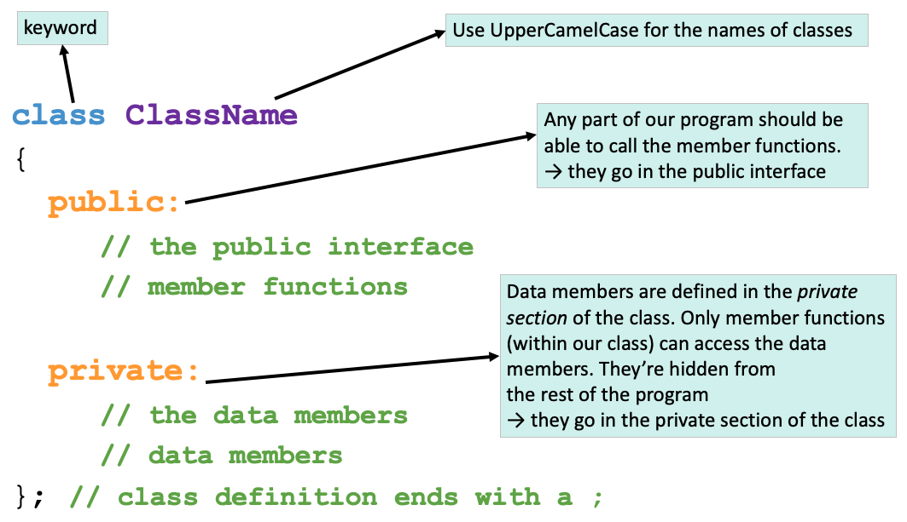

#### **CSCI 1300 CS1: Starting Computing: Homework 6**
#### **Hoenigman/Naidu/Park/Ramesh - Fall 2023**
#### **Due: Friday, November 10th by 5:00pm MST**

<br/>

# Table of contents

1. [Objectives](#objectives)
2. [Background](#background)
    1. [Structs](#structs)
    2. [Classes](#classes)
        1. [Class Name](#className)
        2. [Access Specifiers](#accessSpecifiers)
        3. [Data Members and Member Functions](#dataMembers)
        4. [Accessing Data Members](#accessingDataMembers)
        5. [Defining Member Functions](#definingMemberFuncs)
    3. [Header and Source Files](#headerAndSourceFiles)
        1. [Header File](#headerFiles)
        2. [Source File](#sourceFiles)
        3. [How to compile multiple .cpp and .h files](#howToCompile)
    4. [Reminders](#reminders)
3. [Questions](#questions)
    1. [Question 1](#question1)
    2. [Question 2](#question2)
    3. [Question 3](#question3)
    4. [Candy Land](#candyland)
    5. [Question 4](#question4)
    6. [Question 5](#question5)
    7. [Question 6](#question6)
    8. [Question 7](#question7)
4. [Deliverables](#deliverables)
    1. [File Header](#fileheader)
    2. [Checklist](#checklist)
    3. [Grading Rubric](#grading)

# Objectives <a name="objectives"></a>
1. Learn how to work with structs, classes, and file I/O.

# Background <a name="background"></a>
## Structures <a name="structs"></a>

In C++, we can define a **structure** using the keyword `struct` like so:

```cpp
struct State
{
    string name;
    int area;
};                   // <-- semicolon after struct definition
```

This defines a new type, `State`, that you can use for declaring variables, e.g.

```cpp
//create a State variable with no name or area
State empty_state;

//create a State variable with a name and area
State colorado{"Colorado", 104094};
```

The variables `empty_state` and `colorado` both have two named attributes, called **members** - `name` and `area`. We can access each member using dot notation, e.g.

```cpp
//set members for empty_state
empty_state.name = "Texas";
empty_state.area = 268596;

//get members for colorado
cout << colorado.name << " has an area of " << colorado.area << " square miles." << endl;
```

Expected output:
```
Colorado has an area of 104094 square miles.
```

If we want to compare two structs, we cannot do so directly. Instead, we must compare each data member individually to see if they match, e.g.

```cpp
//compare each data member one by one
if(colorado.name == empty_state.name && colorado.area == empty_state.area)
{
    cout << "These are the same state!" << endl;
}
else
{
    cout << "These are not the same state!" << endl;
}
```

Expected output:
```
These are not the same state!
```

## Classes <a name="classes"></a>
When writing complex programs, sometimes the built-in data types (such as `int`, `char`, `string`)
don’t offer developers enough functionality or flexibility to solve their problems.
A solution is for the developer to create their own custom data types called classes.
Classes are user-defined data types which hold their own data members and member functions. These data members and member functions can be accessed and used by creating an instance of that class. The instance of classes are called objects. Essentially, a class acts as a blueprint for each type of object where each class can be customized to the programmer's need.

String, for example, is a class in C++ which holds data (the characters comprising the string) and supports useful member functions like `substr` which operate on this data.

Below is an example of the basic definition of a class in C++.



Let’s break down the main components of this diagram:

### Class Name <a name="className"></a>
A class is defined in C++ using the keyword `class` followed by the name of the class.
The body of the class is defined inside the curly braces and terminated by a semicolon at the end.
This class name will be how you reference any _variables_ or _objects_ you create of that type.
For example:
`ClassName objectName;`

The above line would create a new **object** (variable) with name `objectName` and of type `ClassName`,
and this object would have all the properties that you have defined within the class ClassName.

### Access Specifiers <a name="accessSpecifiers"></a>
Access specifiers in a class are used to set the accessibility of the class members.
That is, they restrict access by outside functions to the class members.

Consider the following analogy:

Imagine an intelligence agency like the CIA, that has 10 senior members.
Such an organization holds various sorts of information, and needs some way of determining who has access to any given piece of information.
Some information concerning classified or dangerous operations may only be accessible to the 10 senior members of the agency, and not directly accessible by any other person.
This data would be **private**.

In a class, like in our intelligence agency, these **private** data members are only accessible by a class's member functions and not directly accessible by any object or function outside the class.

Some other information may be available to anyone who wants to know about it.
This is **public** data.
Even people outside the CIA can know about it, and the agency might release this information through press releases or other means.
In terms of our class, this **public** data can be accessed by any member function of the class, as well as outside functions and objects, even other classes. The public members of a class can be accessed from anywhere in the program using the direct member access operator (**.**) with the object of that class.

### Data Members and Member Functions <a name="dataMembers"></a>
Data members are the data variables and member functions are the functions used to manipulate these variables; together, data members and member functions define the properties and behavior of the objects in a Class.

The data members declared in any class definition can be fundamental data types (like `int`, `char`, `float`, etc.), arrays, or even other classes.

For example, for string objects, the data member is a `char array[]` that holds all of the individual letters of your string.
Some of a string’s member functions that we have used already are functions like `.substr()` and `.length()`.

### Accessing Data Members <a name="accessingDataMembers"></a>
Keeping with our intelligence agency example, the code below defines a class that holds information for any general agency.
In the `main` function, we then create a new `IntelligenceAgency` object called `CIA`, and we set its `_organization_name` to “CIA” by using the access operator (.) and the corresponding data member’s name.
However, we cannot access the `_classified_intelligence` data member in the same way.
Not everyone has access to that private data.

Instead, we need to use a member function of the IntelligenceAgency class, `getClassifiedIntelligence()`, in order to see that information.
This allows us to control the release of private information by our IntelligenceAgency.

Additionally, the main function includes four different ways of creating objects with descriptions in the comments next to it.

```c++
class IntelligenceAgency
{
    public:
        IntelligenceAgency();         // Default constructor
        IntelligenceAgency(string classified_intelligence); // Parameterized constructor  
        string _organization_name;
        string getClassifiedIntelligence();
        void setClassifiedIntelligence(string classified_intelligence);

    private:
        string _classified_intelligence;
};

int main()
{
    IntelligenceAgency CIA;
    CIA._organization_name = "CIA";
    cout << CIA._classified_intelligence; // gives an error
    cout << CIA.getClassifiedIntelligence();

    // four types of constructor calls
    IntelligenceAgency abc; // creating an IntelligenceAgency object with the default constructor
    IntelligenceAgency xyz = IntelligenceAgency(); // creating an IntelligenceAgency object with the default constructor
    IntelligenceAgency pqr("PQR"); // creating an IntelligenceAgency object with a paramaterized constructor
    IntelligenceAgency rst = IntelligenceAgency("RST"); // creating an IntelligenceAgency object with a paramaterized constructor
}

```

### Defining Member Functions <a name="definingMemberFuncs"></a>
You may have noticed that we declared various member functions in our class definition,
but we did not specify how they will work when called.
The body of the function still needs to be written.
The solution is to define a function, such as `getClassifiedIntelligence()`, corresponding to our class’s functions.
But how does our program know that these functions are the same as the ones we declared in our class?
You as the developer need to explicitly tell the computer that these functions you are defining are the same ones you declared earlier.

```c++
IntelligenceAgency::IntelligenceAgency()
{
    _classified_intelligence = " ";
}         
IntelligenceAgency::IntelligenceAgency(string classified_intelligence)
{
    _classified_intelligence = classified_intelligence;
}
string IntelligenceAgency::getClassifiedIntelligence() const
{
    return _classified_intelligence;
}
void IntelligenceAgency::setClassifiedIntelligence(string classified_intelligence)
{
    _classified_intelligence = classified_intelligence;
}
```

We start the definition as we do any function, with the return type.
Then, we have to add a specifier `IntelligenceAgency::` that lets our program know that this function and the one we declared inside the class are the same.
We can see that this function returns the class’ `classified_intelligence` to the user.

Functions like `getClassifiedIntelligence()` are called **accessor/getter functions**.
This is because they retrieve or ‘get’ the private data members of a class object and return it to the program so that these values may be used elsewhere.

The second function, `setClassifiedIntelligence(string classified_intelligence)`, is called a **mutator/setter function**.
These allow functions from other parts of our program to modify or ‘set’ the private data members of our class objects.
Getters and setters are the functions that our program uses to interact with the private data members of our class objects.

## Header and Source Files <a name="headerAndSourceFiles"></a>
Creating our own classes with various data members and functions increases the complexity of our program.
As our programs become more complex and includes many functionality, keeping all our code in a single cpp file makes our code difficult to maintain. Therefore, we split our code into multiple files where each file contains only one part of functionality of the program.
To do this, we split our code into 2 types of files called header and source files. The header files mostly include the definition of classes and function prototypes. The source files include the implementation or body of classes and functions.

### Header file <a name="headerFiles"></a>
Header files have `.h` as their filename extensions.
In a header file, we declare one or more of the complex structures (classes) we want to develop.
In a class, we define member functions and member attributes. These functions and attributes are the building blocks of the class.

**Example file 0:** ClassName.h
```c++
#ifndef CLASSNAME_H
#define CLASSNAME_H
#include <iostream>
using namespace std;
class ClassName
{
    public:
    .
    .
    .
    private:
    .
    .
    .
};
#endif
```

**Example file 1:** IntelligenceAgency.h
```c++
#ifndef INTELLIGENCE_AGENCY_H
#define INTELLIGENCE_AGENCY_H
#include <iostream>
using namespace std;
class IntelligenceAgency
{
    public:
        IntelligenceAgency();         // Default constructor
        IntelligenceAgency(string classified_intelligence); // Parameterized constructor  
        string _organization_name;
        string getClassifiedIntelligence() const;
        void setClassifiedIntelligence(string classified_intelligence);

    private:
        string _classified_intelligence;
};
#endif
```

### Source file <a name="sourceFiles"></a>
Source files are recognizable by the `.cpp` extension.
In a source file, we implement the class defined in the header file.
Since we are splitting the development of actual code for the class into a definition (header file) and an implementation (source file),
we need to link the two somehow.

```c++
//IntelligenceAgency Example
#include "IntelligenceAgency.h"
```
OR
```c++
//General Example
#include "ClassName.h"
```
In the source file, we will include the header file that defines the class so that the source file is “aware” of where we can retrieve the definition of the class.
We must define the class definition in every source that wants to use our user defined data type (our class).
When implementing each member function, our source files must tell the compiler that these functions are actually the methods defined in our class definition using the syntax that we showed earlier.

### How to compile multiple .cpp and .h files <a name="howToCompile"></a>
In some homeworks and project, it will be necessary to write multiple files (.h and .cpp) and test them before submitting them.
You need to compile and execute your code using the command line.
Make sure that you start by changing directories so that you are in the folder where your solution’s files are stored.
In this example, our folder will be called `homework_x`. To change to this directory, use:

```
cd homework_x/
```

**When compiling from the command line, you need to specify every .cpp file in your project.**
This means that when you call the g++ compiler, you need to explicitly name the files you’re compiling:

```
g++ -Wall -Werror -Wpedantic -std=c++17 file1.cpp file2.cpp main.cpp
```

The compiling command results in the creation of an executable file. **Note that header files (`.h`) are NOT included in compilation commands.**
If you did not specify a name for this executable, it will be named `a.out` by default.
To execute this file, use the command:

```
./a.out
```

You can add the `-o` flag to your compiling command to give the output file a name:

```
g++ -Wall -Werror -Wpedantic -std=c++17 -o myName.out -std=c++17 file1.cpp file2.cpp main.cpp
```

And then run the file with
```
./myName.out
```

## Reminders <a name="reminders"></a>
Here is a collection of useful things:

- Reading from and writing to files
    ```cpp
    //Remember to include this library!
    #include <fstream>

    int main()
    {
        ifstream infile; //declare an input file stream
        infile.open("path_to_file"); //open a file for reading
        infile.is_open(); //returns true if file was opened successfully
        //we can use getline, >>, etc to get data from this stream

        ofstream outfile; //declare an output file stream
        outfile.open("path_to_write"); //open a file for writing
        outfile << "sending sample data to the output stream";
        outfile.close(); //close the file
    }
    ```
- Arrays
    - Declare arrays like so: ```int integer_array[SIZE_OF_ARRAY] = {}```
    - ```{}``` syntax initializes all values to zero, can also specify values 
    - Can declare arrays of any data type, including structs and classes!
- Vectors
    - Remember to include ```<vector>```!
    - Similar to arrays, can store multiple elements of the same data type
    - Use ```.at(index)``` for extra safety checks!
    - Other useful vector functions:
        - ```.push_back()``` adds an element to the end of the vector
        - ```.pop_back()``` removes the last element of the vector
        - ```.size()``` get the size of the vector
- Setting decimal points in cout (remember to include ```<iomanip>```!):

    ```cout << fixed << setprecision(number_of_decimal_points) << floating point value << endl```

    As an example, try running this program to see the difference:
    ```cpp
    #include <iostream>
    #include <iomanip>
    using namespace std;

    int main()
    {
        cout << 7.0/13.0 << endl;
        cout << fixed << setprecision(2) << 7.0/13.0 << endl;
        return 0;
    }
    ```
- Code compilation with g++: <br>
    ```g++ -Wall -Werror -Wpedantic -std=c++17 name_of_source_file.cpp```
- Using the ```-o``` option provided by g++ to name your executable [OPTIONAL]: <br>
    ```g++ -Wall -Werror -Wpedantic -std=c++17 name_of_source_file.cpp -o nameOfExecutable```
- Good coding style: <br>
    - Name variables well, for example: ```double d = 42.0167``` is confusing, whereas ```double height_of_rectangle = 42.0167``` is clearer about what the variable represents
    - Name functions well, for example: ```int Func(int x);``` is confusing, whereas ```int calculateSquare(int x);``` is clearer about what the function does
    - Variables should be named using snake-case, where_all_words are all lowercase and separated by underscores: this_is_snake_case.
    - Functions should be named using camel-case, where all words except the first start with an uppercase letter, and there are no separators: thisIsCamelCase.
    - Indent things properly! If-else blocks should be well-spaced and indented, function blocks as well, etc. Use tab to increase indent, and shift+tab to decrease indent. Here is an example: <br>
    ```cpp
    void function(void){
    if(condition) {
    <code>}else{
    <code>}return;}
    ```
    The above is very confusing and hard to understand, simply adding space and indents really helps:
    ```cpp
    void function(void)
    {
        if (condition)
        {
            <code>
        }
        else
        {
            <code>
        }
        return;
    }
    ```
    - Remember to comment your code! Comment lines start with ```//```
    - Good places to put comments include (but are not limited to!): next to function prototypes, next to variable declarations, and next to important lines, such as numerical calculations, etc.
    - These conventions will make your code easier to read and understand

# Questions <a name="questions"></a>

**Warning: you are not allowed to use global variables, pointers and references for this homework.** <br><br>
**If you are suspected of using an outside source to complete homework, you may be called for an in-person interview, and could risk losing points for the assignment.** <br><br>
**For questions which require structs and/or classes, be sure to match names EXACTLY to the instructions. If functions are asked for, DO NOT WRITE ALL YOUR CODE IN ```main()```! Your code will NOT compile in Coderunner if you do not have the correct struct/class name, see below for an example of what this could look like:** <br>


## Question 1 (5 points): A Simple Struct <a name="question1"></a>
You are the manager of a popular doggy daycare and need a program to keep track of all the dogs' favorite toys. 

Create a structure named `Dog` with the following attributes to help you acheive this goal. 

```cpp
struct Dog
```
| **Member Type** | **Member Name** | **Description** |
|-----------------|-----------------|-----------------|
| ```string```    | ```name```      | Dog's name      |
| ```int```       | ```age```       | Dog's age       |
| ```string```    | ```favorite_toy```| Name of favorite toy|

The main function should create two instances of the ```Dog``` structure to contain the information of 2 dogs. The first dog is named ```spot``` which is 5 years old and likes playing with a ```tennis ball```. The second dog's name is ```lassie``` which is 3 years old and likes playing with a ```frisbee```. Your main function should print out all members of each instance of the struct on two lines, as demonstrated below.<br>

```Name: spot. Age: 5. Favorite Toy: tennis ball.```<br>
```Name: lassie. Age 3. Favorite Toy: frisbee.```

**Sample run:**<br>


When you are happy with your solution head over to Coderunner on Canvas and paste your entire program including ```main()```.

Please make sure to add file header in your program before you turn your code into Coderunner. Refer [File Header](#fileheader) for instructions.
**DO NOT ADD EXTRA PRINT STATEMENTS!**

## Question 2 (10 points): Planet Class <a name="question2"></a>
Create a class `Planet` with separate header(Planet.h) and implementation(Planet.cpp) and a driver(PlanetDriver.cpp).
The driver will contain your main function.
The Planet class will comprised of the following attributes.

**Data members (private)**

| **Member Type** | **Member Name** | **Description** |
|-----------------|-----------------|-----------------|
| ```string```    | ```_planet_name```      | Name of the planet      |
| ```double```       | ```_planet_radius```       | Radius of the planet      |

**Member Functions (public)**

| **Function** | **Description** |
|-----------------|-----------------|
|Default constructor|Creates a new instance of Planet with name as an empty string and planet radius as 0.0|
|Parameterized constructor|Creates a new instance of Planet with the name and radius as specified by the parameters. The data types for the parameters are string and double in this order|
|getName()|Returns planet name as a string|
|setName(string)|(void) Sets planet name to the value of the input string|
|getRadius()|Returns planet radius as a double|
|setRadius(double)|(void) Sets planet radius to the value of the input double|
|getVolume() |Calculates and returns the volume of the planet as a double  |

Develop and validate your solution on VS code and test it by writing a driver with a `main()`. Below we provide a few examples creating `Planet` objects and testing its member functions. 

Take note to match the function specifications exactly. When you are happy with your solution head over to Coderunner on Canvas and paste **ONLY** your code from the header(Planet.h) and implementation(Planet.cpp) for the ```Planet``` class.

Please make sure to add file header in your program before you turn your code into Coderunner. Refer [File Header](#fileheader) for instructions.

**Sample run 1: Default constructor with setters and getters:**<br>
```cpp
Planet Mars = Planet();
Mars.setName("Mars");
Mars.setRadius(3390);
```

**Desired output:**<br>


**Sample run 2: Parameterized constructor:**<br>
```cpp
Planet Mars = Planet("Mars", 3390);
```

**Desired output:**<br>


## Question 3 (5 points): Max Radius<a name="question3"></a>
Write a function, maxRadius, to find an index of a Planet with the largest radius in the array. The function specification is provided below.<br>
**Note:** Use the Planet class from Question 2 to create Planet objects

*Function Specifications*:
  * **Name**: maxRadius()
  * **Parameters (in this order)**:
    * ```Planet``` planet_array[]: Array containing Planet objects.
    * ```const int``` PLANET_ARRAY_SIZE: size of the Planet array.
  * **Return Type**: ```int```
    * Return the index of the Planet in the array with the largest radius.
    * Return the index of the first Planet that has the largest radius if multiple Planets in the array share the largest radius.
    * Return -1 if the array is empty.


Develop and validate your solution in VS code and test it by writing a main() with either assert calls or one that supports user input. Below we provide a few examples testing out a valid maxRadius() function. Note these input and output statements exist within main(). `maxRadius()` should not accept user input or display output.

Take note to match the function specifications exactly. When you are happy with your solution head over to Coderunner on Canvas and paste **ONLY** your code from the header(Planet.h), implementation(Planet.cpp) for the ```Planet``` class and the ```maxRadius()``` function.

Please make sure to add file header in your program before you turn your code into Coderunner. Refer [File Header](#fileheader) for instructions.

**Sample run 1: Single largest radius:**<br>
```cpp
Planet Mars = Planet("Mars", 3390);
Planet Earth = Planet("Earth",6378);
Planet planets[2] = {Earth, Mars};
```

**Desired output:**<br>


**Sample run 2: Tie for largest radius:**<br>
```cpp
Planet planets[4] = {Mars, Earth, Earth, Mars};
```

**Desired output:**<br>


## Questions 4 through 7: Candy Land<a name="candyland"></a>
The theme for the final project is the game of Candy Land. To prepare for the final project, you have decided to implement a minigame that can be used. In Candy Land, candy is a power-up or item that can be used to provide certain benefits for each player. Each player in Candy Land will have their own inventory of candies. This minigame of rock-paper-scissors will allow players to bet candy against each other and gain candy if they win. In this homework, you will develop the minigame of rock-paper-scissors, the player class and the candy structure.

## Question 4 (10 points): readCandy<a name="question4"></a>

Create a c++ program to read candy information from a file, store it in a vector and print it.

1. Create a `Candy` struct with the following attributes.

    | **Member Type** | **Member Name** | **Description** |
    |-----------------|-----------------|-----------------|
    | ```string```    | ```name```      | Name of candy   |
    | ```string```    | ```description```| Description of candy|
    | ```double```    | ```price```     | Price of candy|
    | ```string```      | ```candy_type```     | Type of candy|

2. Write a function named `readCandy()` that will fill a vector of Candy struct objects. 

    *Function Specifications*:
      * **Name**: readCandy()
      * **Parameters (in this order)**:
        * ```string``` file_name: the name of the file to be read.
        * ```vector<Candy>``` candies: vector of Candy objects.
      * **Return Type**: ```vector<Candy>```
        * Return the updated vector.
        * Return the original vector, print `Failed to open file` and exit if the file could not be opened.
      * Empty lines should not be added to the vector.
    
    The text files contain information about one type of candy per line, separated by the character ```|```. There may be multiple types of candy in a single file. Here is an example: <br>
    
    File Contents:<br>
    ```
    Fearsome Fudge|A delectably dangerous confectionary concoction! Causes fright!|4.37|Debuff
    Lucky Licorice|A subtly sweet licorice, known to bring good luck to the owner|3.15|Buff
    ...
    ```

3. Your `main()` should prompt the user to input a file name for candy information, process the file contents and populate a vector of Candy struct objects. Candy Information should be printed as shown below.
   * **Hint:** Create a helper function to print the arributes on a `Candy` object.

<br>

```cpp
Name: Fearsome Fudge. Description: A delectably dangerous confectionary concoction! Causes fright!. Price: 4.37. Type: Debuff
Name: Lucky Licorice. Description: A subtly sweet licorice, known to bring good luck to the owner. Price: 3.15. Type: Buff
```

If the file cannot be opened, your program should display:<br>
```Failed to open file```

The price for each candy should be rounded to 2 decimal places. You can assume there will be no duplicate candies in the source file. Sample files are available in the [data_files](./data_files) folder on GitHub.

When you are happy with your solution head over to Coderunner on Canvas and paste your entire program including ```main()```.

Please make sure to add file header in your program before you turn your code into Coderunner. Refer [File Header](#fileheader) for instructions.


**Sample run: Candy!**<br>

Input Files
  * [candy.txt](./data_files/candy.txt)

**Desired output:**<br>


## Question 5 (30 points): Player Class<a name="question5"></a>
In this question you will be creating a `Player` class. This class will be used in the creation of a high-stakes rock-paper-scissors game, candy will be on the line! 

The Player class will consist of several pieces of information about the player, including an array to store their candy. Additionally, the Player class has several helpful functions to make other programs easier. Details are as provided below.<br>
**Note:** Copy the Candy struct from question 4 into Player.h.

**Data Members (private)**

| **Member Type** | **Member Name** | **Description** |
|-----------------|-----------------|-----------------|
|```const static int```| ```_MAX_CANDY_AMOUNT```| The maximum number of candies the player can have in their inventory. Use the value of 4 for this homework|
|```int```        | ```_stamina```   | Current Energy  |
|```double```     | ```_gold```      | Value of the player's current money|
|```string```     | ```_effect```    | Name of current effect|
|```Candy[]```    | ```_inventory``` | Array to store the player's candy|
|```int```| ```_candy_amount```| Amount of initialized candy structs in the inventory array|


**Member Functions (public)**

| **Function** | **Description** |
|-----------------|-----------------|
|```Default constructor```| Creates a new instance of Player with _stamina, _gold and _candy_amount as zero, _effect as an empty string, and _inventory as an empty array. Empty inventory slots should contain candy structs with all members set to zero or empty. |
|```Paramaterized constructor```| Creates a new instance of Player with and sets the data members accordingly. See details below|
|```getCandyAmount()```| Returns the amount of candy the player has in their inventory.|
|```setStamina()```| Takes an integer as input, and sets stamina to the input value.|
|```getStamina()```| Returns the current value of stamina as an integer.|
|```setGold()```| Takes a double as input, and sets gold to the input value.|
|```getGold()```| Returns the current value of gold as a double.|
|```setEffect()```| Takes a string as input, and sets effect to the input value.|
|```getEffect()```| Returns the current value of effect as a string.|
|```printInventory()```| Prints out the player's current inventory.|
|```findCandy()```| Searches for a Candy in the Player's inventory.|
|```addCandy()```| Adds a Candy to the Player's inventory.|
|```removeCandy()```| Removes a Candy from the Player's inventory.|


**Implementation details**

1. Parameterized constructor  

   *Function Specifications*:
      * **Name**: Player
      * **Parameters (in this order)**:
        * ```int``` stamina
        * ```double``` gold
        * ```string``` effect
        * ```Candy[]``` candy_array
        * ```const int``` CANDY_ARR_SIZE: size of candy_array 
      * **Note**: If the input candy_array is larger than the inventory, populate _inventory with as many candies as possible.
      * **Note**: If the input candy_array contains empty candies, _candy_amount should not be incremented.
      * Empty inventory slots should contain candy structs with all members set to zero or empty. 
   

3. printInventory - Prints the Player's current inventory
  
    *Function Specifications*:
      * **Name**: printInventory
      * Accept no parameters
      * **Return Type**: `void`
      * **Output**: Display the Player's inventory in a 2x2 grid format as shown below: 

    ```cpp
    |[Fearsome Fudge]|[Empty]|
    |[Empty]|[Empty]|
    ```

4. findCandy - Searches for a Candy in the Player's inventory  

   *Function Specifications*:
      * **Name**: findCandy
      * **Parameters (in this order)**:
        * ```string``` candy_name: name of candy
      * **Return Type**: `Candy`
        * Return the first candy in _inventory with specified name if it was successfully found in the Player's inventory 
        * Return a blank Candy structure if the candy is not found in the Player's inventory 
      
6. addCandy - Adds a Candy to the Player's inventory  

   *Function Specifications*:
      * **Name**: addCandy
      * **Parameters (in this order)**:
        * ```Candy``` candy: Candy struct to be added to the Player's inventory
      * **Return Type**: `bool`
        * `true` if the candy was successfully added to the Player's inventory 
        * `false` otherwise, if the Player's inventory is full

8. removeCandy - Removes a Candy from the Player's inventory  

   *Function Specifications*:
      * **Name**: removeCandy
      * **Parameters (in this order)**:
        * ```string``` candy_name: name of candy 
      * **Return Type**: `bool`
        * `true` if the candy was successfully removed from the Player's inventory 
        * `false` otherwise, if the candy is not in the Player's inventory 
      * **Notes**:
        * Update the `_candy_amount` data member appropriately.
        * The candy name should be case **insensitive**, e.g. both "Fearsome Fudge" and "fearsome fudge" refer to the same candy.
        * Remove the first candy occurrence if there are multiple instances of the candy in the Player's inventory

Develop and validate your solution on VS code and test it by writing a driver with a `main()` with either assert calls or one that supports user input. Below we provide a few examples creating `Player` objects and testing its constrcutors and member functions. 

Take note to match the function specifications exactly. When you are happy with your solution head over to Coderunner on Canvas and paste **ONLY** your code from the header(Player.h) and implementation(Player.cpp) for the ```Player``` class.
**Note:** Copy the Candy struct from question 4 into Player.h.

#### Question 5 is tested across three questions in Coderunner with each question testing different member functions of the Player class. Paste the same code(Player.h and Player.cpp) for Question 5, 6 and 7 on Coderunner. 

Please make sure to add file header in your program before you turn your code into Coderunner. Refer [File Header](#fileheader) for instructions.


**Sample run 1: Default constructor with setters, getters, and addCandy():**<br>
```cpp
Player player = Player(); //Declare a Player
Candy test{"brown candy", "candy born from mud", 1.01, "Buff"};
Candy test2{"striped candy", "This candy dropped from the rainbow", 2.02, "Chance"};
//print stats before
player.setStamina(5);
player.setGold(100);
player.setEffect("Increased stamina");
player.addCandy(test);
player.addCandy(test2);
//print stats after
```

**Desired output:**<br>


**Sample run 2: Parameterized constructor and removeCandy():**<br>
```cpp
Candy test{"brown candy", "candy born from mud", 1.01, "Buff"};
Candy test2{"striped candy", "This candy dropped from the rainbow", 2.02, "Chance"};
Candy candy_array[3] = {test, test2, test2};
Player player = Player(5, 100, "Start of game", candy_array, 3);
//print stats before
player.removeCandy("test candy");
player.removeCandy("striped candy");
player.removeCandy("brown candy");
//print stats after
```

**Desired output:**<br>


**Sample run 3: Parameterized constructor with empty candies:**<br>
```cpp
Candy test{"brown candy", "candy born from mud", 1.01, "Buff"};
Candy test2{"striped candy", "This candy dropped from the rainbow", 2.02, "Chance"};
Candy candy_array[3] = {test, test2, test2};
Candy empty[4] = {{}};
Player player = Player(5, 100, "No candy!", empty, 4);
//print stats before
player.addCandy(candy_array[0]);
//print stats after
```

**Desired output:**<br>


## Question 6 (10 points): Rock Paper Scissors<a name="question6"></a>
Create a function simulating the game, rock-paper-scissors. 

Players can play rock-paper-scissors for a chance to win the other's candy! Before the game begins, each player has to select a type of candy to bet. After each player has made their bet, the function should ask each player to enter ```r```, ```p```, or ```s```. 

Rules for rock-paper-scissors:<br>

|**Player 1**|**Player 2**|**Winner**|
|------------|------------|----------|
|Rock        |Scissors    |Player 1 (Rock)|
|Scissors    |Paper       |Player 1 (Scissors)|
|Paper       |Rock        |Player 1 (Paper)|

If players select the same option, the game is a tie, and the function should re-prompt the players to select again. 

*Function Specifications*:
  * **Name**: playRockPaperScissors()
  * **Parameters (in this order)**:
    * ```Player``` players[2]: Array containing two Player class objects. 
  * **Return Type**: ```void```
  * **Output**:
    * Print ```Not enough candy!``` if either one of the players has no candy available to bet.
    * Print ```Invalid selection!``` if a player selects a type of candy to bet where they do not have available in their inventory.
    * Print ```Tie! Play again``` if the players tie.
    * Print ```Player [1 or 2] has won [candy name] from player [1 or 2]!``` if a player wins the game.  
    Example: ```Player 1 has won Fearsome Fudge from player 2!```
  * **Hint**: Use the findCandy() member function


Develop and validate your solution in VS code and test it by writing a main() with either assert calls or one that supports user input. Below we provide a few examples testing out a valid playRockPaperScissors() function.

Take note to match the function specifications exactly. When you are happy with your solution head over to Coderunner on Canvas and paste **ONLY** your code from the header(Player.h), implementation(Player.cpp) and the ```playRockPaperScissors()``` function.
**Note:** Copy the Candy struct from question 4 into Player.h.

Please make sure to add file header in your program before you turn your code into Coderunner. Refer [File Header](#fileheader) for instructions.

**Sample run 1: Player 1 Wins!**<br>


**Sample run 2: Player 2 Wins, after some ties:**<br>


**Sample run 3: Input Selection:**<br>


## Question 7 (20 points): Putting it all Together<a name="question7"></a>
For this question, you will be using tools from the previous 3 questions. You will be writing a program to initialize two players, and present the user with a menu for displaying and editing player attributes, reading candy files, and playing rock-paper-scissors:<br>

```cpp
Select from the following options:
1. Display player stats
2. Edit player stats
3. Play rock-paper-scissors
4. Read candy file
5. Exit
```

Displaying player stats should print out their stamina, gold, effect, and inventory. While stamina, gold, and effect are not used for this homework, they will be very useful for project 2! Options 1 and 2 should ask the user to select which player they wish to display/edit the stats of. Here are the sub-menus:<br>

Player Stat Display Prompt:<br>
```
Which player's stats do you want to display? Choose 1 or 2:
```

Example:<br>
```cpp
Player 1 stats:
Stamina: 0
Gold: 0
Effect: 
Inventory:
|[Empty]|[Empty]|
|[Empty]|[Empty]|
```

Player Stat Edit Prompt:<br>
```
Which player's stats do you want to edit? Choose 1 or 2:
```

Editing Menu:<br>
```
Editing player [1 or 2] stats:
1. Edit stamina
2. Edit gold
3. Edit effect
4. Add candy
5. Remove candy
```
Options 1-3 of this menu should allow the user(s) to input an appropriate value to be saved in the corresponding player class object. Stamina must be a value between 1 and 10. Gold must be a value between 0 and 1000. Effect can be any string. Option 4 should display a list of possible candies to add to the inventory. 

When you are happy with your solution head over to Coderunner on Canvas and paste your entire program including ```main()```, and all classes, functions, and structs required.

Please make sure to add file header in your program before you turn your code into Coderunner. Refer [File Header](#fileheader) for instructions.

**Sample run 1: A Simple Game**<br>


**Sample run 2: Invalid Setup**<br>


**Sample run 3: Editing stats**<br>


**Sample run 4: Adding candies**<br>


**Sample run 5: Removing candies**<br>


# Deliverables  <a name="deliverables"></a>

## File Headers <a name="fileheader"></a>

Before submitting your program on Coderunner, ensure that you include the below information at the top of your file
```cpp
// CSCI 1300 Fall 2023
// Author: FirstName LastName
// TA: TA Name
// Question #
```

Example
```cpp
// CSCI 1300 Fall 2023
// Author: John Smith
// TA: Nick
// Question 1
```

## Checklist <a name="checklist"></a>
Here is a checklist for submitting the assignment:
1. Develop pseudocode, code solutions and test all functions in VS Code.
2. Use your solutions to complete the **Homework 7 - Coderunner** assignment on Canvas (Modules → Week 10). Coderunner will be published on Friday, Nov 3rd.
3. Complete the Homework 7 Quiz. This will be published on Monday, Nov 6th.

## Grading Rubric <a name="grading"></a>
Note: Global variables, pointers and references are not permitted in this homework. The use of global variables, pointers and references will result in a 0 on the entire homework.

| **Criteria**                                | **Points** |
| ------------------------------------------- | ---------- |
| Question 1                                  | 5          |
| Question 2                                  | 10         |
| Question 3                                  | 5          |
| Question 4                                  | 10         |
| Question 5                                  | 30         |
| Question 6                                  | 10         |
| Question 7                                  | 20         |
| Homework 7 Quiz                             | 30         |
| Total                                       | 120        |
