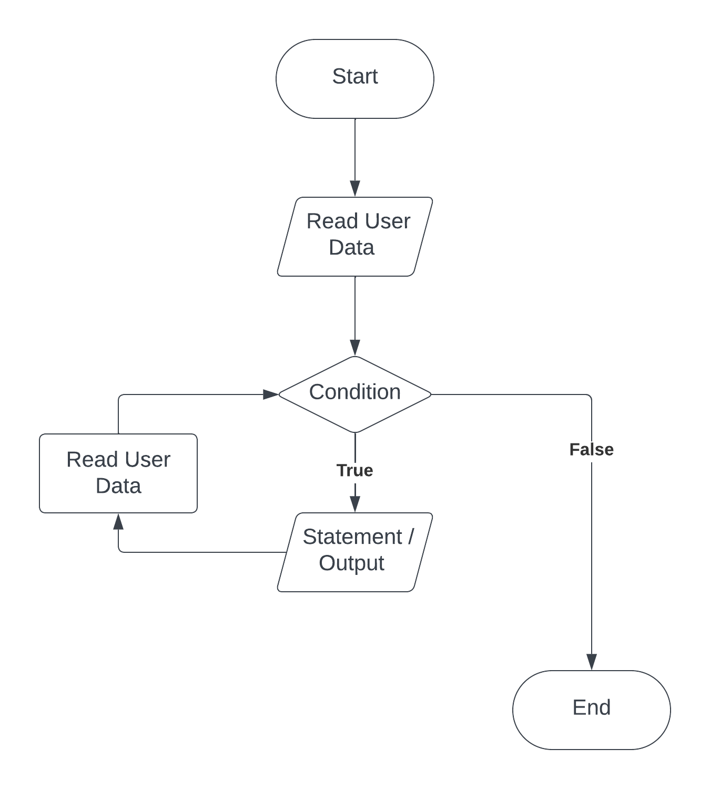

#### **CSCI 1300 CS1: Starting Computing: Midterm Guide**
#### **Hoenigman/Naidu/Park/Ramesh - Fall 2023**

# Table of contents
1. [Loops and Flowcharts](#loops)
	1. [While loops](#while)
	2. [Do while loops](#dowhile)
	2. [For loops](#for)
	3. [Flowchart](#flowchart)
2. [Arrays](#arrays)
	1. [Multidimensional Arrays](#2darrays)
	2. [Passing arrays to functions](#arraytofunc)
3. [Vectors](#vectors)
4. [File Input](#fileinput)
5. [String Streams](#stringstream)
6. [Testing](#tests)
7. [Pseudocode](#pseudocode)

## Loops <a name="loops"></a>
### 1.1 While Loops <a name="while"></a>

*Loops* allow us to run a section of code multiple times. They will repeat execution of a single statement or 
group of statements as long as a specified condition continues to be satisfied. If the condition is not true, 
then the statement will not be executed. 

*Syntax of a while loop*

```cpp
while (condition)
{
	//statement(s) to do something;
}
```
Here, `while` is a C++ reserved word, *condition* should be a Boolean expression that will evaluate to either **true** or **false**, and *statement(s) to do something* is a set of instructions enclosed by curly brackets. If the condition is **true**, then the specified statement(s) within the loop are executed. After running once, the Boolean expression is re-evaluated. If the condition is **true**, the specified statement(s) are executed again. This process of evaluation and execution is repeated until the condition becomes **false**.

**Example 1**

```cpp
int userChoice = 1;
while (userChoice != 0)
{
   cout << "Do you want to see the question again?" << endl; 
   cout << "Press 0 if no, any other number if yes." << endl;
   cin >> userChoice;
}
```

Entering 0 will terminate the loop, but any other number will cause the loop to execute again.  **Note how we must initialize the condition before the loop starts.** Setting `userChoice = 1` ensures that the while loop will run at least once.

**Example 2** <a name="whileExample2"></a>

```cpp
int i = 0; 
while (i < 5)
{
	cout << i << endl;
	i = i + 2;
}
```
Notice how you must manually initialize `i=0` and then manually increment `i` by 2. 
Inserting `cout` statements into your loops is a quick way to debug your code if something isn’t working, to make sure the loop is iterating over the values you want to be using. A common error is to forget to update `i` within the loop, causing it to run forever.

### 1.2 Do while loops <a name="dowhile"></a>
Similar to a while loop, a do while loop will repeat a block of code until the specified condition becomes false. The major difference between a while loop and a do while loop is that the boolean condition is evaluated at the end of the code block instead of the beginning. This means that the block of code in a do while loop is guaranteed to run at least once (which is not true for a standard while loop).

*Syntax of a do while loop*

```cpp
do {
	//code block that will be looped
} 
while (condition);
```

This do while loop will run the inner code block until the while loop condition becomes false. In this context, *condition* represents a boolean statement that must only be true or false. 

**Example 1**

```cpp
int userChoice;
do {
   cout << "Should the loop run again?" << endl; 
   cout << "Press 0 if no, any other number if yes." << endl;
   cin >> userChoice;
}
while (userChoice != 0);
```

The above program initializes an integer `userChoice`, and then enters the do while loop. Since the boolean condition has not been evaluated yet, we know that the do while will run at least once. We ask the user to enter a number, where an entry of 0 would terminate the do while loop. This user entry is saved to the variable `userChoice`, and then the condition `userChoice != 0` is evaluated. If this condition is true (meaning that userChoice is a number not equal to zero), the loop will continuie from the top of the code block. Otherwise, the program will end. 

**Example 2a**

```cpp
int number = 1;
do {
	cout << "The do while loop is running!" << endl;
}
while (number == 10)
```

Here is an example of a do while loop that is fundamentally different than a while loop. As we can see below in Example 2b, a regulat while loop would never execute the cout command. But since the do while loop evaluates the condition at the end, Example 2a would display `The do while loop is running!`, while Example 2b would not display anything.

**Example 2b**

```cpp
int number = 1;
while (number == 10) 
{
	cout << "The while loop is running!" << endl;
}
```

### 1.3 For loops <a name="for"></a>

Sometimes you know the exact number of iterations that a loop has to perform. In these cases a `for` loop comes into use. It has three elements: 
* *Initialization*: It must initialize a counter variable to a starting value. 
* *Condition*: If it is true, then the body of the loop is executed. If it is false, the body of the loop does not execute and jumps to the next statement(s) just after the loop.
* *Update*: Updates the counter variable during each iteration  

*Syntax of a for loop*
```cpp
for (initialization; condition; update)
{
	//statement(s) to do something;
}
```

**Example 1:**  
```cpp
for (int count = 0; count < 5; count++)
{
	cout << "hello" << endl;
}
```
Notice the following three parts of the `for` loop:
 * `count` is initialized to `0`, 
 * the test expression is `count < 5` 
 * `count++` to increment the count value by one

**Example 2:**
```cpp
for (int i = 0; i < 5; i = i + 2)
{
	cout << i << endl;
}
```
Notice that this example behaves in the same way as the [example 2](#whileExample2) in the `while` loop section above.  


### 1.4 Loop control

There are two additional keywords to understand in the context of loops. These can be used within any of the previous loop types.


1. ```break``` is a statement used to exit the loop prematurely. When break is encountered within a loop, the loop is immediately terminated, and the program continues with the code after the loop.

2. ```continue``` is a statement used to skip the remaining code inside the current iteration of the loop and move to the next iteration. It effectively jumps to the loop's condition-checking step, allowing you to skip some loop iterations while the loop continues running.

### 1.5 flowchart <a name="flowchart"></a>

A flowchart shows the structure of decisions and tasks required to solve a problem. Some of the basic flowchart elements are shown in the following table.


##### Example



The example above shows a program that takes in a user input, evaluates the user input inside a while loop, and outputs some statement. The evaluation and statement outputs will continue looping until the condition is false, which will then terminate the program. 


## Arrays <a name="arrays"></a>
An array is a data structure that can store primitive data types like `double`, `int`, `char`, `bool`, and `string`.
Arrays have both a `type` and a `size`.

**How to declare arrays**
```cpp
// data_type array_name[declared_size];
bool my_booleans[10];
string my_strings[15];
int my_ints[7];
```

**How to initialize arrays (method 1)**

```cpp
bool my_booleans[4] = {true, false, true, true};
```
If you do not declare the size inside the square brackets, the array size will be set to however many entries you provide on the right.
```cpp
bool my_booleans[] = {true, false, true}; // size = 3
```
Note: the size specified in the brackets needs to match the number of elements you wrote in the curly brackets.

*Example 1*

When the specified size is larger than the actual number of elements, the elements provided in the curly brackets will be the first several elements in the array, while the additional elements will be filled with default values. If it’s an integer/double array, the default values are zero, while if it’s a string array, the default values are empty strings.

```cpp
#include <iostream>
using namespace std;
int main()
{
    int int_array[5] = {1,2,3};
    for (int i = 0; i < 5; i ++)
    {
        cout << int_array[i] << “ ”;
    }
}
```

Output:
```
1 2 3 0 0
```

*Example 2*

When the specified size is smaller than the actual number of elements, there will be a compilation error.

```cpp
#include <iostream>
using namespace std;
int main()
{
    int int_array[3] = {1,2,3,4,5};
}
```

Output:
```
error: excess elements in array initializer
int int_array[3] = {1,2,3,4,5};
                         ^
1 error generated.
```

* **How to Initialize Arrays (Method 2)**
You can also initialize elements one by one using a for loop:
```cpp
int my_ints[10];
for (int i = 0; i < 10; i++)
{
    my_ints[i] = i;
}
//{0, 1, 2, 3, 4, 5, 6, 7, 8, 9}
```
* **How to Access Elements in an Array**
We have essentially already had practice with accessing elements in an array, as in C++, a string is an array of characters.
You can access elements in arrays using the same syntax you used for strings:
```cpp
string greetings[] = {"hello", "hi", "hey", "what’s up?"};
cout << greetings[3] << endl;
```
Output
```
what's up?
```

Arrays can be iterated in the same way we iterated over strings. Below, we are iterating through an array of strings:
```cpp
string greetings[] = {"hello", "hi", "hey", "what’s up?"};
int size = 4;
for (int i = 0; i < size; i++)
{
    cout << greetings[i] << endl;
}
```
Output:
```
hello
hi
hey
what's up?
```

## Multidimensional arrays <a name="2darrays"></a>
In C++, we can declare an array of arrays known as a multidimensional array. Multidimensional arrays store data in tabular form.
* **How to Declare Multidimensional arrays**
```cpp
// data_type array_name[dimension_1][dimension_2]....;
int my_ints[7][5];
bool my_booleans[10][15][12];
string my_strings[15][10];
```
* **How to Initialize Multidimensional arrays (Method 1)**
The 2D array, in this case, will be filled from left to right from top to bottom.
```cpp
int my_ints[2][2] = {{1, 2}, {3, 4}}
```
You can also initialize a 2D array by explicitly separating the rows as shown above.

* **How to Initialize Multidimensional  arrays  (Method 2)**
You can also initialize elements using nested loops:
```cpp
int my_ints[2][2];
for(int i=0; i < 2; i++)
{
    for(int j=0; j < 2; j++)
    {
        my_ints[i][j] = i + j;
    }
}
```
The above code will create the following 2D array {{0, 1}, {1, 2}}.

* **How to Access Elements in a Multidimensional array**

You can use  `my_ints[i][j]` to access the ith row and jth column of a 2D array

Multidimensional arrays can be iterated using nested loops as shown below:
```cpp
int my_ints[2][2] = {{0, 1}, {1, 2}};
int res = 0;
for(int i=0; i < 2; i++)
{
    for(int j=0; j < 2; j++)
    {
        res = res + my_ints[i][j];
    }
}
cout << “Result is “ << res;
```
Output:
```
Result is 4
```

## Passing arrays to functions <a name="arraytofunc"></a>
* **Passing By Value**
Up until now, when calling functions, we have always passed by value. When a parameter is passed in a function call, a new variable is declared and initialized to the value passed in the function call.

Observe that the variable `x` in main and variable `x` in addOne are separate variables in memory. When `addOne` is called with `x` on line 10, it is the value of `x` (i.e. 5) that is passed to the function. This value is used to initialize a new variable `x` that exists only in addOne's scope. Thus, the value of the variable `x` in main's scope remains unchanged even after the function `addOne` has been called.

```cpp
void addOne(int x)
{
    x = x + 1;
    cout << x << endl;
}

int main()
{
    int x = 5;
    cout << x << endl;
    addOne(x);
    cout << x << endl;
}
```

Output:
```
5
6
5
```

* **Passing By Reference**
Arrays, on the other hand, are passed by reference (to the original array’s location in the computer’s memory). So, when an array is passed as a parameter, the original array is used by the function.
Observe that there is only one array `X` in memory for the following example. When the function `addOne` is called on line 10, a reference to the original array `X` is passed to `addOne`. Because the array `X` is passed by reference, any modifications done to `X` in `addOne` are done to the original array. These modifications persist and are visible even after the flow of control has exited the function and we return to main.

```cpp
void addOne(int X[])
{
   X[0] = X[0] + 1;
   cout << X[0] << endl;
}
int main()
{
    int X[4] = {1, 5, 3, 2};
    cout << X[0] << endl;
    addOne(X);
    cout << X[0] << endl;
}
```

Output:
```
1
2
2
```

When we pass a one-dimensional array as an argument to a function, we also provide its length. For two-dimensional arrays, in addition to providing the length (or number of rows), we will also assume that we know the length of each of the subarrays (or the number of columns). A function taking a two-dimensional array with 10 columns as an argument might look something like this:
```cpp
void twoDimensionalFunction(int matrix[][10], int rows){ … }
```

## **Vectors** <a name="vectors"></a>

Let's start with something we already know about - Arrays.

To recap, an array is a contiguous series that holds a *fixed number of values* of the same datatype.

A vector is a template class that uses all of the syntax that we used with vanilla arrays, but adds functionality that relieves us of the burden of keeping track of memory allocation for the arrays. It also introduces a bunch of other features that make handling arrays much simpler.

First things first, we need to include the appropriate header files to use the vector class.
```cpp
#include <vector>
```
We can now move on to declaring a vector. This is the general format of any vector declaration:
```cpp
vector <datatype_here> name(size);
```
The *size* field is optional. Vectors are dynamically sized, so the size that you give them during initialization isn't permanent - they can be resized as necessary.

You can access elements of a vector in the same way you would access elements in an array, for example `my_array[4]`. Remember, indices begin from 0.

The C++ vector class comes with [several member functions](https://www.cplusplus.com/reference/vector/vector/vector/), but the following are the ones you will need to know:

* ```size()``` returns the size of a vector
* ```at()``` takes an integer parameter for the index and returns the value at that position. This is similar to [] syntax but will have bound checking to ensure the argument given is a valid index.


* ```push_back()``` takes in one parameter (the element to be added) and appends it to the end of the vector.
```cpp
vector<int> vector1; // initializes an empty vector
vector1.push_back(1); //Adds 1 to the end of the vector.
vector1.push_back(3); //Adds 3 to the end of the vector.
vector1.push_back(4); //Adds 4 to the end of the vector.
cout<< vector1.size(); //This will print the size of the vector - in this case, 3.
// vector1 looks like this: [1, 3, 4]
```


* ```pop_back()``` deletes the last element in the vector
```cpp
vector <int> vector1; // initializes an empty vector
vector1.push_back(1); //Adds 1 to the end of the vector.
vector1.push_back(3); //Adds 3 to the end of the vector.
vector1.push_back(4); //Adds 4 to the end of the vector.
vector1.pop_back(); //Removes the last element of the vector.
//vector1 looks like this: [1, 3]
```


## File Input <a name="fileinput"></a>
So far in class, we've been using the `iostream` standard library. This library has provided us with methods like `cin` and `cout`. `cin` is the method that reads from standard input (i.e. in the terminal via the keyboard) and `cout` is for writing to standard output.

In this background section, we'll cover file input, which will allow you to read information from a file. To do this, we'll need to include C++'s `fstream` library, which is short for "file stream".

**Reading Lines From A File**

**Step 1. Make a stream object.** <br/>
Create an object (a variable) of file stream type. If you want to open a file for reading only, then the `ifstream` object should be used (short for “input file stream”).

*Example*
```cpp
// create an input file stream object
ifstream file_input;
```

**Step 2. Open a file.** <br/>
 Once you have a file stream object, you need to open the file. To do this, use the `ifstream` object's `open()` method (function), which takes only one parameter: the file name as a string (surrounded by " " if the file name is given directly).

*Example*
```cpp
// open myTextFile.txt with the file stream object
file_input.open("myTextFile.txt");  
```

**Step 3. Checking for open files.** <br/>
It is always good practice to check if the file has been opened properly and take appropriate action if not. To check if a file was successfully opened, you may use the `fail()` **or** `is_open()` methods.

`fail()`: This method will return a boolean value `true` if the file fails to open and `false` otherwise.

*Example*
```cpp
if (file_input.fail()) // true when file fails to open
{
    cout << "Could not open file." << endl;
    return -1; // return to terminate the program; -1 to indicate that the program didn't function as expected
}
// do things with the file
```

`is_open()`: This method will return a boolean value `true` if the file has successfully opened and `false` otherwise.

*Example*
```cpp
if (file_input.is_open()) // true when file opens successfully
{
    // do things with the file
}
else
{
    cout << "Could not open file." << endl;        
}
```

**Step 4. Read lines from the file.** <br/>
In C++, getline and >> are two input methods used for reading data from streams, like files. Here are the key differences between them:

```getline(my_stream, my_string, my_deliminator)```:

* Always stores data into a string.
* Stores everything up until the specified my_deliminator character into your my_string variable.
* Moves the stream's cursor past the encountered delimiter.
* my_deliminator is an optional argument - leaving it off will default the deliminator to `'\n'`

```my_stream >> my_variable```

* Can store data into any type of variable (string, int, float, etc).
* Skips any leading whitespace characters (newline, tab, spaces).
* Stores everything up until the next whitespace or an invalid character for the variable type into your my_variable variable.
* Moves the stream's cursor to just past the last character stored (before the encountered whitespace or invalid character).
* Sets something called the failbit to true if it is not possible to store the data into the desired type. The failbit in C++ streams signals input/output failures, like data type mismatches. It's checked using `fail()`. 

#### getline vs >> examples:

*ex.txt*
```
hello there!
second
```

For all examples below we will start with this code which opens the `"ex.txt"` file and sets up some variables we can use.
```cpp
#include <fstream>
#include <iostream>

using namespace std;

int main()
{
    ifstream my_file_stream("ex.txt");
    string my_string;
    float my_float;
    int my_int;

    // Example reading code goes here
    __________________________
}
```

* example 1: only getline
```cpp
getline(my_file_stream, my_string); // my_string = "hello there!"
getline(my_file_stream, my_string); // my_string = "second"
```
* example 2: only >>
```cpp
my_file_stream >> my_string; // my_string = "hello"
my_file_stream >> my_string; // my_string = "there!"
my_file_stream >> my_string; // my_string = "second"
```
* example 3: both getline and >>
```cpp
my_file_stream >> my_string;        // my_string = "hello"
getline(my_file_stream, my_string); // my_string = " there!" (notice the leading space)
my_file_stream >> my_string;        // my_string = "second"
```
* example 4: another mixing getline and >>
```cpp
my_file_stream >> my_string;        // my_string = "hello"
my_file_stream >> my_string;        // my_string = "there!"
getline(my_file_stream, my_string); // my_string = ""
getline(my_file_stream, my_string); // my_string = "second"
```

Lets introduce a different example file

*ex2.txt*
```
1.2345hello
```

* example 5: using >> to a float
```cpp
my_file_stream >> my_float;  // my_float = 1.2345
my_file_stream >> my_string; // my_string = "hello"
```
* example 6: using >> to an int
```cpp
my_file_stream >> my_int;    // my_int = 1
my_file_stream >> my_float;  // my_float = 0.2345
my_file_stream >> my_string; // my_string = "hello"
```
* example 6: using >> to a data type that is not possible
```cpp
my_file_stream >> my_int;    // my_int = 1
my_file_stream >> my_int;    // This operation fails to set my_int because .2345 cannot be converted to an integer.
my_file_stream >> my_string; // This operation fails to do anything because the failbit on my_file_stream is set to true. You must call my_file_stream.clear() to clear the failbit.
```

Now we can cover a full example on reading from a file using a loop. In this example we will use `getline(file_input, line)`. However this strategy would work the extraction operator as well.

We can use `.eof()` which will tell us when we have readed the end-of-file. This method will return a boolean value `true` if all the data in the file was processed and `false` otherwise.

*Example*
```cpp
string line = "";
int line_idx = 0;
// read each line from the file
while (!file_input.eof()) // continue looping as long as there is data to be processed in the file
{
    // get the next line from the file and store it in 'line' variable
    getline(file_input, line);

    // print each line read from the file
    cout << line_idx << ": " << line << endl;

    // increment index(count of lines in the file)
    line_idx++;   
}
```

Something to note is that `getline(file_input, line)` is evaluated as true as long as an additional line has been successfully assigned to the variable line. Once no more lines can be read in, getline evaluates to false. So we can set up a while loop where the condition is instead the call to getline.

*Example*
```cpp
string line = "";
int line_idx = 0;
// read each line from the file
while (getline(file_input, line)) // continue looping as long as there is data to be processed in the file
{
    // print each line read from the file
    cout << line_idx << ": " << line << endl;

    // increment index(count of lines in the file)
    line_idx++;   
}
```

**Step 5. Closing a file.** <br/>
When you are finished processing your files, it is recommended to close all the opened files before the program is terminated. You can do this by using the `.close()` function on your file stream object.

*Example*
```cpp
// closing the file
file_input.close();
```

**Step 6. Putting it all together.** <br/>
If we put all the previous steps together, this is the final piece of code we get.

*Example*
```cpp
// create an input file stream object
ifstream file_input;

// open myTextFile.txt with the file stream object
file_input.open("myTextFile.txt");

// check if file opened successfully
if (file_input.fail())
{
    cout << "Could not open file." << endl;
    return -1;
}
else
{
    // do things with the file
    string line = "";
    int line_idx = 0;

    // read each line from the file
    while (!file_input.eof())
    {
        // gets line of text from file_input, stores it in line
        getline(file_input, line);

        // print each line read from the file
        cout << line_idx << ": " << line << endl;

        // increment index (count of lines in the file)
        line_idx++;   
    }
}

// closing the file
file_input.close();
```

## Stringstreams <a name="stringstream"></a>

String streams are C++ objects that allow you to read from and write to strings as if they were streams. This means that you can use the same operators and functions that you use with other streams (```iostream``` and ```fstream```), such as ```<<``` and ```>>```, to manipulate strings.

To use a string stream, you first need to create an instance of the stringstream class. You can then use the ```<<``` operator to write to the string stream and the ```>>``` operator to read from the string stream.


Below are two examples that show how to create string streams and assign the value "Hello World!" to them.

#### Example 1 - Assign "Hello World!" to stringstream

```cpp
#include <iostream>
#include <sstream>
using namespace std;

int main()
{
    stringstream ss("Hello World!");    
    return 0;
}
```

#### Example 2 - Assign "Hello World!" to stringstream

```cpp
#include <iostream>
#include <sstream>
using namespace std;

int main()
{
    stringstream ss;
    ss << "Hello World!";  
    return 0;
}
```

Once a string stream has been initialized, we can use the ```>>``` to read the contents of it word by word. Please note that ```>>``` is splitting based on space.

#### Example - Read contents of stringstream word by word

```cpp
#include <iostream>
#include <string>
#include <sstream>
using namespace std;

int main()
{
    stringstream ss("Hello World!");    
    string word;
    while(ss >> word) {
        cout << word << endl;
    }
    return 0;
}
```

*Output*

```
Hello
World!
```


### getline with Stringstream

Since ```>>``` breaks on spaces and sometimes we may need to split based on other delimiters, we can use ```getline()``` to achieve it. In the previous programs, the syntax has been ```getline(cin, <variable_name>)``` or ```getline(file_stream, <variable_name>)```; however, when using ```getline()``` with the stringstream, there is another argument that is passed in, the delimiter. If we do not specify the third argument, the default value will be ```\n```, which is why getline() will read each line.

To specify the delimiter, we will add a third argument of type ```char``` (surrounded by \'\'). Below is an example of using comma as the delimiter.
#### Example - getline() with comma as the delimiter
```cpp
#include <iostream>
#include <sstream>
using namespace std;

int main()
{
    string line = "John,40";
    string name, age;
    stringstream ss(line);
    getline(ss, name, ',');
    getline(ss, age);  // the delimiter is set to \n by default
    cout << name << endl;
    cout << age << endl;
}
```

*Output*
```
John
40
```

When using getline and stringstreams, the variables that are parsed will be string, which cannot be used for comparison. This is when we can use ```stoi()``` or ```stod()``` to cast string into int or double, respectively.

Below is an example of the modified program from above, where we can compare the age.
```cpp
#include <iostream>
#include <sstream>

using namespace std;

int main()
{
    string line = "John,40";
    string name, age;
    stringstream ss(line);
    getline(ss, name, ',');
    getline(ss, age);
    int age_num = stoi(age);
    if(age_num >= 18){
        cout << name << " is an adult" << endl;
    } else{
        cout << name << " is still a minor" << endl;
    }
}
```

*Output*
```
John is an adult
```

#### Example - getline(), splitting on defined delimiter

```cpp
#include <iostream>
#include <sstream>
using namespace std;

int main()
{
    string line = "a,b,c,d,e";
    string word;
    stringstream ss(line);
    while(getline(ss, word, ',')){
        cout << word << endl;
    }
}
```

Here we are using our while loop to navigate our stringstream, setting `word` to every line in the stream after we split by the comma.

*Output*

```
a
b
c
d
e
```

### Reusing stringstreams

Depending on how you split using stringstream, reusing the same stringstream could create issues. Therefore to check on the status of stringstream by using ```fail()``` , reset the stringstream with ```clear()``` and reset the string with ```str("")```.

```cpp
#include <iostream>
#include <fstream>
#include <sstream>

using namespace std;

int main()
{
    stringstream ss("this is a test\n");
    string temp;
    while(ss >> temp){
        cout << temp << endl;
    }
    // checks on the status of ss
    if(ss.fail()){
        ss.clear();
        ss.str("");
    }
    
    ss.str("this is the second test\n");

    while(ss >> temp){
        cout << temp << endl;
    }
    return 0;

}
```

## Testing functions <a name="tests"></a>

Every C++ program you write should include a main function that tests the function you wrote.
There will be 3 different types of test cases you are expected to write depending on the return type of the function.
Listed below is how we expect you to test different types of functions. The process will be different
if you are testing a `void` function, a non-void function that return an `int` or `bool`, or a non-void function
that returns a `double`.

#### 1. Void Functions with printed output <a name="void"></a>

For **void** functions that have printed output (i.e. functions that use `cout` to print to the terminal), call the testing function in the main function. Your tests should include the expected output in comments.

See the sample code below:
```c++
void checkDiscount(double discount) 
{
    if (discount >= 50) 
    {
        cout << "Great discount!" << endl;
    } 
    else 
    {
        cout << "Not a great discount." << endl;
    }
    return;
}
int main() 
{
    // test 1 for checkDiscount
    // expected output: "Great discount!"
    checkDiscount(82.7);

    // test 2 for checkDiscount
    // expected output: "Not a great discount."
    checkDiscount(22);

    return 0;
}
```


<br>


#### 2. Non-Void Functions returning bool or int <a name="non-void-bool-int"></a>

For functions that return a **bool, char or int**, use **assert statements** 
from the **cassert** library (`#include <cassert>`) with a conditional expression.

Assert statements contain a conditional expression which will evaluate to `true` if the function's actual output matches what's expected. If the conditional expression evaluates to `false`, then your program will stop running after printing an error message.

For the purpose of this project, functions that return a `bool`, `char` or `int` can be compared to a specific value using the equality operator `==`.

Your test will look something like this:

`assert(<function call> == <value to compare to>);`

* `<function call>` is where you will call the function you want to test with its function parameters.
* `<value to compare to>` is the value you expect the function to return.
* `==` is the equality operator, and it compares the equality of both sides of itself.

See the sample code below:
```c++
#include <iostream>
#include <cassert>
using namespace std;

int addInts(int num1, int num2)
{
    // add num1 and num2 before returning
    return num1 + num2;
}

// isDrivingAge() returns true if the given age passed as a parameter
// is greater than or equal to 16, otherwise it returns false.
bool isDrivingAge(int age)
{
    return age >= 16;
}

int main()
{
    // test 1 for addInts
    assert(addInts(5, 6) == 11);

    // test 2 for addInts
    assert(addInts(10, 10) == 20);

    // test 3 for drivingAge
    assert(isDrivingAge(17) == true);

    // test 4 for drivingAge
    assert(isDrivingAge(14) == false);
}
```
_* For the purpose of this test code snippet, algorithm comments were not included, but they are still expected in your C++ files._

<br>


#### 3. Non-Void Functions returning double <a name="non-void-double"></a>

For functions that return a **double**, you should use an **assert statement** from the **cassert** header (`#include <cassert>`) with a conditional expression like above. The difference is that you will also need to include the following function in your program:
```c++
/**
 * doublesEqual will test if two doubles are equal to each other within two decimal places.
 */
bool doublesEqual(double a, double b, const double epsilon = 1e-2)
{
    double c = a - b;
    return c < epsilon && -c < epsilon;
}
```
Because the `double` type holds so much precision, it will be hard to compare the equality of a function that returns a 
double with another double value. To overcome this challenge, we can compare `double` values within a certain range 
of precision or decimal places. The function above compares the equality of two variables `a` and `b` up to two decimal places, and returns `true` if the values of `a` and `b` are equal with each other up to two decimal places.

You will be expected to use this function in conjunction with `assert` statements to test functions that return 
the type double.

Your test will look something like this: 

`assert(doublesEqual(<function call>, <value to compare to>));`

 * `<function call>` is where you will call the function you want to test with its function parameters 
 * `<value to compare to>` is the `double` value you expect the function to return.


See the sample code below:
```c++
#include <iostream>
#include <cassert>
using namespace std;
/**
 * doublesEqual will test if two doubles are equal to each other within two decimal places.
 */
bool doublesEqual(double a, double b, const double epsilon = 1e-2)
{
    double c = a - b;
    return c < epsilon && -c < epsilon;
}
/**
 * reciprocal returns the value of 1 divided by the number passed into the function.
 */
double reciprocal(int num)
{
    return 1.0 / num;
}
int main()
{
    // test 1 for reciprocal
    assert(doublesEqual(reciprocal(6), 0.16));
    // test 2 for reciprocal
    assert(doublesEqual(reciprocal(12), 0.083));
}
```
For test 1, `reciprocal(6)` is being called, and we expect the function to return the value `0.16`.
The return value of `reciprocal(6)` and `0.16` is passed in as parameters to the `doublesEquals` function,
which will then return `true` if these two values are equal or `false` if they are not.

_* For the purpose of this test code snippet, algorithm comments were not included, but they are still expected in your C++ files._
<br>


#### 4. Functions manipulating arrays <a name="test-function-array"></a>

Functions which manipulate arrays passed as arguments can be tested by asserting on individual elements of the array after calling the function. This works even for `void` functions because arrays are passed by reference; even if the function doesn't return anything, the array in the function is the same array in memory as the one outside the scope of your function.

Note that if the array is an array of `double`, the `doublesEqual` function described [here](#non-void-double) should be used to assert on individual array elements.

See the sample code below:
```cpp
#include<iostream>
#include<cassert>
using namespace std;

/**
 * Add one to each element of the array.
 */
void addOneToArrayElements(int arr[], int size) 
{
    for (int i = 0; i < size; i++) 
    {
        arr[i] = arr[i] + 1;
    }
}

int main() {
    // test 1 for addOneToArrayElements
    int test1_arr[3] = {1, 2, 3};
    addOneToArrayElements(test1Arr, 3);
    assert(test1_arr[0] == 2);
    assert(test1_arr[1] == 3);
    assert(test1_arr[2] == 4);

    // test 2 for addOneToArrayElements
    int test2_arr[3] = {8, 10};
    addOneToArrayElements(test2Arr, 2);
    assert(test2_arr[0] == 9);
    assert(test2_arr[1] == 11);
}
```
_* For the purpose of this test code snippet, algorithm comments were not included, but they are still expected in your C++ files._

<br>

## Pseudocode <a name="pseudocode"></a>

Pseudocode is used to develop algorithms. An algorithm is a procedure for solving a problem.

An algorithm describes actions to be executed and the order in which those actions are to be executed. In other words, an algorithm is merely the sequence of steps taken to solve a problem; like a recipe. An algorithm is not computer code. Algorithms are just the instructions which provide a clear path for you to write the computer code.

An algorithm for adding two numbers together:

```
Step 1: Start
Step 2: Declare variables num1, num2, and sum.
Step 3: Read values num1 and num2.
Step 4: Add num1 and num2 and assign the result to sum.
Step 5: Display sum
Step 6: Stop
```

The main difference between an algorithm and pseudocode is that an algorithm is a step by step procedure to solve a given problem while pseudocode is a method of writing an algorithm.

| **Algorithm**                                           | **Pseudocode**                                                                                          |
| ------------------------------------------------------- | ------------------------------------------------------------------------------------------------------- |
| An unambiguous specification of how to solve a problem. | An informal high-level description of the operating principle of a computer program or other algorithm. |
| Helps to simplify and understand the problem.           | A method of developing an algorithm.                                                                    |

Pseudocode is informal language that helps programmers develop algorithms (or recipes). Although there are no hard and fast rules for pseudocode, there are some suggestions to help make pseudocode more understandable and easy to read.

For instance, consider indenting all statements showing a “dependency”, like statements that use: While, do, for, if.


## Common Action Keywords for Pseudocode
Several keywords are often used to indicate common input, output, and processing operations.
```
Input:		READ, OBTAIN, GET
Output:		PRINT, DISPLAY, SHOW
Compute:		COMPUTE, CALCULATE, DETERMINE
Initialize:		SET, INITIALIZE
Add one:		INCREMENT, BUMP
```


## Some Keywords:
```
For looping and selection, The keywords that you might consider writing include:
Do While...
Do Until...
Case...
If… then...
Call ... with (parameters)
Call
Return ....
Return
When
Try to indicate the end of loops and iteration by using scope terminators.
For instance use if… (statements) ... endif.
```

As verbs, consider using the words:
```
Generate, Compute, Process, set, reset, increment, compute, calculate, add, sum, multiply, subtract, divide, print, display, input, output, edit, test, etc.
```

Be sure to indent if the indentation fosters understanding.
Being clear is the purpose of pseudocode, and a very desirable goal to strive for.


## Example 1.
Pseudocode:
```
If students grade is higher than or equal to 60
	Then Print, “Passed”
else
	Print, “Failed”
```

The above pseudocode would be used to develop the following C++ code.
C++ Source Code:
```cpp
if(grade > 60 || grade == 60)
{
	cout << “Passed” << endl;
}
else
{
	cout << “Failed” << endl;
}
```


## Example 2.
Pseudocode:
```
Set total to zero
initialize and type variables

While grade counter is less than or equal to ten
	Input the next grade score
	Add the grade score into the total
Set the class average to the total divided by ten

Print the class average.
```

C++ Source Code:
```cpp
double total = 0;
double grade = 1;
double score = 0;

while(grade <= 10)
{
    cout << “Enter a score: ”;
    cin >> score;
    cout << endl;
    total = total + score;
    grade++;
}

double average;
average = total / 10;
cout  << average;
```


## Example 3.
Pseudocode:
```
Initialize total to zero
Initialize counter to zero
Input the first grade

While the user has not as yet entered the sentinel
	Add this grade into the running total
	Add one to the grade counter
	Input the next grade (possibly the sentinel)
endwhile

If the counter is not equal to zero
	Set the average to the total divided by the counter
	Print the average
Else
	Print, “No grades were entered”
Endif
```

C++ Source Code:
```cpp
double total = 0;
double counter = 0;

double grade = 0;
cout << "Enter a grade. Enter 999 to quit: ";
cin >> grade;
cout << endl;

while(grade != 999)
{
    total = total + grade;
    counter++;

    cout << "Enter another grade. Enter 999 to quit: ";
    cin >> grade;
}

if(counter != 0)
{
    double average;
    average = total / counter;
    cout << average << endl;
}
else
{
    cout << "No grades were entered." << endl;
}
```


## Example 4.
pseudocode:
```
Read the length of the rectangle
Read the width of the rectangle
Compute the area of the rectangle as length times width.
```
C++ Source Code:
```cpp
double length = 0;
double width = 0;

cout << "What is the rectangle length?: " << endl;
cin >> length;

cout << "What is the rectangle width?: " << endl;
cin >> width;

cout << "The rectangle area is: " << length * width;
```
