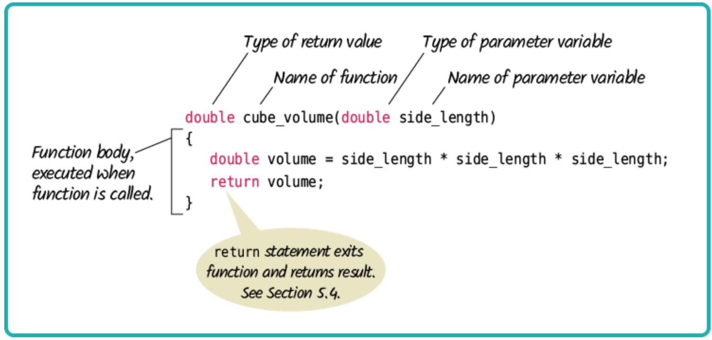
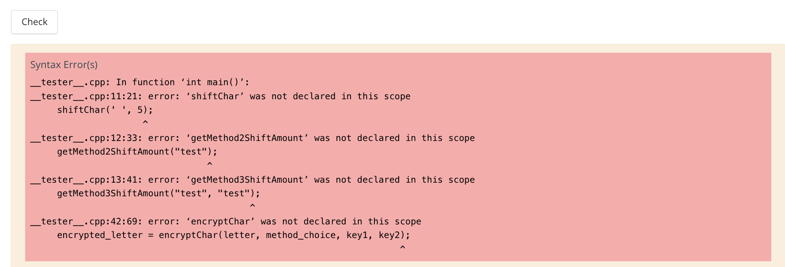
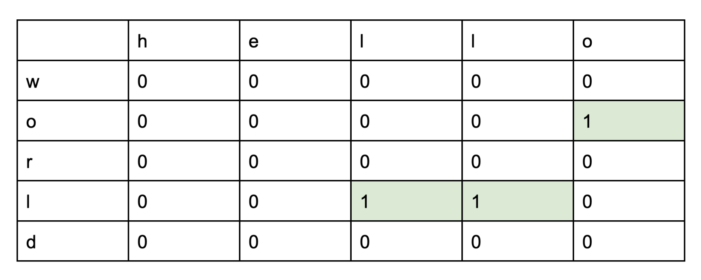
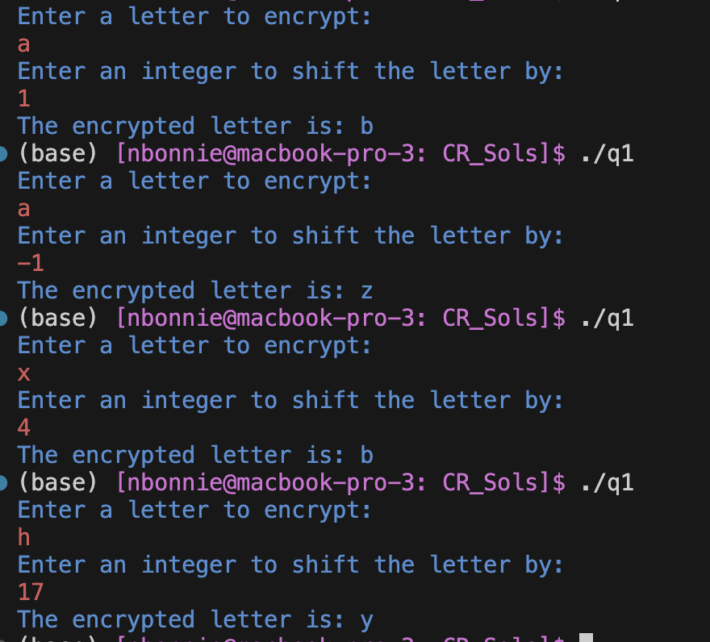
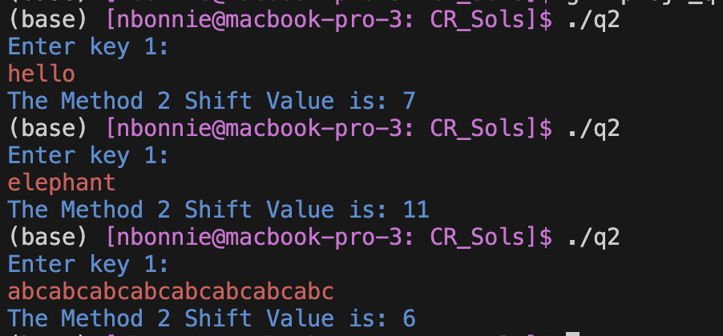
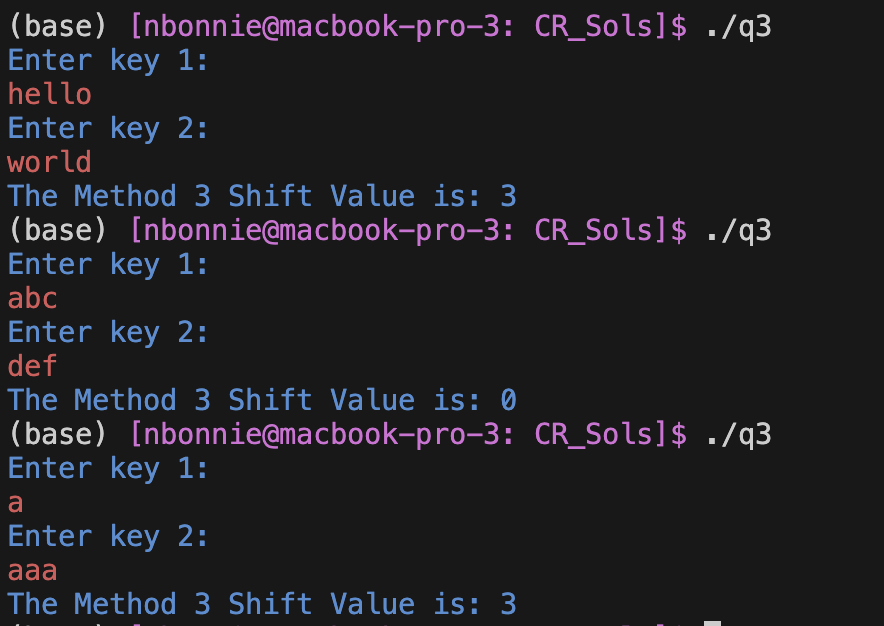
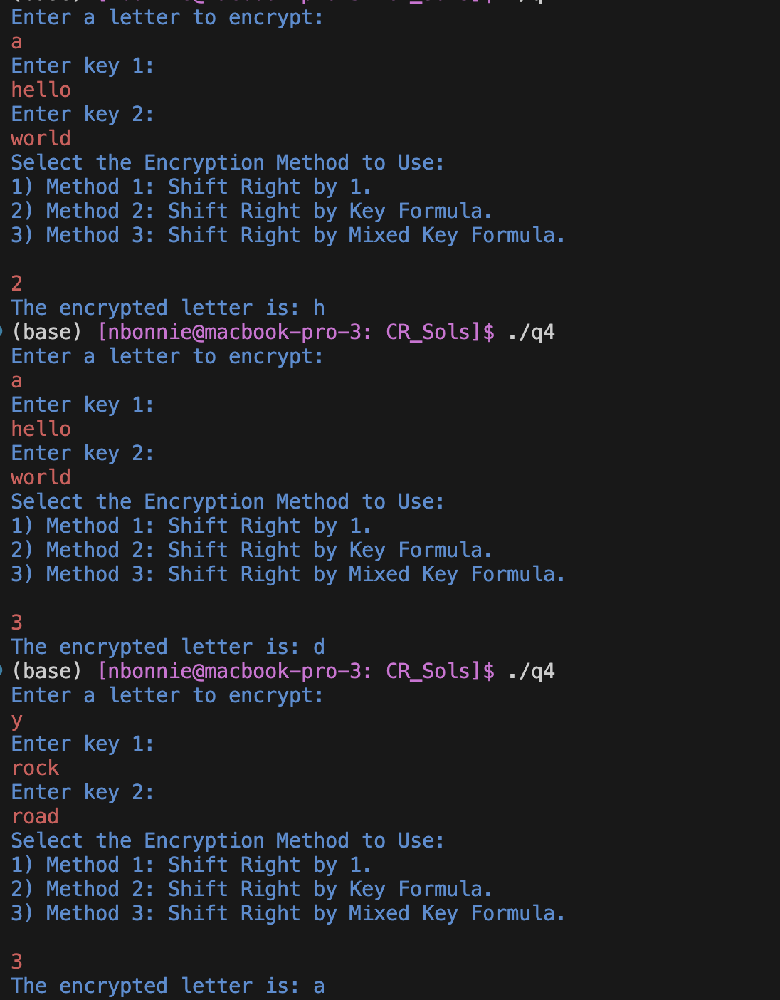
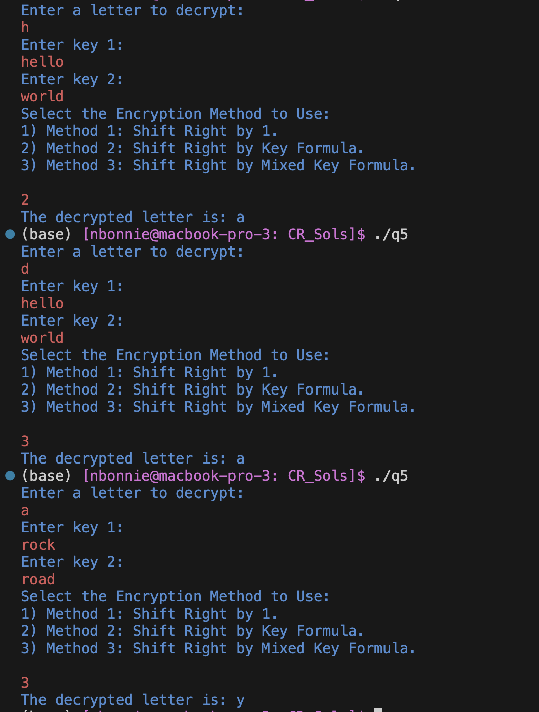
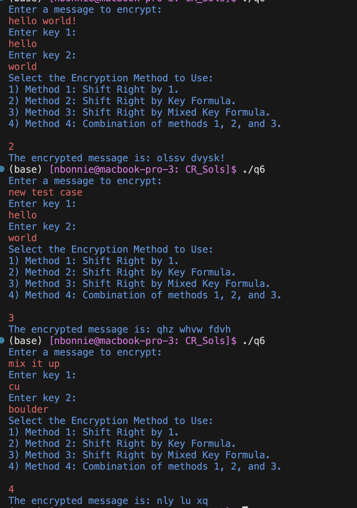
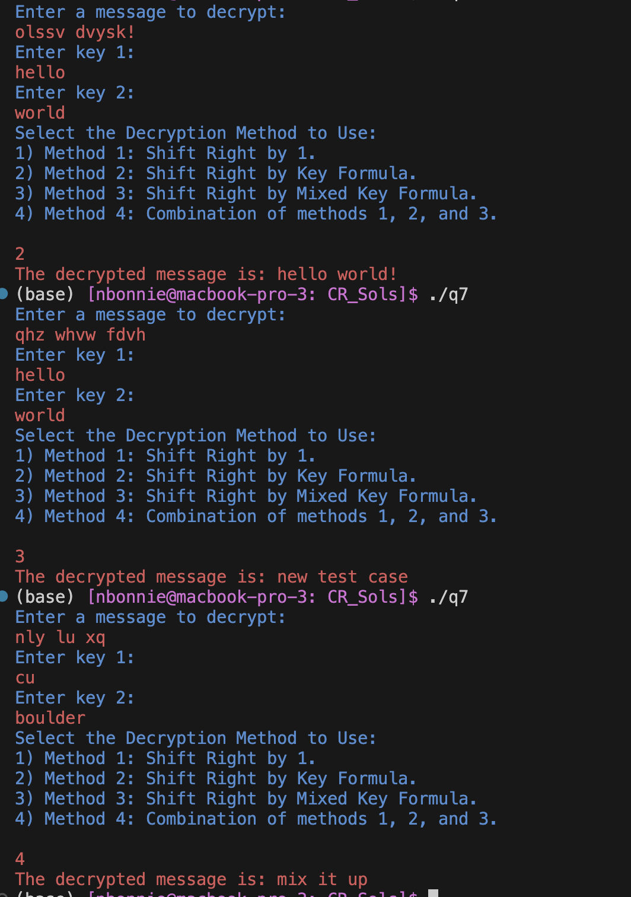

#### **CSCI 1300 CS1: Starting Computing: Project 1**
#### **Hoenigman/Naidu/Park/Ramesh - Fall 2023**
#### **Due: Friday, October 13th by 5:00pm MST**

<br />

# Table of contents
1. [Objectives](#objectives)
2. [Background](#background)
    1. [Functions](#functions)
    2. [Strings](#strings)
    3. [Input with cin and getline](#cin)
    4. [Loops](#loops)
    5. [Test Cases Instructions](#tests)
       1. [Void functions](#void)
       2. [Non-void functions that return a bool or int](#non-void-bool-int)
       3. [Non-void functions that return a double](#non-void-double)
    6. [Reminders](#reminders)
4. [Interview Grading](#interviews)
5. [Questions](#questions)
    1. [Question 1](#question1)
    2. [Question 2](#question2)
    3. [Question 3](#question3)
    4. [Question 4](#question4)
    5. [Question 5](#question5)
    6. [Question 6](#question6)
    7. [Question 7](#question7)
    8. [Question 8](#question8)
6. [Overview](#overview)
    1. [File Header](#fileheader)
    2. [Checklist](#checklist)
    3. [Grading Rubric](#grading)


# Objectives <a name="objectives"></a>
* Understand and work with functions, strings, and loops
* Be able to test functions

# Background <a name="background"></a>
## Functions<a name="functions"></a>


A function is a named block of code which is used to perform a particular task. The power of functions lies in the capability to perform that task anywhere in the program without requiring the programmer to repeat that code many times.  This also allows us to group portions of our code around concepts, making programs more organized.  You can think of a function as a mini-program.

There are two types of functions:
1. Library functions
2. User-defined functions

Library functions refer to pre-existing functions that you can use but did not write yourself. In order to use a library function, you must include the library that contains the function. For example, the C++ math library provides a ```sqrt()``` function to calculate the square root of a number. To use the `sqrt()` function, you must include the cmath library at the top of your program, e.g. `#include<cmath>`. Libraries other than the built-in C++ libraries can be found online.

C++ allows programmers to define their own functions. These are called user-defined functions. Every valid C++ program has at least one function, the ```main()``` function.

We pass values to functions via **parameters**. In general, the parameters should be all the information needed for the function to do its work.  When that work is complete, we would like to use the result in other code.  The function can **return** *one value* of the specified **return type**. A function may also return nothing, in which case its return type is **void**.



Here is the syntax for a function definition:

```cpp
return_type functionName(parameter_list)
{
    //function body
}
```

* The ```return_type``` is the data type that the function returns
* ```functionName``` is the actual name of the function
* ```parameter_list``` refers to the type, order, and number of the parameters of a function. A parameter is like a placeholder. When a function is invoked, you pass a value to the parameter. This value is referred to as actual parameter or argument.
* ```//function body``` contains a collection of statements that define what the function does. The statements inside the function body are executed when a function is called.

When we want a function to run, we **call** it like this:

```cpp
return_variable = functionName(parameter_values);
```

Note that in the above example, `parameter_values` refers to a comma-separated list of values for each parameter your function accepts, in the order they are listed in the function definition. These parameter values can either be pre-existing variables or literal values, e.g.
```
sqrt(4);
```
and 
```
int x = 4;
sqrt(x);
```

A function has its own **scope**. That means that the parameters of the function, as well as local variables declared within the function body, are not accessible outside the function. This is useful because it allows us to solve a small problem in a self-contained way. Parameter values and local variables disappear from memory when the function completes its execution.

When we call a function, the **flow of execution** changes. Let’s follow in the example below:

When the program below is run, it will begin by executing the first line of code in the body of the `main()` function. When the program execution reaches the line `int sum_result = sum(parameter_var, 99);`, the main function will pause, and the first line in the body of the `sum()` function will begin running. After the line `return result;` is reached, `sum()` will stop running, and the main program will resume execution where it left off. In this case, when `main()` resumes execution, the return value of `sum()` will be stored in `int sum_result`, and then the last two lines of the main function will run.

```cpp
#include <iostream>
using namespace std;

//funtion to add two numbers
int sum(int num_one, int num_two)
{
    int result = num_one + num_two;
    return result;
}

//main function
int main()
{
    //declare parameter value
    int parameter_var = 1;
    
    //call the function
    int sum_result = sum(parameter_var, 99);
    
    cout << "The sum is " << sum_result << endl;
    
    return 0;
}
```

## Strings <a name="strings"></a>

In C++, a **string** is a data type that represents sequences of characters instead of a numeric value (such as int or float). A string literal can be defined using double-quotes. So ```“Hello, world!”```, ```“3.1415”```, and ```“int i”``` are all strings. We can access the character at a particular location within a string by using square brackets, which enclose an index which you can think of as the address of the character within the string. Importantly, strings in C++ are indexed starting from zero. This means that the first character in a string is located at index 0, the second character has index 1, and so on. For example:

```cpp
string s = “Hello, world!”;
cout << s[0] << endl;  //prints the character ‘H’ to the screen
cout << s[2] << endl;  //prints the character ‘l’ to the screen
cout << s[9] << endl;  //prints the character ‘r’ to the screen
cout << s[12] << endl; //prints the character ‘!’ to the screen
```

Note that when a character in a string is accessed with square brackets, the character has type `char`. For example:
```cpp
string str = "Example"; //this is a string
char c = str[1]; //this is a char
```

There are many useful standard functions available in C++ to manipulate strings. One of the simplest is ```length()```. We can use this function to determine the number of characters in a string. This allows us to loop over a string character by character (i.e. traverse the string):

```cpp
string s = “Hello, world!”;
int s_length = s.length();
cout << s_length << endl; //This line will print 13 to the screen
for (int i = 0; i < s_length; i++)
{
    cout << s[i] << endl;
}
```

This will print each character in the string ```“Hello, world!”``` to the screen one per line. Notice how the length function is called.

The correct way:
* ```s.length()```

Common incorrect ways:
* ```length(s)```
* ```s.length```

Another useful function available for strings is `substr()`. This function allows us to access a subset, or a small portion, of a longer string. The substring function takes two arguments:
1. The starting index of the substring you would like to capture
2. The length of the substring you would like to capture (optional)

Note that the second argument is optional. If you do not pass a second argument to subtring, then the function will print the entirety of the string, beginning with the character at the position specified in the first argument. Note that `substr()` always returns a variable of type `string`, regardless of the length of the substring.

For example, consider the code below:

```cpp
string str = "Project 1 is fun!"
cout << str.substr(0, 7) << endl;
cout << str.substr(7) << endl;
cout << str.substr(1, 1) << endl; //prints a string of length one
```

This will ouput the following:
```
Project
 1 is fun!
r
```
**Note:** The second line of output begins with a space.

Both `length()` and `substr()` are special kinds of functions associated with **objects**, usually called **methods**, which we will discuss later in the course.

## Input with cin and getline <a name="cin"></a>

In this project you will be collecting a lot of different user inputs. Two functions that can handle user inputs are ```std::cin``` and ```std::getline```. While both of these functions allow for user inputs, they function a bit differently.

### cin

Consider the following lines of code: 

```cpp
int number;
cin >> number;
```

```std::cin``` is designed to read in the user input (let's say for example 23), and automatically add in \n to the input. so ```23``` turns into ```23\n``` where ```\n``` represents a new line. The cin function will assign everything **except** for ```\n``` to the variable ```number```. So in our code example above, cin will assign ```23 >> number``` leaving a residual ```\n``` command stuck in the cin buffer. Usually this isn't a problem if you keep using additional cin functions to handle inputs, as **cin ignores the ```\n``` newline character**. However, when we start mixing in ```std::getline```, things can start getting complicated.

### getline()

While getline also assigns a user input to a variable, it **does not** ignore the ```\n``` character. Now consider the following lines of code:

```cpp
int number;
cin >> number;

string message;
getline(cin, message);
```

Intuitively, one would imagine this program would promt the user for two separate inputs that would then be saved to the variables. However, this is not the case. The first two lines will allow a user to enter a value to be saved to ```number```. Let's say the user types in ```23``` and then hits the enter key. The function cin will recieve ```23\n```, and since cin ignores ```\n```, cin will assign ```23 >> number``` leaving ```\n``` in the cin buffer. Now in the last two lines, when getline is called, the residual ```\n``` from cin will be passed to getline, and since getline does not ignore ```\n```, it will take ```\n``` as the input and assign it to ```message``` - seemingly never asking the user for an input.

### Solution

The fix to use both ```cin``` and ```getline()``` in the same program is to use a function ```cin.ignore()``` between ```cin``` and ```getline()```. ```cin.ignore()``` is a function that clears the ```cin``` buffer, removing the residual ```\n```. The parameters we will use with ```cin.ignore()``` are ```cin.ignore(10000,'\n')```. What this says is ignore the first 10000 characters in the input buffer or up until we hit a newline character (whichever comes first).

So to fix the above program, we would write:

```cpp
int number;
cin >> number;

cin.ignore(10000,'\n');

string message;
getline(cin, message);
```

Note that we wouldn't need to include ```cin.ignore``` if we are switching from ```getline()``` to ```cin```, only when we switch from ```cin``` to ```getline()```.

### Checking for invalid inputs

In Q8 of the project, you will need to check for invalid user inputs. For example, you'll need to ensure that the user inputs an integer instead of something else, like a character. Consider the following code:

```cpp
int number;
cout << "Enter an integer: " << endl;
cin >> number;
```

If we get a user input of ```h```, that would be an invalid input. In order to handle this, we can check if ```cin.fail() == true```. In the case above, trying to assign the character ```h``` to an integer variable would cause ```cin.fail()``` to be true. When this is the case, we should clear the error with ```cin.clear()```, then clear the input buffer with ```cin.ignore(10000,'\n')```, and then ask for another input.

## Loops <a name="loops"></a>
**While Loops**

*Loops* allow us to run a section of code multiple times. They will repeat execution of a single statement or 
group of statements as long as a specified condition continues to be satisfied. If the condition is not true, 
then the statement will not be executed. 

*Syntax of a while loop*
```cpp
while (condition)
{
	//statement(s) to do something;
}
```
Here, `while` is a C++ reserved word, *condition* should be a Boolean expression that will evaluate to either **true** or **false**, and *statement(s) to do something* is a set of instructions enclosed by curly brackets. If the condition is **true**, then the specified statement(s) within the loop are executed. After running once, the Boolean expression is re-evaluated. If the condition is **true**, the specified statement(s) are executed again. This process of evaluation and execution is repeated until the condition becomes **false**.

**Example 1**
```cpp
int userChoice = 1;
while (userChoice != 0)
{
   cout << "Do you want to see the question again?" << endl; 
   cout << "Press 0 if no, any other number if yes." << endl;
   cin >> userChoice;
}
```

Entering 0 will terminate the loop, but any other number will cause the loop to execute again.  **Note how we must initialize the condition before the loop starts.** Setting `userChoice = 1` ensures that the while loop will run at least once.

**Example 2** <a name="whileExample2"></a>
```cpp
int i = 0; 
while (i < 5)
{
	cout << i << endl;
	i = i + 2;
}
```
Notice how you must manually initialize `i=0` and then manually increment `i` by 2. 
Inserting `cout` statements into your loops is a quick way to debug your code if something isn’t working, to make sure the loop is iterating over the values you want to be using. A common error is to forget to update `i` within the loop, causing it to run forever.

**For loop**

Sometimes you know the exact number of iterations that a loop has to perform. In these cases a `for` loop comes into use. It has three elements: 
* *Initialization*: It must initialize a counter variable to a starting value. 
* *Condition*: If it is true, then the body of the loop is executed. If it is false, the body of the loop does not execute and jumps to the next statement(s) just after the loop.
* *Update*: Updates the counter variable during each iteration  

*Syntax of a for loop*
```cpp
for (initialization; condition; update)
{
	//statement(s) to do something;
}
```

**Example 1:**  
```cpp
for (int count = 0; count < 5; count++)
{
	cout << "hello" << endl;
}
```
Notice the following three parts of the `for` loop:
 * `count` is initialized to `0`, 
 * the test expression is `count < 5` 
 * `count++` to increment the count value by one

**Example 2:**
```cpp
for (int i = 0; i < 5; i = i + 2)
{
	cout << i << endl;
}
```
Notice that this example behaves in the same way as the [example 2](#whileExample2) in the `while` loop section above.  


## Test Cases Instructions <a name="tests"></a>

Every C++ program you write should include tests in your main function that verify the correctness of your code. There are 3 different types of test cases you will write depending on the return type of the function you are testing. Listed below is an explanation of how we expect you to test different functions with varying return types, such as `void`, `double`, or `int`, `bool`, and `char`.

### 1. Void Functions <a name="void"></a>

To test a **void** function that has printed output, call the function you are testing from your `main()` function. You should include a comment above the function call that includes the expected output.
See the sample code below:

```c++
void checkDiscount(double discount)
{
    if (discount >= 50)
    {
        cout << "Great discount!" << endl;
    }
    else
    {
        cout << "Not a great discount." << endl;
    }
    return;
}

int main()
{
    // test 1 for checkDiscount
    // expected output: "Great discount!"
    checkDiscount(82.7);

    // test 2 for checkDiscount
    // expected output: "Not a great discount."
    checkDiscount(22);

    return 0;
}
```
_* For the purpose of this test code snippet, algorithms were not included, but they are still expected in your C++ files._


<br>

### 2. Functions that return a bool, char or int <a name="non-void-bool-int"></a>

For functions that return a **bool, char or int**, use **assert statements** 
from the **cassert** library (`#include <cassert>`) with a conditional expression.

Assert statements contain a conditional expression which will evaluate to `true` if the function's actual output matches what's expected. If the conditional expression evaluates to `false`, then your program will stop running after printing an error message.

For the purpose of this project, functions that return a `bool`, `char` or `int` can be compared to a specific value using the equality operator `==`.

Your test will look something like this:

```
<data type> result = <function call>;
assert(result == <expected value>);`
```

* `<data type>` is the data type of the result variable, which stores the return value of the function.
* `<function call>` is where you will call the function you want to test with its function parameters.
* `<expected value>` is the value you expect the function to return.
* `==` is the equality operator, and it compares the equality of both sides of itself. 

See the sample code below:
```c++
#include <iostream>
#include <cassert>
using namespace std;

int add_(int num1, int num2)
{
    // add num1 and num2 before returning
    return num1 + num2;
}

// isDrivingAge returns true if the given age passed as a parameter is greater than 16,
// else it returns false.
bool isDrivingAge(int age)
{
    if (age >= 16)
    {
        return true;
    }
    else
    {
        return false;
    }
}

int main()
{
    // test 1 for add_
    assert(add_(5, 6) == 11);
    // test 2 for add_
    assert(add_(10, 10) == 20);

    // test 3 for drivingAge
    assert(isDrivingAge(17) == true);
    // test 4 for drivingAge
    assert(isDrivingAge(14) == false);
}
```
_* For the purpose of this test code snippet, algorithms were not included, but they are still expected in your C++ files._

<br>

### 3. Functions that return a double <a name="non-void-double"></a>

For functions that return a **double**, you should use an **assert statement** from the **cassert** header (`#include <cassert>`) with a conditional expression like above. The difference is that you will also need to include the following function in your program:
```c++
/**
 * doublesEqual will test if two doubles are equal to each other within two decimal places.
 */
bool doublesEqual(double a, double b, const double epsilon = 1e-2)
{
    double c = a - b;
    return c < epsilon && -c < epsilon;
}
```
Because the `double` type holds so much precision, it will be hard to compare the equality of a function that returns a 
double with another double value. To overcome this challenge, we can compare `double` values within a certain range 
of precision or decimal places. The function above compares the equality of two variables `a` and `b` up to two decimal places, and returns `true` if the values of `a` and `b` are equal with each other up to two decimal places.

You will be expected to use this function in conjunction with `assert` statements to test functions that return 
the type double.

Your test will look something like this: 

`assert(doublesEqual(<function call>, <value to compare to>));`

 * `<function call>` is where you will call the function you want to test with its function parameters 
 * `<value to compare to>` is the `double` value you expect the function to return.


See the sample code below:
```c++
#include <iostream>
#include <cassert>
using namespace std;
/**
 * doublesEqual will test if two doubles are equal to each other within two decimal places.
 */
bool doublesEqual(double a, double b, const double epsilon = 1e-2)
{
    double c = a - b;
    return c < epsilon && -c < epsilon;
}

/**
 * reciprocal returns the value of 1 divided by the number passed into the function.
 */
double reciprocal(int num)
{
    return 1.0 / num;
}

int main()
{
    // test 1 for reciprocal
    //call reciprocal 
    double reciprocal_result = reciprocal(6);
    //call doublesEqual
    bool is_equal = doublesEqual(reciprocal_result, 0.16);
    //assert statement
    assert(is_equal);

    // test 2 for reciprocal
    assert(doublesEqual(reciprocal(12), 0.083));
}
```

Notice that in the above example test 1 and test 2 are equally valid ways of testing functions that return a `double`.

For test 1, `reciprocal(6)` is being called, and we expect the function to return the value `0.16`.
The variable `reciprocal_result` and `0.16` are passed in as parameters to the `doublesEqual` function,
which will return `true` if these two values are equal and `false` if they are not. We pass the return value, which is stored int the variable `is_equal`, to our assert statement. If our `is_equal` is `true`, the assert statement will pass. If `is_equal` is false, the program will stop running and print an error message.

## Reminders <a name="reminders"></a>
Here is a collection of useful things:

- Setting decimal points in cout (remember to include ```<iomanip>```!): <br>
    ```cout << fixed << setprecision(number of decimal points) << floating point value << endl```
    As an example, try running this program to see the difference:
    ```cpp
    #include <iostream>
    #include <iomanip>
    using namespace std;

    int main() 
    {
        cout << 7.0/13.0 << endl;
        cout << fixed << setprecision(2) << 7.0/13.0 << endl;
        return 0;
    }
    ```
- Code compilation with g++: <br>
    ```g++ -Wall -Werror -Wpedantic -std=c++17 name_of_source_file.cpp```
- Using the ```-o``` option provided by g++ to name your executable [OPTIONAL]: <br>
    ```g++ -Wall -Werror -Wpedantic -std=c++17 name_of_source_file.cpp -o nameOfExecutable```
- Good coding style: <br>
    - Name variables well, for example: ```double d = 42.0167``` is confusing, whereas ```double height_of_rectangle = 42.0167``` is clearer about what the variable represents
    - Name functions well, for example: ```int Func(int x);``` is confusing, whereas ```int calculateSquare(int x);``` is clearer about what the function does
    - Variables should be named using snake-case, where_all_words are all lowercase and separated by underscores: this_is_snake_case.
    - Functions should be named using camel-case, where all words except the first start with an uppercase letter, and there are no separators: thisIsCamelCase.
    - Indent things properly! If-else blocks should be well spaced and indented, function blocks as well, etc. Use tab to increase indent, and shift+tab to decrease indent. Here is an example: <br>
    ```cpp
    void function(void){
    if(condition) {
    <code>}else{
    <code>}return;}
    ```
    The above is very confusing and hard to understand, simply adding space and indents really helps:
    ```cpp
    void function(void)
    {
        if (condition)
        {
            <code>
        }
        else
        {
            <code>
        }
        return;
    }
    ```
    - Remember to comment your code! Comment lines start with ```//```
    - Good places to put comments include (but are not limited to!): next to function prototypes, next to variable declarations, and next to important lines, such as numerical calculations, etc...
    - These conventions will make your code easier to read and understand

<br>

# Interview Grading <a name="interviews"></a>

You must also sign up for an interview grading slot on Canvas. Interview grading rules and the scheduler will be posted on a Canvas announcement on Monday, October 9th .

# Questions <a name="questions"></a>

## **Warning : you are not allowed to use global variables for this homework.**
## **For questions which require the use of a function, Coderunner will check that you have written the function correctly. DO NOT WRITE ALL YOUR CODE IN ```main()```! Your code will NOT compile if you do not have the correct function, see below for an example of what this could look like:** <br>



## Caesar Cipher <a name = "caesar_cipher"></a>
The ability to encrypt or decrypt a message has been utilized by civilizations for centuries. One historic example of encryption is the [Caesar cipher](https://en.wikipedia.org/wiki/Caesar_cipher), where Caesar would protect important military messages using the cipher.

This encryption works by shifting letters of the alphabet to the right by a certain amount. Below us an example of a right shift cipher with a value of 3.

### Right Shift: <a name = "right_shift"></a>


We can encode messages using this cipher by mapping our regular alphabet to the new shifted alphabet. In the example above, instead of writing an "a" we would write a "d" instead. Note that the alphabet will wrap around, so the letter "y" would map to "b".

With a right shift of 3, the phrase ```hello world``` would turn into ```olssv dvysk```

Here is a good tool that allows you to explore the right shift cipher: [link](https://cryptii.com/pipes/caesar-cipher)

### Left Shift: <a name = "left_shift"></a>

Left shift is the word we will use when we are decrypting instead of encrypting. With a left shift of 3, the phrase ```olssv dvysk``` would turn into ```hello world```.  We call it left shift because on the image above, the shift will go towards the left instead of towards the right. 

## Project Overview <a name = "project_overview"></a>
In the Caesar cipher, every letter in the message is always shifted by the same predetermined number. For your project, you'll be creating software that can encrypt and decrypt messages utilizing a slightly different variation of the Caesar cipher. In your cipher, you will have 3 methods of calculating the shift value, which are described below:
1. Shift right by 1
2. Shift right by single key
3. Shift right by mixed keys

All of the methods will be a right shift encryption, similar to the Caesar cipher. How many values you should shift the message will depend on different formulas.

**Throughout the entire project, you should only encrypt lowercase letters. Uppercase letters, spaces, and special characters should be returned the same.** Lets look at the methods in more detail and give examples.

### Method 1: <a name = "method1"></a>
Method 1 is going to be a right shift encryption with a shift value of 1. This means that every letter will be shifted to the right adjacent letter in the alphabet. Notice how lowercase alphabet letters wrap around if needed and all other characters are unchanged.

**Example 1:**
* Original message: ```hello world```
* Encrypted message: ```ifmmp xpsme```

**Example 2:**
* Original message: ```z ~ b```
* Encrypted message: ```a ~ c```

### Method 2: <a name = "method2"></a>
Method 2 is a right shift encryption with a shift value that you will calculate from a user provided key. You will calculate the shift value based on the following formula:
  `(number of vowels in key + number of characters in key) modulus 26` 

**Note:** Only lowercase vowels ```a e i o u y``` should count towards the number of vowels.

**Example 1:** 
* Key: ```Rock```
* Shift Value: ```(1 + 4) mod 26 = 5```
* Original Message: ```hello world```
* Encrypted Message: ```mjqqt btwqi```

**Example 2:** 
* Key: ```hello world```
* Shift Value: ```(3 + 11) mod 26 = 14```
* Original Message: ```Some Text!```
* Encrypted Message: ```Scas Tslh!```

### Method 3: <a name = "method3"></a>
Method 3 is a right shift encryption with a shift value that you will calculate from two keys that the user provides. The shift value will be calculated based on the number of matching letters between the two keys modulo 26.

**Example 1:**
* Key 1: ```hello``` 
* Key 2: ```world```:


The shift value is the sum of all the matches, which in this case would be ```3```.
* Original Message: ```csci is great```
* Encrypted Message: ```fvfl lv juhdw```

  
**Example 2:**
* Key 1: ```rocky``` 
* Key 2: ```road```
* Computed Shift Value: ```2```
* Original Message: ```programming is fun!```
* Encrypted Message: ```rtqitcookpi ku hwp!```


## Question 1 (5 points): shiftChar() <a name="question1"></a>

Write a function named ```shiftChar()``` that performs the right shift operation based on the user provided shift value. See explanation above to learn more about [right shift](#caesar_cipher).

<ins>Function Specifications</ins>:
  * **Name**: shiftChar()
  * **Parameters (in this order)**:
    * ```char``` c: letter to be shifted
    * ```int``` shift: shift value
  * **Return Type**: ```char```
    * The right shifted letter
  * The function should not print anything


Develop and validate your solution on VS code and test it by writing a main() with either assert calls or one that supports user input. Below we provide a few examples testing out a valid ```shiftChar()``` function. Note these input and output statements exist within ```main()```. ```shiftChar()``` should not accept user input or display output.

Take note to match the function specifications exactly. When you are happy with your solution head over to Coderunner on Canvas and paste your function in the answer box! Make sure to ONLY include the ```shiftChar()``` function (do not include ```main()``` or any other statements). 



## Question 2 (5 points): getMethod2ShiftAmount() <a name="question2"></a>

Write a function named ```getMethod2ShiftAmount()``` that computes the shift value (encryption method 2) based on the user provided encryption key. See [Method 2](#method2) for description, equation and examples.
	
<ins>Function Specifications</ins>:
  * **Name**: getMethod2ShiftAmount()
  * **Parameters (in this order)**:
    * ```string``` key1: encryption key
  * **Return Type**: ```int```
    * The computed shift value
  * The function should not print anything
    

Develop and validate your solution on VS code and test it by writing a main() with either assert calls or one that supports user input. Below we provide a few examples testing out a valid ```getMethod2ShiftAmount()``` function. Note these input and output statements exist within ```main()```. ```getMethod2ShiftAmount()``` should not accept user input or display output.

Take note to match the function specifications below exactly. When you are happy with your solution head over to Coderunner on Canvas and paste your function in the answer box! Make sure to ONLY include the ```getMethod2ShiftAmount()``` function (do not include ```main()``` or any other statements).



## Question 3 (5 points): getMethod3ShiftAmount() <a name="question3"></a>

Write a function named ```getMethod3ShiftAmount()``` that computes the shift value (encryption method 3) based on the two user provided encryption keys. See [Method 3](#method3) for description, equation and examples.
	
<ins>Function Specifications</ins>:
  * **Name**: getMethod3ShiftAmount()
  * **Parameters (in this order)**:
    * ```string``` key1: encryption key1
    * ```string``` key2: encryption key2
  * **Return Type**: ```int```
    * The computed shift value
  * The function should not print anything

Develop and validate your solution on VS code and test it by writing a main() with either assert calls or one that supports user input. Below we provide a few examples testing out a valid ```getMethod3ShiftAmount()``` function. Note these input and output statements exist within ```main()```. ```getMethod3ShiftAmount()``` should not accept user input or display output.

Take note to match the function specifications below exactly. When you are happy with your solution head over to Coderunner on Canvas and paste your function in the answer box! Make sure to ONLY include the ```getMethod3ShiftAmount()``` function (do not include ```main()``` or any other statements).


 


## Question 4 (5 points): encryptChar() <a name="question4"></a>
Now we will start writing functions that will use our functions from Q1-Q3.

Write a function named ```encryptChar()``` that encrypts a character based on the user selected encryption method. See the [overview section](#project_overview) for description, equation and examples for the three encryption methods.

<ins>Function Specifications</ins>:
  * **Name**: encryptChar()
  * **Parameters (in this order)**:
    * ```char``` c: character to be encrypted
    * ```int``` method_choice: encryption method
    * ```string``` key1: encryption key1
    * ```string``` key2: encryption key2
  * **Return Type**: ```char```
    * The encrypted character if encryption method is valid
    * The original character to be encrypted if encryption method is invalid
  * Method2 should utilize ```key1```
  * Method3 should utilize both ```key1``` and ```key2```
  * The function should print ```Invalid encryption method``` if encryption method is invalid
  * Valid encryption methods are ```1, 2, or 3``` 


Develop and validate your solution on VS code and test it by writing a main() with either assert calls or one that supports user input. Below we provide a few examples testing out a valid ```encryptChar()``` function. Note these input and output statements exist within ```main()```. ```encryptChar()``` should not accept user input and the only output it can display is ```Invalid encryption method``` when the encryption method is invalid.

Take note to match the function specifications below exactly. When you are happy with your solution head over to Coderunner on Canvas and paste your solution in the answer box! You will need to include ```encryptChar()``` as well as the functions from Q1-Q3 which should be used as part of your solution.




## Question 5 (5 points): decryptChar() <a name="question5"></a>


Now we will support decrypting a single character. A [left shift operation](#left_shift) should be performed for decryption. 

Write a function named ```decryptChar()``` that decrypts a character based on the user selected decryption method. See the [overview section](#project_overview) for description, equation and examples for the three decryption methods.

<ins>Function Specifications</ins>:
  * **Name**: decryptChar()
  * **Parameters (in this order)**:
    * ```char``` c: encrypted character
    * ```int``` method_choice: decryption method 
    * ```string``` key1: decryption key1
    * ```string``` key2: decryption key2
  * **Return Type**: ```char```
    * The decrypted character if decryption method is valid
    * The original encrypted character if decryption method is invalid
  * Method2 should utilize ```key1```
  * Method3 should utilize both ```key1``` and ```key2```
  * The function should print ```Invalid decryption method``` if decryption method is invalid
  * Valid decryption methods are ```1, 2, or 3```
     
Develop and validate your solution on VS code and test it by writing a main() with either assert calls or one that supports user input. Below we provide a few examples testing out a valid decryptChar() function. Note these input and output statements exist within ```main()```. ```decryptChar()``` should not accept user input and the only output it can display is ```Invalid decryption method``` when the decryption method is invalid.

Take note to match the function specifications exactly. When you are happy with your solution, head over to Coderunner on Canvas and paste your solution in the answer box! You will need to include ```decryptChar()``` as well as the functions from Q1-Q3 which should be used as part of your solution.


 

## Question 6 (10 points): encryptMessage() <a name="question6"></a>

Write a function named ```encryptMessage()``` that encrypts a string based on the user selected encryption method. See the [overview section](#project_overview) for description, equation and examples for the original three encryption methods. However ```encryptMessage()``` should also support a fourth encryption method described below.

### Method 4 <a name="method4"></a>

Method 4 will repeat using Method1, Method2, and Method3 for a given message. Lets walk through an example.
* Original Message: ```hello world!```
* Key1: ```rock```
* Key2: ```road```

The shift values for each method are:
* Method 1: ```1```
* Method 2: ```5``` (1 vowel + 4 characters in Key1)
* Method 3: ```2``` (2 matching characters between Key1 and Key2)

Method 4 will use Method 1 for the first character (```h```), Method 2 for the second character (```e```), Method 3 for the third character (```l```), Method 1 for the fourth character (```l```), Method 2 for the fifth character (```o```), Method 3 for the sixth character (``` ```), etc.. 

Written all out, we see each method gets the following characters:
* Method 1: ```"h", "l", "w", "l"```
* Method 2: ```"e", "o", "o", "d"```
* Method 3: ```"l", " ", "r", "!"```

And the final encrypted message for method 4 would be ```ijnmt xttmi!``` which we can see has shift values of ```1,5,2,1,5,2,1,5,2,1,5,2```.

<ins>Function Specifications</ins>:
  * **Name**: encryptMessage()
  * **Parameters (in this order)**:
    * ```string``` message: message to be encrypted.
    * ```int``` method_choice: encryption method.
    * ```string``` key1: encryption key1.
    * ```string``` key2: encryption key2.
  * **Return Type**: ```string```
    * The encrypted message if encryption method is valid
    * The original message to be encrypted if encryption method is invalid
  * Method2 should utilize ```key1```
  * Method3 should utilize both ```key1``` and ```key2```
  * The function should print ```Invalid encryption method``` if encryption method is invalid
  * Valid encryption methods are ```1, 2, 3, or 4```


Develop and validate your solution on VS code and test it by writing a main() with either assert calls or one that supports user input. Below we provide a few examples testing out a valid encryptMessage() function. Note these input and output statements exist within ```main()```. ```encryptMessage()``` should not accept user input and the only output it can display is ```Invalid encryption method``` when the encryption method is invalid.

Take note to match the function specifications exactly. When you are happy with your solution head over to Coderunner on Canvas and paste your solution in the answer box! You will need to include ```encryptMessage()``` as well as the functions from Q1-Q4 which should be used as part of your solution.



## Question 7 (10 points): decryptMessage() <a name="question7"></a>

Write a function named decryptMessage() that decrypts a string based on the user selected decryption method. See the overview section for description, equation and examples for the original three encryption methods and [method 4 above](#method4). 

<ins>Function Specifications</ins>:
  * **Name**: decryptMessage()
  * **Parameters (in this order)**:
    * ```string``` message: message to be decrypted.
    * ```int``` method_choice: decryption method.
    * ```string``` key1: decryption key1.
    * ```string``` key2: decryption key2.
  * **Return Type**: ```string```
    * The decrypted message if decryption method is valid
    * The original encrypted message if decryption method is invalid
  * Method2 should utilize ```key1```
  * Method3 should utilize both ```key1``` and ```key2```
  * The function should print ```Invalid decryption method``` if decryption method is invalid
  * Valid decryption methods are ```1, 2, 3, or 4```


Develop and validate your solution on VS code and test it by writing a main() with either assert calls or one that supports user input. Below we provide a few examples testing out a valid decryptMessage() function. Note these input and output statements exist within ```main()```. ```decryptMessage()``` should not accept user input and the only output it can display is ```Invalid decryption method``` when the decryption method is invalid.

Take note to match the function specifications exactly. When you are happy with your solution head over to Coderunner on Canvas and paste your solution in the answer box! You will need to include ```decryptMessage()``` as well as the functions from Q1-Q3 & Q5 which should be used as part of your solution.




## Question 8 (15 points): Making an application <a name="question8"></a>
Now we will tie all of our functions together into a program that can be used by a person to do encryption and decryption of their own! Here you ARE responsible for writing the entire program, including the ```main()``` function.

Your program should have a main function that allows a user to navigate a menu of options. Your menu function should present the user the following options:

Please input 1-6 followed by enter to navigate the menu:
1. Set Encryption Key 1
2. Set Encryption Key 2
3. Select Encryption Method
4. Encrypt Message
5. Decrypt Message
6. Exit Program

Your menu should run in a loop, offering the user every option until they choose to exit the program. User inputs should direct the flow of the program utilizing the functions developed in Q1-Q7.

### Starting Off:

* Display the 6 options written above to the user.
* Get their choice as a number 1-6, handling invalid input. Any invalid input here should print ```Invalid input``` and then prompt them for their choice again.

### Option 1 & 2:

* Start by printing, ```Enter key:```
* Get input from the user and update the corresponding key.
* Keys should be at least 1 character long and any invalid input should display ```Invalid key``` and then prompt the user for input again.
* * When successfully set, display ```Successfully set encryption [key] to [value]``` Replace ```[key]``` with ```key1``` or ```key2```. Replace ```[value]``` with what the user typed in.

### Option 3

* Display to the user the following choices:
```
Please input 1-4 to decide encryption technique.
1. Method1 only (shift by 1)
2. Method2 only (shift by first key)
3. Method3 only (shift by both keys)
4. Mix of Method1, Method2, Method3
```

* Any invalid input here should print ```Invalid encryption choice``` and then prompt the user to input something again.
* * When successfully set, display ```Successfully set encryption type to [type]``` where ```[type]``` should be 1, 2, 3, or 4 depending on what the user entered.

### Option 4 & 5

* If the user has not set both of the keys and chosen an encryption method, this should print ```You cannot do this until you set both keys and choose an encryption method```
* Otherwise print, ```Enter your message to encrypt:``` (replace with decrypt for option 5).
* Next, get input from the user and then display the input either encrypted or decrypted.

### Option 6:

* Print ```Goodbye.``` and terminate the program.

**NOTE** Question 8 has 31 total tests on CodeRunner. They are split up into 3 separate questions of 10, 10, and 11 tests. You should develop and validate your solution on VS code, then head over to Coderunner on Canvas and paste your **entire program** in each of the answer boxes for q8_part1, q8_part2, and q8_part3!


# Project 1 Overview <a name="overview"></a>

## File Headers <a name="fileheader"></a>

Before submitting your program on coderunner ensure that you include the below information at the top of your file
```cpp
// CSCI 1300 Fall 2023
// Author: FirstName LastName
// TA: TA Name
// Question #
```

Example
```cpp
// CSCI 1300 Fall 2023
// Author: John Smith
// TA: Nick 
// Question 1
```

## Checklist <a name="checklist"></a>

Here is a checklist for completing the project:
1. Develop pseudocode, code solutions and test your functions in VS Code.
2. Use your solutions to complete the **Project 1 - Coderunner** assignment on Canvas (Modules → Week 6). Coderunner will be published on Friday, October 6th. 
3. Complete the Project 1 quiz. This will be published on Monday, October 9th.
4. Sign up for a grading interview slot on Canvas. If you don't sign up or don't attend your interview then you will receive a 0 for the entire project. The interview scheduler will be made available by Wednesday, October 11th. 
    * During interview grading, the course staff will ask you about your implementation and conceptual questions related to the topics covered in this project. We will also review your code files for style, comments, and test cases.

## Grading Rubric <a name = "grading"></a>
Note: Global variables are not permitted in this homework. The use of global variables with result in a 0 on the entire homework.

| **Criteria**      | Points |
| :---------------- | -----: |
| Question 1        |      5 |
| Question 2        |      5 |
| Question 3        |      5 |
| Question 4        |      5 |
| Question 5        |      5 |
| Question 6        |     10 |
| Question 7        |     10 |
| Question 8        |     15 |
| Grading Interview |     60 |
| Project 1 Quiz    |     30 |
| **Total**         |    150 |
