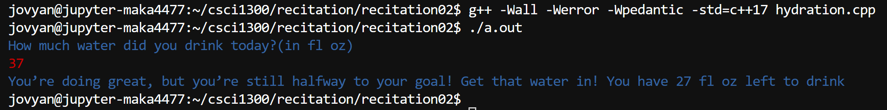

#### **CSCI 1300 CS1: Starting Computing**
#### **Hoenigman/Naidu/Park/Ramesh - Fall 2023**
#### **Recitation 2 - Week of September 11th, 2023**

# Table of contents
1. [Exercises](#exercises)
   1. [Question 0 - Warmup](#fill)
   2. [Question 1 - Spot the Errors](#spot)
   3. [Question 2 - Hydration app](#app)
3. [Deliverables](#deliverables)


# Exercises <a name="exercises"></a>
### 0. **Warmup** <a name="fill"></a>
Fill in the blank with a condition that accounts for temperature in range of 40 degrees to 60 degrees (both inclusive).
```cpp
#include <iostream>
using namespace std;

int main()
{
    int temperature = 50; 

    if (temperature >= 85) {
        cout << "It's a hot day!";
    }
    else if (temperature > 60 && temperature < 85) {
        cout << "It's a pleasant day.";
    }
    // Fill in the below line
    ___________________________________________ {
        cout << "It's a cool day.";
    }
    else {
        cout << "It's a cold day.";
    }

    return 0;
}

```

### 1. **Spot the errors**. <a name="spot"></a>

a.    
```cpp
#include <iostream>
using namespace std;

int main()
{
    int num = 5;

    if (num > 10) {
        cout << "The number is greater than 10." ;
    }
    else if (num = 10) {
        cout << "The number is equal to 10."; 
    }
    else {
        cout << "The number is less than 10.";
    }

    return 0; 
}
```

b.   
```cpp
#include <iostream>
using namespace std;

int main()
{
    int angle = 40;
    if (x<90) { 
        cout<<"It is an acute angle." ;
    }
    elif(x=90) {
        cout<<"It is a right angle.";
    }
    else{
        cout<<"It is an obtuse angle.";
    }
}
```

c.    
```cpp
#include <iostream>
using namespace std;

int main()
{
    int num = 0;

    else {
        cout << "This is the 'else' block.";
    }
    if (num == 0) {
        cout << "The number is zero.";
    }
    else {
        cout << "The number is not zero.";
    }

    return 0; 
}
```
    
d.    
```cpp
#include <iostream>
using namespace std;

int main()
{
    int num = 7;

    if (num) { 
        cout << "The number is zero.";
    }
    else {
        cout << "The number is not zero.";
    }

    return 0; 
}
```
Work through the spot the error questions interactively via [CodeRunner](https://canvas.colorado.edu/courses/95610/assignments/1799621).

-----------------------------

### 2. Hydration app  <a name="app"></a>

  Your goal is to drink half a gallon or 64 fl oz every day but you aren’t great at remembering to do it! So you decide to create a hydration app that tracks your water intake every day and will alert you based on how much you drank for the day.
  The program first asks how much water you drank for the day, which is in fl oz and then displays a message based on whether you have hit your goal for the day.
  Next, it will also tell you how much water you have left to drink. 
  
  The following are the possible messages you will get based on your intake:<br/>
  
   1. If you’re drinking 32 fl oz or less, then you get
    
 ```
    "You’re very, very dehydrated! Get that water in! You have X fl oz left to drink."
 ```
   2. If you’re drinking more than 32 fl oz but less than 64 fl oz, then you get
    
 ``` 
    "You’re doing great, but you’re still halfway to your goal! Get that water in! You have X fl oz left to drink"
 ```
   3. If you’re drinking 64 fl oz or more, then you get<br/>
 ```
    "You’ve hit your goal for the day! Great job getting hydrated!" 
 ```     
        
 
 Note that **X** is the amount of water left after subtracting your intake.  
 
  Example output

  
  
  **2a**. Write an algorithm in pseudocode for the program above. 

-----------------------------

<br/><br/>
<br/><br/>
<br/><br/>
<br/><br/>

  **2b**. Let’s draw a flowchart of the solution

-----------------------------

<br/><br/>
<br/><br/>
<br/><br/>
<br/><br/>


  **2c**. Implement your solution in C++ using VS Code. Revise your solution, save, compile and run it again. Are you getting the expected result and output? Keep revising until you do. Make sure you test for the values used in your sample runs.

<br>


# Deliverables for Recitation <a name="deliverables"></a>
Complete the quiz on [Canvas](https://canvas.colorado.edu/courses/95610/quizzes/349306)
