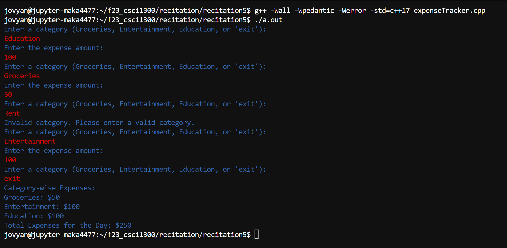
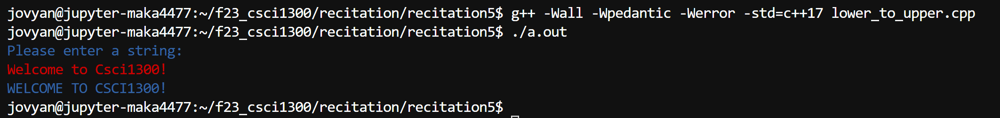
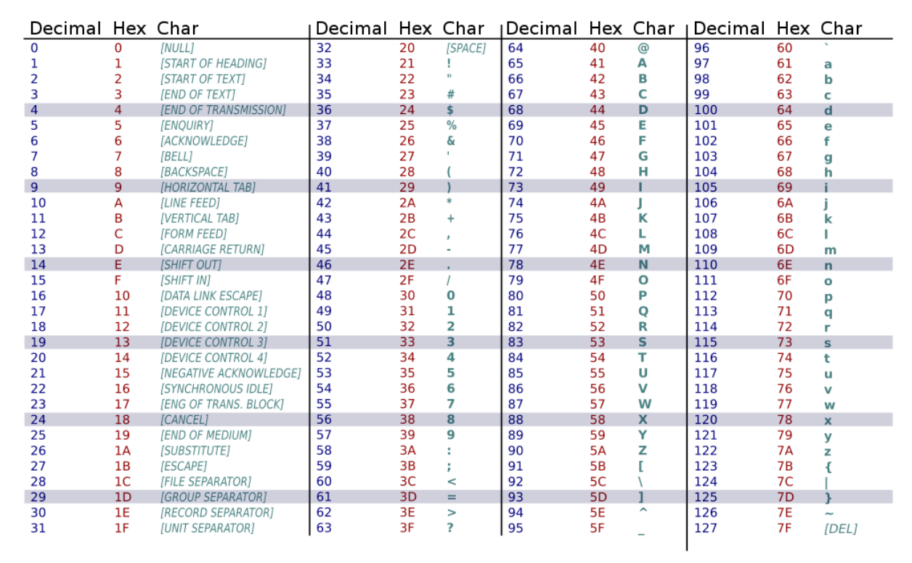

#### **CSCI 1300 CS1: Starting Computing**
#### **Hoenigman/Naidu/Park/Ramesh - Fall 2023**
#### **Recitation 5 - week of October 2nd, 2023**

# Table of contents
- [Table of contents](#table-of-contents)
- [Loops <a name="loops"></a>](#loops-)
- [Exercises <a name="exercises"></a>](#exercises-)
    - [0. Warmup <a name="warmup"></a>](#0-warmup-)
    - [1. Expense Tracker <a name="expense-tracker"></a>](#1-expense-tracker-)
    - [2. Spot the errors <a name="spot"></a>](#2-spot-the-errors-)
    - [3. Converting Lowercase Letters To Uppercase <a name="lower-to-upper"></a>](#3-converting-lowercase-letters-to-uppercase-)
- [Deliverables for Recitation <a name="deliverables"></a>](#deliverables-for-recitation-)

# Loops <a name="loops"></a>
Last week in lecture we learned about using loops: `while`, `do while` and `for` loops. Let's get some practice in with them today. 

# Exercises <a name="exercises"></a>

### 0. Warmup <a name="warmup"></a>

a. 
The program allows the user to repeatedly withdraw from account as long as the amount entered is positive and is less than the balance in the account.
```cpp
#include <iostream>
using namespace std;

int main()
{
    int balance = 1000, withdraw;
    cout << "Enter the amount to be withdrawn: " << endl;
    cin >> withdraw;
    // Write a while loop with a condition that repeats the process until the account has sufficient balance and the user input is positive.
    _________________
    {
        balance = balance - withdraw;
        cout << "Enter the amount to be withdrawn: " << endl;
        cin >> withdraw;
    }

    return 0;
}
```

b.
The program prints a multiplication table for a given number up to 10 times. (For example, if input = 5, print 5 * 1 = 5 ... 5 * 10 = 50)

```cpp
#include <iostream>
using namespace std;

void multiplicationTable(int number)
{
    // Write a loop that iterates 10 times
    ______________________________
    {
        cout << number << " * " << i << " = " << number*i << endl;
    }
}

int main()
{
    int number;
    cout << "Enter a number: " << endl;
    cin >> number;
    multiplicationTable(number);
    return 0;
}
```

c.
The program adds all the numbers until the user inputs 0 to exit the loop. Fill in the blank with an appropriate condition for the while statement. 
```cpp
#include <iostream>
using namespace std;

int main() 
{
    int number, sum = 0;
    
    do
    {
        cout << "Enter a number: ";
        cin >> number;
        sum += number;
    }
    while (_______________________);

    cout << "Total sum = " << sum << endl;
    return 0;
}
```

d. 
The program presents a menu to the user and allows them to make a selection or exit the program, ensuring they input a valid choice.
```cpp
#include <iostream>
using namespace std;

int main()
{
    int choice;

    do {
        cout << "Menu Options:" << endl;
        cout << "1. Print Good Choice" << endl;
        cout << "2. Print Great Choice" << endl;
        cout << "3. Quit" << endl;
        cout << "Enter your choice (1-3): ";
        cin >> choice;

        if (choice == 1)
        {
            cout << "Good Choice!" << endl;
        }
        else if (choice == 2)
        {
            cout << "Great Choice!" << endl;
        }
        // Add a condition to check if the choice is not among 1,2 and 3.    
        ________________________________________
            cout << "Invalid choice. Please try again." << endl;
        }
        // Add a condition for the while loop which executes as long as the input is not 3.
        while (__________________________________);

    cout << "Program exiting." << endl;

    return 0;
}
```

e.
What is the output of the following code?
```cpp
#include <iostream>
using namespace std;

int main() {
    int num = 20;
    do
    {
        num -= 5;
    } 
    while (num > 8);
    
    cout << num << endl;
    return 0;
}
```

f.
The program intends to count and display the number of workdays (assuming a Monday to Friday work week).

1. How many iterations does the for loop perform?  ________________
 
2. How many times does the if condition evaluate to true?  ________________

3. Add an assert statement in the main() function below to test the function for a different input.

```cpp
#include <iostream>
#include <cassert>
using namespace std;

int workdays(int total_days)
{
    int workday_count = 0;

    for (int day = 1; day <= total_days; day++)
    {
            // Check if the day falls on a workday (Monday to Friday)
            if (day % 7 != 0 && day % 7 != 6)
            {
                workday_count++;
            }
    }
    return workday_count;
}

int main() {
    int total_days = 30;
    int workday_count = workdays(total_days);

    cout << "The number of workdays out of " << total_days << " is: " << workday_count << endl;
    
    // Use assert statements to test the function for other inputs
    assert(workdays(40) == 30);
    // Add your assert statement here
    ____________________________________
    return 0;
}
```

-----------------------------

### 1. Expense Tracker <a name="expense-tracker"></a>

You are tasked with developing an expense tracking program that allows users to track their daily expenses. Users can enter the category of expense and the amount, and they can continue entering expenses until they decide to stop. The program should provide a summary of expenses by category and calculate the total expenses incurred for the day.

Your program should follow these guidelines:
1. Create a function expenseTracker() that takes in no parameters and returns an integer value for the total expense.
2. Call the function from main().
3. In the expenseTracker() function:
    * Create 3 integer variables in the expenseTracker() function - Groceries, Entertainment, Education - to store the category-wise totals.
    * Allow the user to enter expenses by providing category and amount.
    * Repeat this until the user decides to stop - which is done by inputting *exit* in the category prompt.
    * If the user inputs a category that doesn't exist, reprompt the user to input the right one.
    * Display the category-wise totals and print this out.
    * Return the total expenses incurred for the day.
4. Print the total expenses incurred for the day in the main function.

Example Output:




**1a**. Write an algorithm in pseudocode for the program above. 

-----------------------------

<br/><br/>
<br/><br/>
<br/><br/>
<br/><br/>


**1b**. Implement your solution in C++ using VS Code. Revise your solution, save, compile and run it again. Are you getting the expected result and output? Keep revising until you do. Make you sure you test for the values used in your sample runs.

-----------------------------

### 2. Spot the errors <a name="spot"></a>

An error is divided into 2 categories. The first category is called syntax error where your code violates the syntax in C++. The second category is called logic error where your code is behaving differently than intended. For the following examples, identify both syntax and logic errors.

a.
The program intends to prints all odd numbers from 1 to N (both inclusive). Fix the error in the code.
```cpp
#include <iostream>
using namespace std;

void printOddNumbers(int num)
{
    int i = 1;
    while (i <= num)
    {
        if (i % 2 != 0)
        {
            cout << i << " ";
        }
    }
    return;
}

int main()
{
    int number;
    cout << "Enter a number: " << endl;
    cin >> number;

    printOddNumbers(number);
    return 0;
}

```

b.
The program monitors the pump status and adds liquid until the liquid level reaches the threshold. Fix the error in the code below.
```cpp
#include <iostream>
using namespace std;

int main()
{
    int liquid_level = 5;
    int threshold = 10;

    while (liquid_level >= threshold)
    {
        cout << "Pump is running. Liquid level: " << liquid_level << " units." << endl;
        liquid_level += 2; 
    }

    cout << "Pump stopped. Liquid level: " << liquid_level << " units." << endl;

    return 0;
}
```

c.
The program intends to verify a user's password, prompting them to re-type it until the correct password is provided, at which point access is granted.
```cpp
#include <iostream>
#include <string>
using namespace std;

int main()
{
    string password = "Secure@123";
    string retype_password;
    bool password_match = true;

    cout << "Enter your password: ";
    cin >> retype_password;

    while (! password_match)
    {
        if (retype_password == password)
        {
            password_match = true;
            cout << "Password accepted. Access granted!" << endl;
        }
        else
        {
            cout << "Incorrect password. Try again: " << endl;
            cin >> retype_password;
        }
    }

    return 0;
}
```

d.
The program intends to find the product of all numbers from 1 to N and print the result.
```cpp
#include <iostream>
using namespace std;

void factorial(int n)
{
    int result = 1;
    for(i = 1; i <= n; i+1)
    {
        result *= i;
    }
    return result;
}

int main() 
{
    int n;
    cout << "Enter a positive integer (n): ";
    cin >> n;

    int result = factorial(n);
    cout << "Factorial of " << n << " is: " << result << endl;

    return 0;
}

```

Work through the spot the error questions interactively via [Coderunner](https://canvas.colorado.edu/courses/95610/assignments/1799634). 

-----------------------------

### 3. Converting Lowercase Letters To Uppercase <a name="lower-to-upper"></a>

The program should ask the user to input a string and convert any lowercase letters in the string to uppercase letters. The program should then print the newly converted string to the terminal. (Any characters apart from lowercase letters can be left unchanged).

Example output:




The ASCII table shown below can be used as a reference on the mapping between characters (char) and integers. For now we'll only be using the Decimal and Char columns (you can ignore the Hex column) and concern ourselves with mapping only letters. Let's test this out and go through an example. We'll begin by finding the value of the character ```a```. If we head over to the table below and find the ```a``` char, we'll see that its decimal value is 97. In code, we can get the integer value for the ```a``` char by using: ```int('a')```. 

```
a = 97
```

We can find the decimal value for uppercase ```A``` (using ```int('A')```) which would give us the value:
```
A = 65
```

Note that the difference in value between a lowercase character and its uppercase counterpart is 32. How can we implement that into our program to make the appropriate conversions? 



**3a**. Write an algorithm in pseudocode for the program above. 

-----------------------------

<br/><br/>
<br/><br/>
<br/><br/>
<br/><br/>

**3b**. Let’s draw a flowchart of the solution.

-----------------------------

<br/><br/>
<br/><br/>
<br/><br/>
<br/><br/>

**3c**. Add three asserts to test the function for various inputs.

------------------------------

Test-1: assert(lowerToUpper("Starting Computing!") == "STARTING COMPUTING!")

Test-2:

Test-3:

Test-4:


**3d**. Implement your solution in C++ using VS Code. Revise your solution, save, compile and run it again. Are you getting the expected result and output? Keep revising until you do. Make you sure you test for the values used in your sample runs.

-----------------------------

# Deliverables for Recitation <a name="deliverables"></a>
Complete the Recitation 5 assignment on [Canvas](https://canvas.colorado.edu/courses/95610/assignments/1815068).
